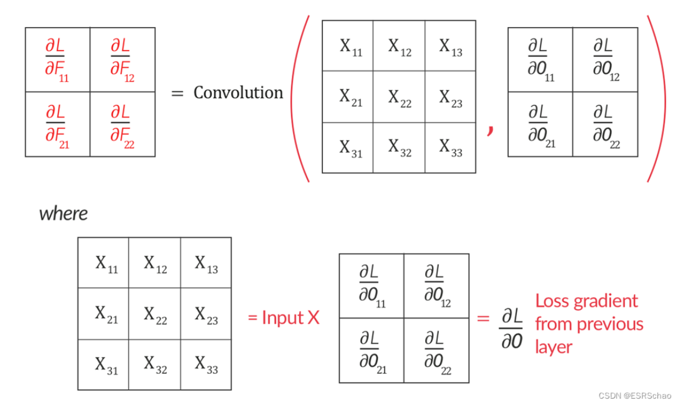
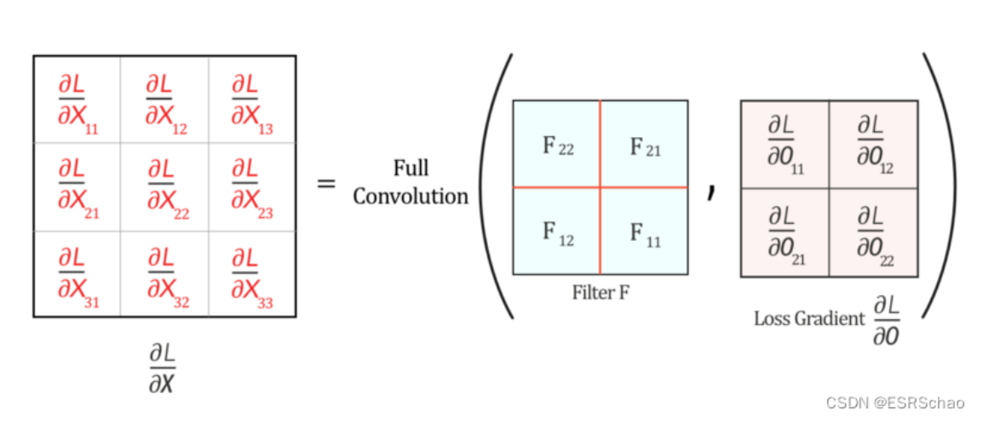
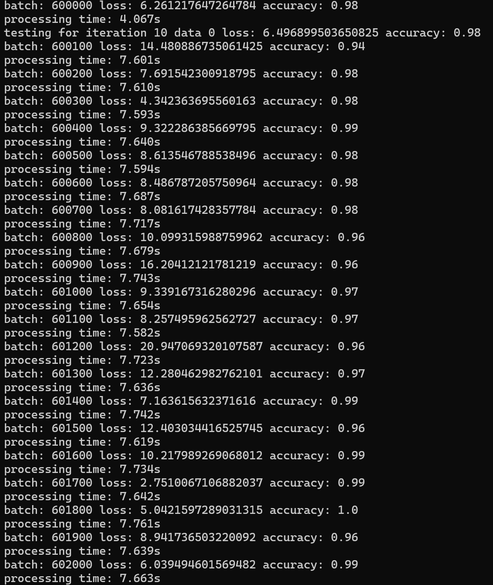
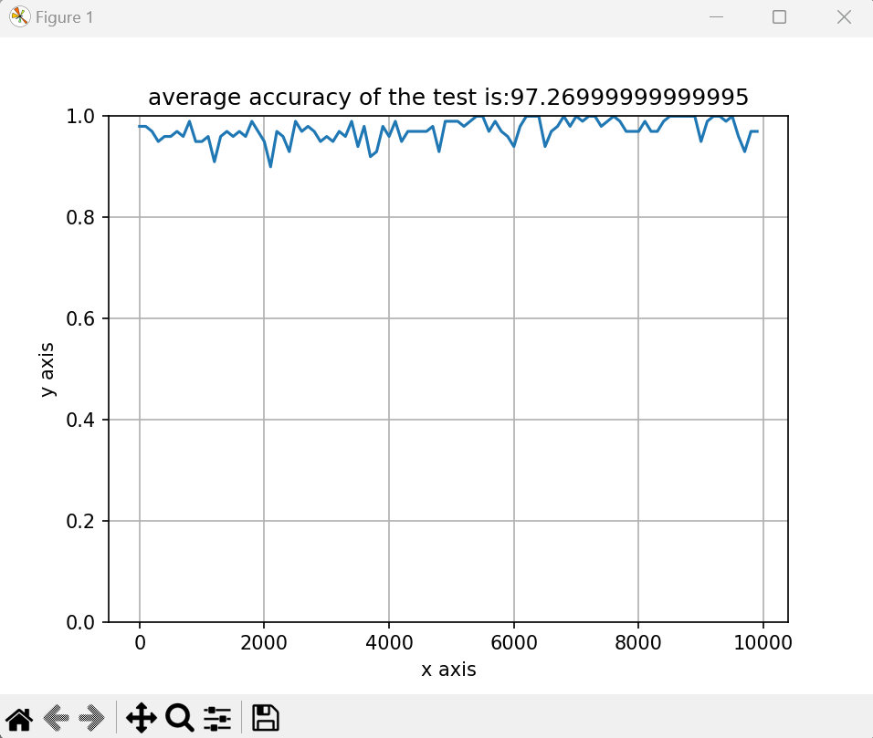
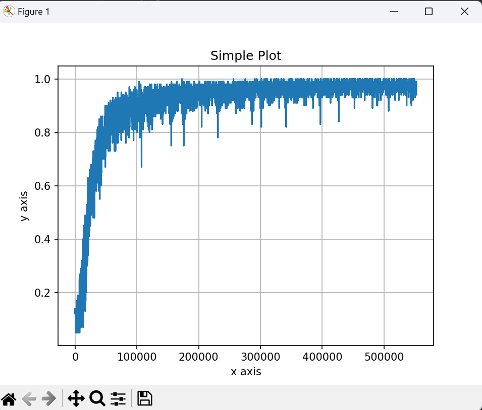
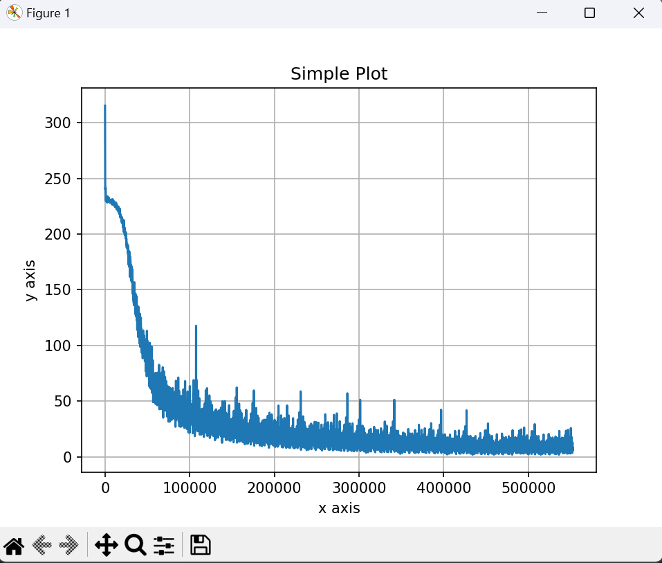

	人工智能前沿实验

	实验一：手写数字识别

	姓名：王昊元

	学号：3220105114

### chapter 1: 简介

本实验需要人工搭建一个卷积神经网络，并对给出的手写数字图像数据集（包括60000个训练数据及10000个测试数据）进行深度学习，并尝试完成计算机对手写数字图像的识别。

在本报告中，将对卷积神经网络的内部构造进行描述，并且给出训练的结果与可视化分析。

### chapter 2: 实现方式

#### chapter 2.1: 实现原理

本卷积神经网络以LeNet5模型为例，将以如下步骤执行程序：

1. 读取MNIST数据集，并将数据转化为二维图像形式：

- train_images: \[60000, 1, 28, 28\]
- train_labels: \[60000, 1\]
- test_images: \[10000, 1, 28, 28\]
- test_labels: \[10000, 1\]

2. 对其进行前向传播计算预测值，反向传播更新权重
3. 经历多次迭代后进行测试，查看学习效果

对于LeNet5结构，进行如下操作：

1. 第一次卷积（卷积核为6x5x5，padding = 2）:*[num, 1, 28, 28]->[num, 6, 28, 28]*
2. 第一次激活（sigmoid函数）
3. 第一次池化（平均池化，池化大小为2x2，无padding）:*[num, 6, 28, 28]->[num, 6, 14, 14]*
4. 第二次卷积（卷积核为16x6x5x5，无padding）:*[num, 6, 14, 14]->[num, 16, 10, 10]*
5. 第二次激活（sigmoid函数）
6. 第二次池化（平均池化，池化大小为2x2，无padding）:*[num, 16, 10, 10]->[num, 16, 5, 5]*
7. 第一次线性全连接（16x5x5->120）:*[num, 16, 5, 5]->[num, 400]->[num, 120]*
8. 第三次激活（sigmoid函数）
9. 第二次线性全连接（120->84）:*[num, 120]->[num, 84]*
10. 第四次激活（sigmoid函数）
11. 第三次线性全连接（84->10）:*[num, 84]->[num, 10]*

在经历如上步骤后，可以得出每个图片在0-9取值中的"得分"，并可根据它来进一步与label进行比较并计算损失函数，从而实现反向传播。

同时为了充分利用向量化计算的效率提升，在函数实现中应当尽可能利用*numpy*库相关函数进行向量化操作。

#### chapter 2.2: 前向传播

##### 卷积层:

卷积层定义为：Conv2d(in_channels, out_channels, kernel_size, stride, padding)

其目的是通过卷积的方式对传入图像进行处理。

卷积在本网络中有两种方式：

1. 不加填充，直接在输入数据的范围内通过卷积核进行卷积（操作后数据的行/列将分别减少 `kernel_size - 1`）:

此种方式一般用作较下层的卷积处理，通过这种方式对图像进行收缩。

2. 加入填充，在数据数据的外圈补充 `kernel_size // 2`层默认数据（一般为0），操作后数据的行/列不变

此种方式一般用作第一层的卷积处理，目的是对边缘特征进行更全面的提取。

具体的实现方式可见 `modules.py`中相应的函数。

##### 激活层：

激活层的目的是将传入的数据归约到0至1之间，从而对卷积/池化/连接操作后的数据进行定性的分析。

本程序中使用的是**Sigmoid**函数作为激活函数，它具备激活函数的相关功能，但可能出现梯度消失的现象（在后续实践中这方面对结果的影响似乎不大，因此没有将其换作**ReLU**函数）

Sigmoid函数的计算方式如下：

针对输入的每一个数据x，输出为：

$$
Sigmoid(x) = \frac{1}{1 + e^{-x}}
$$

##### 池化层：

池化层的目的就是通过对图像进行局部特征的提取，将图像的大小进行收缩。

在本网络中，采用的是平均池化的方法，池化大小为2。即，在对于输入数据，对于每2x2个数据，计算出它们的平均值作为输出的一个数据。

输出的数据相对于输入的数据，行/列都会减半。

具体的实现方式可见 `modules.py`中相应的函数。

##### 全连接层：

该层的目的是将二维的数据转化为一维的数据，并由一个权重矩阵进行处理，从而将数据量再次进行收缩。

假设其输入通道数为 `C`(如果输入的数据为二维，则将其转化为一维)，输出通道数为 `O`，则：

权重矩阵大小为$W_{C \times O}$, 将输入数据与权重矩阵做矩阵的乘法，则可得到对应的输出数据。

具体的实现方式可见 `modules.py`中相应的函数。

#### chapter 2.3: 反向传播

在得到\[num, 10\]大小的结果后，我们需要对其进行处理、比较并根据结果进行反向传播进行参数的调整。

我们采用梯度下降的方式进行调参，需要调整的参数为：

- 全连接层的权重矩阵与偏移
- 卷积层的卷积核

其基本原理为：根据损失函数的定义、各个层实现的方式等，计算出**损失函数关于权重**的偏导数，再根据这个偏导数令权重向着“令损失函数减小”的方向调整，则在理想情况下通过这种方式能够找到损失函数的最小值，此时卷积神经网络的准确率最大。

##### 交叉熵损失函数

对于传入的结果，我们首先需要通过**softmax**函数将它在0-9取值转化为概率分布（即将 `np.sum(x[i])`变为1）。

softmax函数具体表述如下：

$$
x_i = \frac{e^{x_i}}{\sum_{j=1}^ne^{x_j}}
$$

而对于label，我们同样需要将它改换为概率分布的模式，例如其中假设第一张图片的结果为3，那么它应当为*[num, 10]*形式，当num = 1时结果分布为 `[0,0,1,0,0,0,0,0,0,0]`

通过上述处理后，我们就可以通过交叉熵来计算它的损失。交叉熵损失函数计算方式如下：

$$
L(p,q) = -\sum_{i=1}^np(x_i)log(q(x_i))
$$

其中，p序列为label（真实的概率分布），q序列为刚才求得的x。

##### 反向传播梯度

根据上述公式我们知道损失函数L的自变量为x。

我们先只看第三层的linear层与softmax函数：

我们目前需要计算的梯度是损失函数L关于linear层的权重w的导数，而它们之间的关系如下：

$$
L = f(x_{out}); x_{out} = softmax(x_{in}); x_{in} = w * x + b
$$

因此根据求导的链式法则，我们可以这样计算$\frac{\partial L}{\partial w}$:

$$
\frac{\partial L}{\partial w} = \frac{\partial L}{\partial x_{out}} * \frac{\partial x_{out}}{\partial x_{in}} * \frac{\partial x_{in}}{\partial w}
$$

对$\frac{\partial L}{\partial x_{out}}$有：

$$
\frac{\partial L}{\partial x_{out}} = -\sum_{i = 1}^n\frac{p(x_i)}{x_{out}}
$$

对$\frac{\partial x_{out}}{\partial x_{in}}$有：

$$
\frac{\partial x_{out}}{\partial x_{in}} = softmax(x_i)(1 - softmax(x_i))
$$

对$\frac{\partial x_{in}}{\partial x}$有：

$$
\frac{\partial x_{in}}{\partial w} = x
$$

由此我们就能够计算出L相对于每个w的梯度，那么再根据提供的学习率lr，即可计算出w的更新数值为：

$$
w' = w - lr * \frac{\partial L}{\partial w}
$$

于是第一层更新结束。

对于更上层的linear层，前面得出的$\frac{\partial L}{\partial x_{in}}$仍然适用，它将作为链式求导法则的一部分继续传递。

##### 池化层的反向传播

对于池化层，它本身并没有需要调参的属性，因此池化层仅需要对梯度的形式进行更改（扩展）：传入的梯度代表着每一个池化核。

对于平均池化，传入的梯度值平均分给所在池化核的所有元素

对于最大池化，传入的梯度值作为前向传播时最大值点位的值，其他点位为0

在该函数处理后，原为[num, depth, h, w]的梯度应当被转化为[num, depth, h * kernel_size, w * kernel_size]。

##### 卷积层的反向传播

卷积层的反向传播相对更为复杂。需要注意的是，卷积核对每一个元素都有一定的作用。

对于权重的偏导相对好求，它就相当于前向传播时每个卷积核位置对应点位的x相加（即权重在前向传播时起作用的位置的x相加）。更形象的理解方式是对x利用dy进行卷积，这样得出的结果就是对权重的偏导。

其图解如下：

对于输入的偏导同理，列出相应的关系式，对特定的元素进行求导并找出其中规律后，发现其为：卷积核对dy进行**全卷积**。

全卷积是指对dy外围扩充 `kernel_size - 1`层默认值（一般为0），再进行卷积。卷积后的数据大小应当增加padding，也就与之前的dx大小一致了。

其图解如下：

至此，整个反向传播的流程结束。

### chapter 3: 训练&测试

在设计好整体的卷积神经网络后，我们可以进行实际的训练与测试了。

在 `train.py`中，综合考虑运行的时间与效率，设计的训练方法如下：

- 读取数据集文件，并将它处理成 `[num, 28, 28]`形式的矩阵作为输入
- 构建LeNet5模型的CNN实例，并且读取当前的权重存档
- 从存档记录的迭代次数与读取数据位置开始进行训练（这是为了避免某组数据被多次重复学习）
  - 对训练集中的60000条数据进行反复循环：
    - 每次训练提取其中100条连续的训练数据进行前向传播、后向传播，记录损失值与正确率
    - 每训练5000条数据后，执行：
      - 1. 对10000条测试集数据采集100个样本，考察当前权重对样本的正确率效果
      - 2. 对当前的权重、记录的损失值列表、正确率列表、样本考察效果进行存档

在 `test.py`中，提供了直接对当前存档进行测试集验证的方式，它将依据当前的权重存档对10000条测试集进行测试：

- 每次线性提取测试集中的100条数据，并通过当前的神经网络进行前向传播并获取损失值与正确率
- 读取直至所有测试数据结束后，计算平均的正确率

通过上述的方式，我们可以对循环训练的过程进行维护，包括程序中断的记录保护以及结果的实时记录。

如下是迭代中随机抽取的截图：

### chapter 4: 测试结果分析

在当前存档（9次迭代）基础上直接运行 `test.py`，可以生成相应的正确率图片：

同时，我们还可以对在训练过程中对训练集上的正确率与损失值进行统计并生成相应的图片（具体代码可见 `analysis.py`）：

根据图像我们可以得知，伴随着训练数据的增加，损失值在不断减小并趋于0，其导数也在不断减小；正确率从随机分布（10%）开始不断变大并趋于某接近100%的定值，其导数在不断减小。

根据损失函数的特性与定义我们知道，当参数量足够大时，针对训练集应当存在一个参数集能够令其损失值全为0（即正确率为100%），但在测试集的表现无法保证这一点。

根据网上查阅信息后发现，理论上这个卷积神经网络系统的效果能够达到99%以上，经分析可能是如下原因导致的：

- 卷积层无bias参量，导致整个卷积层在调整过程中运作的并不很理想
- 神经网络深度不足，参量数目过小导致某些细节的特征没有获取到
- 学习率始终为0.1，事实上应当先让学习率为较大的值，加速参数调整的同时避免陷入局部最优解；当正确率达到某阈值时再换用小的学习率
- 使用的激活函数为sigmoid，事实上建议使用ReLU，避免梯度消失导致上层参数没有显著的变化

### chapter 5: 参考文献

> https://blog.csdn.net/qq_45912037/article/details/128073903
