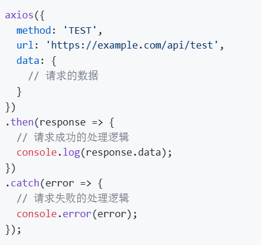

小记：在删除操作时，会先响应OPTIONS

204时，返回长度为-1，不返回任何东西

DELETE看来应该是要用param的写法，但现在还没有明确param的东西应该怎么读

对CARD板块已经全部完成了

同时查询对应的东西已经在vue中解决了，查询的是user

BORROW板块，缺少验证方式，先放着

BOOK板块，还没想好怎么限定填入的价格等是数字

现在做到了BOOK新建的bookhandler部分，休息一下~

测试发现，在delete card时正则表达式不能够用’？‘，这是因为它后面没有东西，所以会最短匹配

现在对所有的完整性约束进行考察

这是不行的！

这里相当好奇，如果用RESTful风格，如果对于同一个页面有不同的更新操作，同样要调用PUT，那么应当如何去操作呢

如果用正则表达式解决这个问题，那么如果两种操作传输的数据格式完全一致，又应当怎么办？

整体的风格还是要统一一下，现在看来感觉不同的请求写的比较乱

批量入库先放在这里，现在要做的不多了

批量入库；还书；增减库存；统一代码风格；代码安全

批量入库特殊条件还没有调整

只剩还书这个操作，在此操作中发现之前代码有误，需要重改returnbook()

至此所有功能全部实现，批量入库的特殊情况还没有调，回去再说
