

	数据库系统实验

	实验名称：MiniSQL(with 3 bonuses)

	姓名：王昊元

	日期：2024/6/14

## Chapter 0: 引言

### 1. 问题描述:

本实验的目的为：设计并实现一个精简型单用户SQL引擎MiniSQL，允许用户通过字符界面输入SQL语句实现基本的增删改查操作，并能够通过索引来优化性能。

### 2. 报告内容：

本报告将依照[实验文档](https://www.yuque.com/yingchengjun/minisql), 将七个子模块逐一进行描述、代码实现、测试样例等，最终呈现具体测试效果。

具体对3个bonus(*CLOCKReplacer*, *optimal table heap*, *lock manager*)在**文档末尾**进行统一阐述。

### 3. 其他说明：

**_1. 本实验为单人完成，因此将个人报告与组队报告合并在一起，仅呈现一个报告！_**

**_2. 考虑到报告篇幅等问题，在本报告中将不粘贴相关源代码，而是用其所在文件名进行代替。_**

**_3. 在源代码中有足够充分的注释与解释，其中包括且不限于对test的注释、对模板的注释以及对自己代码的注释。可以进入源代码对应部分进行注释方面的阅读。_**

## Chapter 1: DISK AND BUFFER POOL MANAGER

### Chapter 1.1: 模块概述

该模块的目的是：通过两层存储结构设计（缓存池+磁盘管理），设计一个兼得空间效益与时间效益的存储体系。

显然，一个数据库系统将存储极大量的数据，而调用这些数据的次数又是极大量的，因此设计缓存池便是有必要的。

- 必须要注意的是，本实验中较大量的数据结构是以**Page**空间作为基底的，那么当我们在不同Page类型(table_page/bitmap_page/meta_page...)之间转换时，需要用到**reinterpret_cast**来进行指针转换。

Page类相关结构如下：

- char data_[PAGE_SIZE]: 数据
- page_id_t page_id_: 页号
- int pin_count_: 该页正在被Pin的数量（即pin_count_ = 0时Page不在被使用状态）
- bool is_dirty_: 该页是否已被修改
- ReaderWriterLatch rwlatch_: 多次读写的latch

### Chapter 1.2: bitmap page

#### Chapter 1.2.1: 位图页的目的

位图页的目的是：快速获取某一个分区（即一系列连续的页构成的区域）的基本信息（哪些页是空闲的，哪些页是被占用的）

#### Chapter 1.2.2: 位图页的结构

位图页占用空间为一页（sizeof(char) * PAGE_SIZE），具体结构如下：

- `uint32_t page_allocated_`: 该分区已被分配的页数
- `uint32_t next_free_page_`: 下一个空闲页
- `unsigned char bytes[MAX_CHARS]`: 具体每页是否被分配的情况（占用为1，空闲为0）

#### Chapter 1.2.3: 位图页的实现

1. bool AllocatePage(uint32_t &page_offset)

   - 目的：分配一个空闲的页号，以page_offset输出
   - 输入量：无
   - 输出量：
     - uint32_t page_offset: 成功则为分配的对应页号；失败则为 `INVALID_PAGE_ID`
     - bool return: 成功则为true，否则为false
   - 实现方式：
     - 1. 若next_free_page_大于最大页面数，则直接返回false
     - 2. 令page_offset = next_free_page_
     - 3. 将next_free_page_对应页面所在位设置为1
     - 4. 寻找并设定下一个next_free_page_
     - 5. page_allocated_++, 返回true
   - 备注：
     - 1. 在步骤3中，采用了相关位操作进行对bytes的设置
     - 2. 在步骤4中，考虑到deallocate函数会造成内存碎片的产生，因此选择使用线性查找的方式寻找最近的next_free_page_
2. bool DeAllocatePage(uint32_t page_offset)

   - 目的：释放页号为page_offset的页
   - 输入量：
     - uint32_t page_offset: 需要释放的页号
   - 输出量：
     - bool return: 释放成功则为true，否则为false
   - 实现方式：
     - 1. 寻找page_offset对应位点（方式与函数1相似）
     - 2. 如果该页已经是空闲的，则返回false
     - 3. 更改该位点状态为0
     - 4. 设置next_free_page_到这里（为了衔接AllocatePage的超限情况）
     - 5. page_allocated_--
3. bool IsPageFree(uint32_t page_offset) const

   - 目的：判断页号为page_offset的页是否空闲
   - 输入量：
     - uint32_t page_offset: 目标页号
   - 输出量：
     - bool return: 空闲则为true, 否则为false
   - 实现方式：
     - 直接调用函数4：IssPageFreeLow(page_offset / 8, page_offset % 8)即可
4. bool IsPageFreeLow(uint32_t byte_index, uint8_t bit_index) const

   - 目的：判断对应位置的页号是否空闲
   - 输入量：
     - uint32_t byte_index: 字节数，与bytes的位数一一对应
     - uint8_t bit_index: 位数，与一个字节中的每一位一一对应
   - 输出量：
     - bool return: 空闲则为true, 否则为false
   - 实现方式：
     - 利用如下位运算即可：`bytes[byte_index] >> (7 - bit_index)) % 2 == 0`

上述4个函数的源代码位于 `page/bitmap_page.cpp`中。

### Chapter 1.3: disk manager

#### Chapter 1.3.1: 磁盘数据页管理的目的

在1.2中，位图页已经能管理一系列页号空间了。但实际上这些页号空间仍然不足以满足数据库的需求。因此我哦们需要通过设计**磁盘数据页**，通过组织一系列位图页+数据页的结构，从而得以管理足够多的内存空间。

#### Chapter 1.3.2: 磁盘数据页的结构

与位图页类似，磁盘数据页由多个位图页+数据页（以下将这种组合称为“分区”）构成，并由一个meta_page页进行统一管理。总体设计如下：

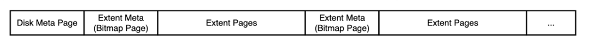

对meta_page，其结构如下：

- uint32_t num_allocated_pages_: 整个磁盘已被取用的页数
- uint32_t num_extents_: 整个磁盘当前拥有的分区数
- uint32_t extent_used_page_[]: 对每个分区，已被分配的页数

同理，这说明每个磁盘可分配的最多分区数为(PAGE_SIZE - sizeof(HEADER)) / sizeof(uint32_t),*HEADER及以下的HEADER表示对应数据结构用于定义基本信息的变量集合。*

对DiskManager，其结构如下：

- std::fstream db_io_: 文件输入输出流
- std::string: 写入的对应文件名
- std::recursive_mutex db_io_latch_: 多次读写的latch
- bool closed: 判断io流是否关闭
- char meta_data_[PAGE_SIZE]: **NOTE：这里作为且仅作为存放该DiskManager的meta_page的位置，在文档中标注的“缓冲区”可能会造成一定的误解。**

另外，需要注意到在这个结构中并不是所有的页都是数据页（例如位图页和meta_page），因此有必要区分逻辑页号（数据页的递增索引）和物理页号（所有页的递增索引），具体转化方式如下：

注意：在正常操作时（包括其他模块对页号的使用都是**逻辑页号**）（显然，位图页和meta_page对于其他模块应当是不可见的）。

#### Chapter 1.3.3: 磁盘数据页的实现

1. page_id_t AllocatePage()

   - 目的：从DiskManager中分配一个空闲页
   - 输入量：无
   - 输出量：
     - page_id_t return: 成功则返回对应页号，否则返回INVALID_PAGE_ID
   - 实现方式：
     - 1. 查看所有分区页情况，若有分区未满则以该分区分配页；否则新建分区并以新分区分配页
     - 2. 读取该位置的位图页数据（利用函数ReadPhysicalPage()）
     - 3. 利用位图页函数AllocatePage()分配页
     - 4. 将位图页状态写入内存中
     - 5. 更改meta_page相关信息，并返回逻辑页号
   - 备注：对meta_page是否需要更新状态的问题，可以关注DiskManager打开和关闭的时间点，由于在数据库工作时理论上DiskManager始终开启，因此没有必要将meta_page频繁写入磁盘，只需要在meta_data_中实时更新就可以了。
2. void DeAllocatePage(page_id_t logical_page_id)

   - 目的：释放logical_page_id对应的页
   - 输入量：
     - page_id_t logical_page_id: 释放页逻辑页号
   - 输出量：无
   - 实现方式：
     - 1. 计算该页号对应的分区号
     - 2. 提取该分区对应的位图页
     - 3. 调用位图页函数DeAllocatePage()释放页
     - 4. 将位图页状态写入内存
     - 5. 更改meta_page相关信息
3. bool IsPageFree(page_id_t logical_page_id)

   - 目的：查验logical_page_id对应页是否空闲
   - 输入量：
     - page_id_t logical_page_id: 查验页逻辑页号
   - 输出量：
     - bool return: 为空闲则为true, 否则为false
   - 实现方式：
     - 1. 计算该页号对应分区号
     - 2. 提取该分区对应位图页
     - 3. 调用位图页函数IsPageFree()查验页并返回结果
4. page_id_t MapPageId(page_id_t logical_page_id)

   - 目的：将逻辑页号转换为物理页号
   - 输入量：
     - page_id_t logical_page_id: 逻辑页号
   - 输出量：
     - page_id_t return: 物理页号
   - 实现方式：
     - 采用如下关系：`physical_page_id = 1 + extent_id * (BITMAP_SIZE + 1) + 1 + logical_page_id % BITMAP_SIZE`即可

上述4个函数的源代码位于 `storage/disk_manager.cpp`中。

### Chapter 1.4: LRU replacer

#### Chapter 1.4.1: LRU替换器的目的

replacer是服务于缓冲池的工具，它的任务是为缓冲池选出最适合被替换的页面。由于缓冲池的工作原理就是提取部分页面数据以备下次使用，因此替换操作较为普遍，于是replacer是必要的。

LRU是其中的一种替换算法，也可以使用其他替换算法作为replacer。

#### Chapter 1.4.2: LRU替换器的结构

- list\<frame_id_t\> lru_list: 可被替换的页面标号

#### Chapter 1.4.3: LRU替换器的实现

1. bool Victim(frame_id_t *frame_id)

   - 目的：将被替换的页号放在frame_id中，返回处理结果
   - 输入量：无
   - 输出量：
     - frame_id_t *frame_id: 可被替换的页号
     - bool return: 成功为true,否则为false
   - 实现方式：
     - 1. 若lru_list为空，则返回false
     - 2. 提取lru_list的第一个值作为frame_id, 更新lru_list, 返回true
2. void Pin(frame_id_t frame_id)

   - 目的：将frame_id从lru_list中去除（不作为Victim）
   - 输入量：
     - frame_id_t frame_id: Pin的页号
   - 输出量：无
   - 实现方式：
     - 1. 在lru_list中找到它（如果能找到），将它删除掉即可
3. void Unpin(frame_id_t frame_id)

   - 目的：将frame_id加入lru_list中
   - 输入量：
     - frame_id_t frame_id: Unpin的页号
   - 输出量：无
   - 实现方式：
     - 1. 在lru_list中寻找是否已存在该页面，若存在则直接return
     - 2. 在lru_list末尾添加该frame_id
4. size_t Size()

   - 目的：给出lru_replacer的处理大小
   - 输入量：无
   - 输出量：
     - size_t return: lru_list的大小
   - 实现方式：
     - 1. `return lru_list.size()`

### Chapter 1.5: buffer pool manager

#### Chapter 1.5.1: 缓冲池的目的

由于每次直接从文件中读取相关数据过于缓慢，因此需要缓冲池对多次重复调用的页面进行保存。当程序再次读取/写入时只需调用内存中的数据即可。

#### Chapter 1.5.2: 缓冲池的结构

BufferPoolManager结构如下：

- size_t pool_size_: 缓冲池的大小
- Page *pages_: 缓冲池存储的具体页面数据，实则为pages_\[pool_size_\]
- DiskManager *disk_manager_: 调用对应的磁盘管理器
- unordered_map\<page_id_t, frame_id_t\> page_table_: 这实际是一个辅助缓冲池实现的工具，用于给出页号与frame_id的映射关系。**NOTE: 个人认为这里写成<frame_id_t, page_id_t>更好**
- Replacer *replacer_: 对应使用的替换器
- list\<frame_id_t\> free_list_: 空闲的缓冲页（一开始，所有页都是空闲的，因此free_list_初始化为0到pool_size_的递增数列）
- recursive_mutex latch_: 多次读写的latch

> 事实上，frame_id_t类型的变量可以直接理解为pages_数组的下标，它们应当是同一个意思

#### Chapter 1.5.3: 缓冲池的实现

0. Pin/Unpin注解：
   当多人调用同一个页面时，内存中对应的页面不可被替换。在本设计中，FetchPage与NewPage都算作“调用”，因此在上层模块使用时如若调用这两个函数，**必须在使用后调用Unpin!**
1. Page* FetchPage(page_id_t page_id)

   - 目的：根据给出的页号，提取对应页的数据
   - 输入量：
     - page_id_t page_id: 提取数据的页面
   - 输出量：
     - Page* return: 提取的数据
   - 实现方式：
     - 1. 查询table中是否存在这个page_id，若存在则直接Pin这个页面，从内存中提取相关数据并返回
     - 2. 需要从磁盘读，先找到可被替换的页

       - 1. 若free_list_不为空，从free_list_中找
       - 2. 若free_list_为空，调用replacer的Victim函数来找
       - 3. 若1/2均无效，则返回nullptr
     - 3. 如果被替换页已被修改，将数据写入磁盘
     - 4. 将被替换页对应page_table中的键值对删除
     - 5. 将新键值对加入page_table中
     - 6. 从磁盘中读入要fetch的页面数据，Pin这个页面，并返回对应指针
2. Page* NewPage(page_id_t &page_id)

   - 目的：分配一个新的页，将页号存储在page_id中
   - 输入量：无
   - 输出量：
     - page_id_t page_id: 分配的页号
     - Page* return: 指向这个页的指针
   - 实现方式；
     - 1. 确定替换/存储的frame_id

       - 1. free_list_有空闲页，用free_list_的id
       - 2. free_list_无空闲页，调用replacer的Victim函数尝试替换。如果采用该方法，需要删去page_table中对应的键值对。
       - 3. 1/2均无效，则直接返回nullptr
     - 2. 无论frame_id所在页是空闲还是存在，判断它是否为dirty，并考虑是否将其写入disk中
     - 3. 调用本类中的AllocatePage()函数，将page_id和frame_id对应页的数据进行修改
     - 4. 设置该页为dirty（现在磁盘中该页全为0）
     - 5. 在page_table_中插入这个映射，Pin这个页面，返回指针
3. bool DeletePage(page_id_t page_id)

   - 目的：释放page_id对应的缓存空间
   - 输入量：
     - page_id_t page_id: 释放的页号
   - 输出量：
     - bool return: 成功则为true, 否则为false
   - 实现方式：
     - 1. 如果在page_table中找不到它，唯一的可能是它已经被其他人释放了（否则page_id根本无法获取到），因此直接返回true
     - 2. 如果存在，且该页对应的pin_count_为0，则执行删除操作：

       - 1. 在page_table中清除它
       - 2. 对内存池中对应的数据全部清零
       - 3. 调用FlushPage()将磁盘对应空间清除（分析如下：由于调用DeallocatePage()后，事实上page_id对应页已经可以被NewPage()调用了，因此里面的数据不再有效）
       - 4. 重置pages的参数，包括is_dirty_与page_id_
       - 5. 调用DeallocatePage()与磁盘同步
       - 6. 在free_list中添加这个frame_id
       - 7. 返回true
     - 3. 如果pin_count_不为0，返回false
4. bool UnpinPage(page_id_t page_id, bool is_dirty)

   - 目的：对该页进行unpin
   - 输入量：
     - page_id_t page_id: unpin的页号
     - bool is_dirty: 该页在调用unpinpage()所在函数中是否被修改
   - 输出量：
     - bool return: 成功则返回true, 否则返回false
   - 实现方式：
     - 1. 从page_table中获取page_id对应的frame_id
     - 2. 如果is_dirty为true则修改该页状态为is_dirty,否则不修改
     - 3. 将pin_count自减1
     - 4. 如果此时pin_count为0，则调用replacer将其unpin,并返回true
     - 5. 如果此时pin_count不为0，则返回false
5. bool FlushPage(page_id_t page_id)

   - 目的：将目标页数据存入磁盘中
   - 输入量：
     - page_id_t page_id: 目标页页号
   - 输出量：
     - bool return: 成功则为true, 否则为false
   - 实现方式：
     - 1. 通过page_table获取page_id对应的frame_id
     - 2. 如果该页为is_dirty,则调用磁盘管理的WritePage()函数进行写入，并更改is_dirty为false
     - 3. 如果该页不为is_dirty,则直接返回
   - 备注：**NOTE:这里认为返回值直接为void即可，因为如果writepage出问题会直接抛出异常**
6. void FlushAllPages()

   - 目的：将所有缓存页转存到磁盘
   - 输入量：无
   - 输出量：无
   - 实现方式：
     - 1. 对所有的page调用FlushPage()即可

## Chapter 2: RECORD MANAGER

### Chapter 2.1: 模块概述

该模块的目的是：将row/column/schema/field序列化（即将其规范化地转化为字符串）及反序列化，从而达到将大量数据以较高效率的方式进行存储管理。同时利用堆表的方式用RowId作为标志，(即该行所在的数据页的页号以及在数据页中的具体位置)将这些数据管理起来。

### Chapter 2.2: 记录与模式

由于field相关序列化/反序列化的代码已被实现，因此略去不表。

给出的关键函数有如下两个：

- MACH_WRITE_TO(Type, buf, Data): 将类型为Type的Data写入buf（注意，使用完该函数后buf仍在写前的位置，需要人为偏移）
- MACH_READ_FROM(Type, buf): 从Buf中以类型Type的方式读一个数据（同理需要人为偏移）

#### Chapter 2.2.1: Row

##### Chapter 2.2.1.1: Row的结构

每个Row对应包括如下结构：

- RowId: 一个占64位（两个uint32_t数据）的类，前32位存储该行所在的数据页，后32位存储该行是所在数据页的第几个数据。
- vector\<Field*\> fields_: 改行对应的一系列field，其中类型包括int/float/char*

需要注意的是，在实现Field::GetSerializedSize()时，框架是认为null不应被存的。因此必须用位图等方式标记null。

##### Chapter 2.2.1.2: Row的记录管理

1. uint32_t SerializeTo(char *buf, Schema *schema):

   - 目的：将该Row序列化
   - 输入量：
     - 1. char *buf: 序列化后的存储位置
     - 2. Schema *schema: 该行隶属的模式（即每个Field代表的是什么）
   - 输出量：
     - 1. uint32_t return: 序列所用的空间
   - 实现方式：
     - 1. ~~存储RowId（需要2 * uint32_t）~~
     - 2. 存储fieldsize，即该行field的个数（由于考虑到size_t不同系统中可能不一样，因此改用uint32_t）
     - 3. 存储一个位图，用于判断Field是否为null以缩短序列化长度（(需要fieldsize / 8 + 1) * char）

       - 1. 对于位图内的数据：遍历一次fields_,若为Null则标注0，否则注1
     - 4. 接下来对每一个非空的field都进行序列化并存储（直接调用其SerializeTo()即可）
     - 5. 用指针相减的方式返回buf的偏移量
2. uint32_t DeserializeFrom(char *buf, Schema *schema):

   - 目的：将buf起始的一个Row反序列化
   - 输入量：
     - 1. char* buf: 读取Row的起始位置
     - 2. Schema* schema: 对该行隶属的模式（即每个Field代表的是什么）
   - 输出量：
     - 1. uint32_t return: 序列所用的空间
   - 实现方式：事实上将每一个Serialize的操作反过来就可以了。
3. uint32_t GetSerializedSize(Schema *schema):

   - 目的；将这个Row的序列化大小返回
   - 输入量：
     - 1. Schema* schema: 对该行隶属的模式
   - 输出量：
     - 1. uint32_t return: 序列所用的空间
   - 实现方式；与上两个函数同理，把所有的量大小加起来即可

#### Chapter 2.2.2: Column

> 由于其他部分与Row基本一致，因此不再列举具体函数，只是展示设计的序列化方式。

column序列化为如下形式：

- COLUMN_MAGIC_NUM: 读取正确性校验（uint32_t）
- name_length: 名称长度（uint32_t）
- name: 名称（char * name_length）
- type: 类型（TypeId）
- max_length: Char类型中具备的最大字符数（uint32_t）
- table_ind_: 在表中的索引（uint32_t）
- nullable: 可空（bool）
- unique: 唯一（bool）

#### Chapter 2.2.3: Schema

schema序列化为如下形式：

- SCHEMA_MAGIC_NUM: 读取正确性校验（uint32_t）
- column_num: 列的个数（uint32_t）
- 每一列的具体元素序列化

### Chapter 2.3: 堆表

堆表(table heap)是存储表内容的结构。它在整体调用时的角色如下：

1. 用户通过key在index中查找到RowId
2. 根据RowId在堆表中找到对应的具体Row数据，并返回给用户

**注意：对于每一个模式(schema),都有自己的index与table heap。**

**NOTE: 来自第四章的注释：由于table heap, 以及b_plus_tree_index这两个东西并没有在这里实际地存储在文件中（真正存储的是table_page与root_page_id/b_plus_tree_page），因此第四章需要把这些东西也存起来。这就是第四章的目的。**

#### Chapter 2.3.1: 堆表的结构

**NOTE: 虽然它叫堆表，但结构上似乎和堆没什么关系x**

堆表是一个双向链表结构，其具体构成如下：
每一个堆表由一个**table heap**来维护，它包含了如下元素：

- buffer_pool_manager_: 对应内存池
- first_page_id_: 第一个table_page
- Schema *schema_: 该table heap对应的模式

一个堆表又由多个**table page**组成。每个table page包含如下元素（在页内数据中存储）：

- PageId: 页号
- LSN: 日志
- PrevPageId: 上一个table_page
- NextPageId: 下一个table_page
- FreeSpacePointer: 下一个空闲指针
- TupleCount: 存储的Row数量
- Tuple offset: 每个Row的偏移量
- Tuple size: Row的大小

#### Chapteer 2.3.2: 堆表的实现

*注：table_page事实上已经大致写好了*

1. bool TableHeap::InsertTuple(Row &row, Txn *txn):

   - 目的：向table heap中插入一个row
   - 输入量：
     - 1. Row &row: 插入的数据
     - 2. Txn *txn: 冲突处理
   - 输出量：
     - 1. bool return: 成功则为true, 否则为false
   - 实现方式：
     - 1. 从first_page_id_开始，逐个尝试调用table_page::InsertTuple

       - 1. 如果成功，则return true即可
       - 2. 如果到最后一个table_page还不成功，则进入步骤2
     - 2. 新建一个table_page,将它初始化
     - 3. 将之前堆表最后一页的next_page配置为新建的page
     - 4. 再次进行table_page::InsertTuple，此时理论上必定成功
2. bool TableHeap::UpdateTuple(Row &row, const RowId &rid, Txn *txn):

   - 目的：更新位于rid的行数据为row
   - 输入量：
     - 1. Row &row: 传入具体行数据，通过它的rowid传出新的rowid
     - 2. RowId &rid: 传入的旧的RowId
     - 3. Txn *txn: 冲突处理
   - 输出量：
     - 1. bool return: 成功则为true，否则为false
   - 实现方式：
     - 1. 直接Fetch传入rid对应的数据页（这是因为rid本身就是由table_heap提供的，因此rid必然是有效的）
     - 2. 创建一个old_row作为旧的row
     - 3. 调用GetTuple获取旧的数据（这是因为在UpdateTuple()中有对反序列化的验证）
     - 4. 尝试调用TablePage::UpdateTuple()

       - 1. 若成功，则Unpin后返回true
       - 2. 若失败且状态为-1（更改模板后设定，当rid是有效的，只是因为空间不足而存储失败的情况）

         - 1. 调用ApplyDelete()删除旧的row
         - 2. 调用InsertTuple()尝试直接插入新的row
       - 3. 若上述步骤后仍然不成功，则return false
3. void TableHeap::ApplyDelete(const RowId &rid, Txn *txn):

   - 目的：删除rid对应的记录（物理意义）
   - 实现方式：直接Fetch对应的页后调用TablePage::ApplyDelete，Unpin即可
4. bool TableHeap::GetTuple(Row *row, Txn *txn):

   - 目的：获取row中RowId对应的数据
   - 实现方式：直接Fetch对应的页后调用TablePage::GetTuple，Unpin即可
5. void FreeTableHeap():

   - 目的：删除整个堆表，包括其中所有的table_page
   - 实现方式：这个已经写好了，就是遍历所有数据页，逐个unpin后delete即可
6. explicit TableHeap(BufferPoolManager *buffer_pool_manager, Schema *schema, Txn *txn, LogManager *log_manager, LockManager *lock_manager):

   - 目的：自行创建一个table_heap
   - 输入量：对应初始化的各种值
   - 输出量：无
   - 实现方式：
     - 1. Fetch一个新页作为first_page
     - 2. 调用TablePage::Init()函数初始化之
     - 3. 将table_heap中的first_page_id_设置为该页
     - 4. unpin
   - 备注：**NOTE:这里的实现并没有在实验文档中要求到，但必须补充这部分代码**

### Chapter 2.4: 堆表迭代器

堆表迭代器的目的是：通过它能够遍历一个堆表中的所有记录(即row)

#### Chapter 2.4.1: 迭代器的实现

该部分涉及的各种函数实现较为简单，只需要利用table_heap调用相关函数，获取需要的RowId/Row即可。因此在这里不再做详细描述。

## Chapter 3: INDEX MANAGER

### Chapter 3.1: 模块概述

该模块的目的是：通过引入某种数据结构，达到如下目的：

- 给出一个键值（例如 `id = 2024`），能够快速地获取它在数据文件中的具体位置（即RowId）从而获取其值

在本实验中，使用B+树作为依赖的数据结构。

而在代码框架中，采用了2-3个不同的cpp文件合作，最终完成同一种操作。

即，在 `b_plus_tree.cpp`中总体统筹分裂、合并等特殊情况，在两个节点cpp文件中进行“简单”的操作。

> 然而正因如此，在实现本部分时会出现很多由于代码框架问题需要重新编写的情况。

**NOTE: 由于本模块实验文档设计顺序欠佳，因此将重新规划报告模块，以自上至下的方式，对每个重要操作进行函数统一的解释。**

**NOTE: 并且在完成这个实验时，Unpin函数的调用需要考虑到跨多个函数的状态分析，这是因为很多函数的返回值为Page\*, 这意味着传回的页面在调用函数中不可被Unpin，于是导致了这个问题的出现。**

### Chapter 3.2: B+树总体结构

#### Chapter 3.2.1: B+树节点

涉及文件为：

`page/b_plus_tree_page.h`

`page/b_plus_tree_internal_page.h`

`index/b_plus_tree_leaf_page.h`

B+树节点是一个抽象类，由它对中间节点和叶子节点两个派生类进行管理。其结构如下：

- IndexPageType page_type_: 节点类型：中间节点/叶子节点
- int key_size_: 一个键的长度（这是因为不同类型、数量的键会不同）
- lsn_t lsn_: 数据页的日志序列号
- int size_: 节点存储键值对的数量
- int max_size_: 节点最大容纳的键值对的数量
- page_id_t parent_page_id_: 该节点的父节点页号
- page_id_t page_id_: 该节点的页号

对于中间节点和叶子节点，其结构仅有：

- char data_[PAGE_SIZE - HEADER]: 存储的数据（键值对）

对叶子节点还有：

- page_id_t next_page_id_: 指向下一个叶子节点

**注意：对size_而言，中间节点起始值为1，因为它的第一个键值对为(INVALID, page_id)，当key小于该节点的所有键时，其应当被分配到page_id对应子结点中。**

**备注：在节点中会出现Key（键），Value（值），index（键值对的下表，是自增的整数序列）三个常用量，需要注意区分。同时注意键值对是以递增的形式存储的，而index主要是为了方便利用整数进行对应的操作。**

#### Chapter 3.2.2: B+树

涉及文件为：

`index/b_plus_tree.h`

由这个模块定义一个B+树。其结构如下：

- index_id_t index_id_: 该B+树的ID（显然不同的表有不同的B+树）
- page_id_t root_page_id_: 该B+树根节点的位置
- BufferPoolManager *buffer_pool_manager_: 管理该B+树的内存池（这是由于B+树以多个页的形式进行存储，相关操作频繁）
- KeyManager processor_: 对该B+树对应键的管理器，通过它内置的函数实现键的比较等操作
- int leaf_max_size_: 叶子节点的最大键值对数量
- int internal_max_size_: 中间节点的最大键值对数量

由于leaf_max_size与internal_max_size可不被定义，这种情况下需要我们自己算出来：

`leaf_max_size_ = (PAGE_SIZE - LEAF_PAGE_HEADER_SIZE) / (processor_.GetKeySize() + sizeof(page_id_t) + sizeof(int32_t)) - 1;`

`internal_max_size_ = (PAGE_SIZE - INTERNAL_PAGE_HEADER_SIZE) / (processor_.GetKeySize() + sizeof(page_id_t)) - 1;`

**最后-1是因为在对满了的节点进行插入操作时，有一小段时间内这个节点需要存储max+1个节点，因此预留一个位置。**

### Chapter 3.3: B+树的实现

#### Chapter 3.3.1: 操作：查询

1. （顶层）bool BPlusTree::GetValue(const GenericKey *key, std::vector\<RowId\> &result, Txn *transaction):

   - 目的：查询key对应的RowId
   - 输入量：
     - GenericKey *key: 待查询的key
     - Txn *transaction: 冲突管理
   - 输出量：
     - bool return: 成功则返回true, 否则为false
     - std::vector\<RowId\> &result: 传回的结果在result的最后一位
   - 实现方式：
     - 1. 若root_page_id_无效，则直接返回false
     - 2. 获取目标page的内容，若其为中间节点，那么调用**BPlusTreeInternalPage::Lookup()**获取子页号，再次执行步骤2；若其为叶子节点则继续
     - 3. 调用**BPlusTreeLeafPage::Lookup()**获取对应的RowId, 并返回结果
   - 备注：**要时刻注意Fetchpage后需要UnpinPage!**
2. page_id_t InternalPage::Lookup(const GenericKey *key, const KeyManager &KM):

   - 目的：在该节点中找到key应当位于的子页面，并返回子页号
   - 输入量：
     - const GenericKey *key: 待查询键
     - const KeyManager &KM: 比较键的处理器
   - 输出量：
     - page_id_t return: 该键应当位于的子页页号
   - 实现方式：
     - 1. 获取该节点的size作为curr_size
     - 2. 运用二分查找，令left与right从两侧逼近直至相距为1（需要注意，key在多数情况是夹在left和right之间的。）
     - 3. 返回left对应的value
3. bool LeafPage::Lookup(const GenericKey *key, RowId &value, const KeyManager &KM):

   - 目的：根据给出的key,返回其对应的RowId
   - 输入量：
     - const GenericKey *key: 待查询的key
     - const KeyManager &KM: 比较键的处理器
   - 输出量：
     - RowId &value: 结果RowId存储位置
     - bool return: 成功则返回true, 否则返回false
   - 实现方式：
     - 1. 用二分法的方式查找与key相等的键，如无法找到则返回false即可

#### Chapter 3.3.2: 操作：插入

插入操作的大体流程如下：

- BPlusTree::Insert
  - 无树：BPlusTree::StartNewTree()
  - 有树：BPlusTree::InsertintoLeaf()
    - 有相同键：return false
    - 无相同键：BPlusTreeLeafPage::Insert()
      - 未超限：return true
      - 超限：BPlusTree::Split()*ForLeaf*
        - BPlusTreeLeafPage::Init()
        - BPlusTreeLeafPage::MoveHalfTo()
        - BPlusTreeLeafPage::SetNextPageId()
        - 若父节点为根节点（只会出现一次，即根节点为叶子节点）
          - 更改根节点信息等
        - 若父节点非根节点：BPlusTree::InsertIntoParent()
          - 未超限：return
          - 超限且该点非根节点：BPlusTree::Split()*ForInternal*
            - BPlusTreeInternalPage::Init()
            - BPlusTreeInternalPage::MoveHalfTo()
            - BPlusTree::InsertIntoParent()
          - 超限且该点为根节点：BPlusTreeInternalPage::PopulateNewRoot()
            - return

**NOTE:这个层次本来应当出现在文档中**

1. （顶层）bool BPlusTree::Insert(GenericKey *key, const RowId &value, Txn *transaction):

   - 目的：插入key与value
   - 输入量：
     - GenericKey *key: 待插入的键
     - const RowId &value: 待插入的值
     - Txn *transaction: 冲突处理
   - 输出量：
     - bool return: 成功则为true, 否则为false
   - 实现方式：
     - 1. 如果root无效，那么调用BplusTree::StartNewTree()新建一棵B+树并插入初始值，return true
     - 2. 如果root有效，则调用BPlusTree::InsertIntoLeaf()向叶子节点插入键值，返回这个函数的返回值即可
2. （二层）void BPlusTree::StartNewTree(GenericKey *key, const RowId &value)

   - 目的：新建一个B+树，把传入的键值作为初始值
   - 输入量：
     - GenericKey *key: 待插入的键
     - const RowId &value: 待插入的值
   - 输出量：无
   - 实现方式：
     - 1. 调用BufferPoolManager::NewPage()分配新页，错误则抛出bad_alloc()异常
     - 2. root一开始必然是作为叶子节点的，因此调用BPlusTreeLeafPage::Init()对其初始化
     - 3. 调用BPlusTreeLeafPage::Insert()插入传入的键值（由于只有一个键值对，必然不会超限，所以不必再做判断处理）
     - 4. Unpin这个页，标注其为is_dirty
3. （二层）bool BPlusTree::InsertIntoLeaf(GenericKey *key, const RowId &value, Txn *transaction):

   - 目的：插入一个键值对到叶子节点，需要处理各种异常情况
   - 输入量：
     - GenericKey *key: 待插入的键
     - const RowId &value:待插入的值
   - 输出量：
     - bool return: 成功则为true，否则为false
   - 实现方式：
     - 1. 若root无效，则直接返回false
     - 2. 与GetValue()函数相似的方式，找到这个键应当在的叶子节点
     - 3. 调用该叶子节点的Lookup()函数，如果找到了同样的键说明非unique，直接Unpin该页并返回false
     - 4. 如果没有同样的键，调用BPlusTreeLeafPage::Insert()插入传入的键值
     - 5. 判断这个叶子节点是否超限，若未超限则Unpin该页后返回true
     - 6. 若超限：

       - 1. 调用BPlusTree::Split()(for leaf)对叶子节点进行分裂
       - 2. 将分裂出的叶子节点的第一个键作为push_key,并调用BPlusTree::InsertIntoParent()（后面的事情这个函数就不用管了）
       - 3. Unpin新的叶子节点
4. BPlusTreeLeafPage *BPlusTree::Split(LeafPage *node, Txn *transaction):

   - 目的：将传入的LeafPage分裂，并返回新的叶子节点指针
   - 输入量：
     - LeafPage* node: 待分裂的叶子节点
     - Txn *transaction: 冲突处理
   - 输出量：
     - LeafPage* return: 新的叶子节点
   - 实现方式：
     - 1. NewPage()一个新的页作为新的叶子节点（返回nullptr时抛出异常）
     - 2. 将这个叶子节点初始化
     - 3. 调用LeafPage::MoveHalfTo()将原叶子节点的一半节点传到新节点中
     - 4. 更新新叶子节点的next为原叶子节点的next
     - 5. 更新原叶子节点的next为新叶子节点
     - 6. 返回新叶子节点指针
5. BPlusTree::InsertIntoParent(BPlusTreePage *old_node, GenericKey *key, BPlusTreePage *new_node, Txn *transaction)

   - 目的：old_node和new_node是两个子节点，要将key插入它们共同的父节点
   - 输入量；
     - BPlusTreePage *old_node: split中的原子节点
     - GenericKey *key: 插入父节点的key
     - BPlusTreePage *old_node: split中的新子节点
     - Txn *transaction: 处理冲突
   - 实现方式：
     - 1. 如果父节点为空（即在该函数前根节点进行了分裂），则:

       - 1. 建一个新页
       - 2. 调用InternalPage中的Init()与PopulateNewRoot()对其进行根节点初始化
       - 3. 将两个子节点的parentpageid设为新节点
     - 2. 如果父节点不为空

       - 1. 调用InternalPage::InsertNodeAfer()将key与value插在value为old_node的pageid的后面（因为分裂后两个子节点在父节点上的位置一定是连续的）
       - 2. 如果父节点超限，则调用Split()（for InternalPage），然后再次调用InsertIntoParent()将下一位节点往上push即可
6. BPlusTreeInternalPage *BPlusTree::Split(InternalPage *node, Txn *transaction):

   - 目的：将中间节点分裂
   - 输入量：
     - 1. InternalPage* node: 待分裂的节点
     - 2. Txn *transaction: 冲突处理
   - 输出量：
     - 1. InternalPage* return: 分裂出的新节点
   - 实现方式：
     - 1. 与LeafPage的分裂相似
7. void InternalPage::PopulateNewRoot(const page_id_t &old_value, GenericKey *new_key, const page_id_t &new_value):

   - 目的：将该节点配置为根节点
   - 输入量：
     - 1. page_id_t old_value: 根节点的左子节点
     - 2. GenericKey* new_key: 根节点的右子节点对应键
     - 3. page_id_t new_value: 根节点的右子节点
   - 输出量：无
   - 实现方式：
     - 1. 将该节点格式设置为：INVALID|old_value|new_key|new_value即可
     - 2. 将该节点大小设置为2（理论上新的根节点必然只有两个子节点）
8. int InternalPage::InsertNodeAfter(const page_id_t &old_value, GenericKey *new_key, const page_id_t &new_value):

   - 目的：在old_value的后面插入new_key和new_value（无视超限）
   - 输入量：
     - 1. page_id_t old_value: 待插入位置的上一个键值对对应值
     - 2. GenericKey* new_key: 新键
     - 3. page_id_t: 新值
   - 输出量：改变后的Size
   - 实现方式：
     - 1. 将old_value后面的所有pairs利用PairCopy()拷贝到暂存空间中
     - 2. 将old_value所在位置set为新的键值对
     - 3. 将暂存空间中的键值对们复制回来
9. void InternalPage::MoveHalfTo(InternalPage *recipient, BufferPoolManager *buffer_pool_manager):

   - 目的：将该节点的一半键值对复制到recipient中
   - 输入量：
     - 1. InternalPage* recipient: 目标节点
     - 2. BufferPoolManager* buffer_pool_manager: 可用的内存池
   - 输出量：无
   - 实现方式：
     - 1. 利用PairCopy将一半键值对复制到暂存空间中
     - 2. 将对应的部分清空为0
     - 3. 调用recipient->CopyNFrom()，对其父节点等进行配置
     - 4. 更改该节点的Size
10. void InternalPage::CopyNFrom(void *src, int size, BufferPoolManager *buffer_pool_manager):

    - 目的：将src的东西复制到这个节点中
    - 输入量：
      - 1. void *src: 暂存空间
      - 2. int size: 键值对数量
      - 3. BufferPoolManager* buffer_pool_manager: 可用的内存池
    - 输出量：无
    - 实现方式：
      - 1. 利用PairCopy将暂存空间中的键值对复制到该节点中
      - 2. 更改该节点的Size
      - 3. 对每一个复制过来的节点，将它的父节点修改为该节点

> 由于叶子节点的对应操作与中间节点基本一致，因此不再多加赘述

#### Chapter 3.3.3: 操作：删除

删除操作的大体流程如下：

- BPlusTree::Remove():最顶层，作为接口
  - 若根节点为空则return
  - 若删除后满足B+树性质则更新index后return
  - 若不满足：调用BPlusTree::CoalesceOrRedistribute()判断处理类型
    - 为根节点：调用AdjustRoot()
    - 为合并：BPlusTree::Coalesce()
      - 调用N::MoveAllTo()进行合并
      - 对父节点调用InternalPage::Remove()
        - 若父节点不满足B+树性质则再次调BPlusTree::CoalesceOrRedistribute()
    - 为分配：BPlusTree::Redistribute()
      - 调用N::MoveFirstToEndOf()与N::MoveLastToFrontOf()分配

具体函数如下：

1. void BPlusTree::Remove(const GenericKey *key, Txn *transaction):

   - 目的：从B+树种移除一个key
   - 输入量：
     - 1. Generickey* key: 要删除的key
     - 2. Txn* transaction: 冲突处理
   - 输出量：无
   - 实现方式：
     - 1. 如果树为空，则直接返回
     - 2. 调用FindLeafPage()获取key所在的叶子节点
     - 3. 调用LeafPage::RemoveAndDeleteRecord()对key进行删除
     - 4. 由于根节点不可能出现分配/合并的情况，因此当叶子节点不为根节点且Size小于MinSize(),则进入处理环节

       - 1. 调用CoalesceOrRedistribute()进行处理
       - 2. 若上述函数返回值为true，则将当前节点删除(调用DeletePage())
     - 5. 从key所在的叶子节点开始调整上层的索引，具体操作为：该节点在父节点的位置如果为第一个，则继续往上找；若不为第一个，将对应的key值改成当前节点的第一个key值，并且结束循环。
2. bool BPlusTree::CoalesceOrRedistribute(N *&node, Txn *transaction):

   - 目的：作为第二层模块，处理删除中的所有特殊操作（同时注意：这里应当作为处理除第一个节点外所有DeletePage()的位置，否则很有可能出现Unpin与Delete的冲突）
   - 输入量：
     - 1. N* &node: 待处理的节点
     - 2. Txn* transaction: 冲突处理
   - 输出量：
     - 1. bool return: 该节点会被删除则返回true，否则返回false
   - 实现方式：
     - 1. 若node为根节点且Size为1，则调用AdjustRoot()对根节点进行更新，并删除旧的根节点（**NOTE：这里的返回值似乎恒为true**）
     - 2. 通过父节点来寻找node的左右兄弟
     - 3. 按照先分配再合并，先左再右的优先级，选择四种操作种的一中（从左/右分配，向左/右合并）
     - 4. 根据对应函数的返回值，对父节点进行删除
     - 5. 若为分配操作则返回false，若为合并操作则返回true
3. bool BPlusTree::Coalesce(N *&neighbor_node, N *&node, InternalPage *&parent, int index, Txn *transaction):

   - 目的：将node与neighbor_node合并为neighbor_node
   - 输入量：
     - LeafPage *&neighbor_node:合并目标
     - LeafPage *&node:被合并目标
     - InternalPage *&parent:二者共同的父节点
     - int index: 合并目标在被合并目标左(0)还是右(1)
     - Txn *transaction:冲突处理
   - 输出量：
     - bool return: 父节点被删除则返回true，否则返回false
   - 实现方式：
     - 1. 调用MoveAllTo()将node中所有节点移到neighbor_node中
     - 2. (对叶子节点)若node的右侧为neighbor的情况，手动更新node上一个节点的next_page
     - 3. (对叶子节点)对相应的索引进行更新
     - 4. 将node在父节点中对应的键值对删除，再根据父节点的情况考虑是否要对父节点调用CoalesceOrRedistribute()以及返回值
4. void BPlusTree::Redistribute(LeafPage *neighbor_node, LeafPage *node, int index):

   - 目的：将neighbor_node中的一个节点挪到node中
   - 输入量：
     - 1. neighbor_node: 分配值来源
     - 2. node: 分配值去向
     - 3. int index: 与上一个函数同理，表示两节点的相对位置
   - 输出量：无（因为该操作不会删除任何节点且必然成功）
   - 实现方式：
     - 1. 根据index考虑调用MoveFirstToEndOf()还是MoveLastToFrontOf()
     - 2. (对叶子节点)更新索引

> 由于其中调用的底层函数较为简单，因此不再赘述如何具体实现

#### Chapter 3.3.4: B+树的根节点管理

本节主要描述B+树根节点的存储及管理方式。

首先需要做如下说明：

- B+树是索引(Index)的一种
- 对每个表，都有其对应的索引(即对应的B+树)

因此，B+树中的index_id_，就是为了标识它在整个系统中是第几个索引（在第四章中，将依靠它与表进行联系）。在这种情况下，我们需要存储一系列index_id与root_page_id的映射关系（这种方式能够在保证能找到对应的B+树的同时节省空间）。

于是我们需要**INDEX_ROOTS_PAGE**（在系统中对应数据页id为1）来记录所有的索引-根节点信息。

而它具体涉及到如下两个情景：

- 当初始化一个B+树时，需要通过传入的index_id获取对应的root_page_id来找到对应的B+树
- 当更改根节点时，需要对INDEX_ROOTS_PAGE进行更新/插入新的映射关系

有了这些基础理解，相关的几个函数就比较好写了，具体的实现不再在这里具体给出。

#### Chapter 3.3.5: B+树的迭代器

与Chapter 2中的堆表迭代器一样，我们需要给上层提供所有叶子节点中所有键值对递增的迭代器。

本例中设置第一个迭代器为LeftMost的KeyAt(0);末尾(end)为page_id = INVALID_PAGE_ID, item_index = 0,其余函数正常实现即可。

## Chapter 4: CATALOG MANAGER

### Chapter 4.1 模块概述

在实现前三个模块后，我们成功将索引（B+树）与每行数据（Table heap）存到了对应数据页中。现在我们需要设计Catalog manager，来存储调用索引/数据的"Id"的值。

### Chapter 4.2 catalog的结构

catalog的结构如下：

- BufferPoolManager* buffer_pool_manager_: 对应的缓存池
- CatalogMeta* catalog_meta_: table_id/index_id到对应数据页的映射，它存储在数据页为0的位置中
- std::atomic<table_id_t> next_table_id_: 在增加表时，用它作为新的table_id
- std::atomic<index_id_t> next_index_id_: 在增加索引时，用它作为新的index_id
- std::unordered_map<std::string, table_id_t> table_names_: table_name与table_id的映射
- std::unordered_map<table_id_t, TableInfo *> tables_: table_id与table_info的映射
- std::unordered_map<std::string, std::unordered_map<std::string, index_id_t>> index_names_: table_name和index们的映射；而index们又是一个index_name和index_id的映射
- std::unordered_map<index_id_t, IndexInfo *> indexes_: index_id与index_info的映射

由上面的结构，我们可以建立如下关系，从而将所有数据的获取方式联系起来：

table_name->table_id->table_info/page_id

table_name + index_name->index_id->index_info/page_id

其中：

- name系列的值一般是上层传入的命令
- info系列的值为相应对象的具体信息（例如具体的table_heap与index等）
- page_id为meta系列值存储的位置（info是程序运行时常用的变量，meta是实际存储的真实数据，info包含meta）

由此即可厘清整个catalog的结构。

### Chapter 4.3 catalog的实现

1. CatalogManager::CatalogManager(BufferPoolManager *buffer_pool_manager, LockManager *lock_manager, LogManager *log_manager, bool init)
   - 目的：CatalogManager的构造函数
   - 输入量：
     - bool init: 是否为新建的数据库
     - 其余量：初始化CatalogManager所用
   - 输出量：无
   - 实现方式：
     - 1. 若init为true，直接调用CatalogMeta::NewInstance()即可
     - 2. 若init为false，则先获取CATALOG_META_PAGE_ID对应page的data
     - 3. 将对应的data反序列化为catalog_meta_
     - 4. 逐一提取catalog_meta_中给出的table_id对应的page，并且对CatalogManager中与table有关的变量初始化
     - 5. 逐一提取catalog_meta_中给出的index_id对应的page，并且对CatalogManager中与index有关的变量初始化
     - 6. 设置next_table_id_与next_index_id_

> 注：由于充分理解catalog的具体结构后，余下的函数几乎大同小异，因此此处仅举出一个例子来说明如何写

2. dberr_t CatalogManager::CreateTable(const string &table_name, TableSchema *schema, Txn *txn, TableInfo *&table_info):
   - 目的：插入表
   - 输入量：
     - 1. const string &table_name: 表名
     - 2. TableSchema *schema: 表的模式
     - 3. Txn *txn: 冲突处理
     - 4. TableInfo *&table_info: 存储生成的table_info
   - 输出量：
     - dberr_t return: 不同的执行结果
   - 实现方式：
     - 1. 在表中找table_name,若已存在则返回DB_TABLE_ALREADY_EXIST
     - 2. 创建新的table_info(对schema要进行深拷贝，防止外函数schema改掉后影响这个table)
     - 3. 对tables_,table_names_进行更新
     - 4. 对next_table_id_进行更新
     - 5. 创建一个新的数据页，用以存储table_meta
     - 6. 将table_meta-page_id的映射插入到catalog_meta中

其余的函数与这个函数的实现方式高度相似，因此不做赘述。

3. dberr_t CatalogManager::FlushCatalogMetaPage() const:
   - 目的：将catalog_meta存入磁盘中
   - 输入量：无
   - 输出量：执行情况（应当必为SUCCESS）
   - 实现方式：
     - 1. Fetch对应的数据页
     - 2. 将当前的catalog_meta序列化到buf上
     - 3. 调用FlushPage将它存储在磁盘中
   - 备注：该函数将在析构函数中被调用

## Chapter 5: PLANNER AND EXECUTOR

> 由于本部分大部分基础代码已经给定，因此这里只对整体的结构进行解析。

### Chapter 5.1: 模块概述

在该模块中，我们需要完成最上层模块的构建，总体的流程为：

1. SQL语句由Parser转化为语法树
2. 语法树由Planner设计生成执行计划
3. 执行计划由Executor进行执行

### Chapter 5.2: Parser

首先，我们需要对传入的命令进行句法上的处理，将它变为一系列系统的操作。（从某种意义上，算是一种“自然”语言处理）：

例如对 `select a, b from t1, t2 where id = 1 and salary > 100`:

它将被处理为如下几个信息：

- 操作：select
- 选取的行：
  - a
  - b
- 被选取的表：
  - t1
  - t2
- 选取的条件：
  - （这里与运算符的语法树类似，以不同条件之间的连接符(如and/or)作为运算符，构建语法树）
  - 两个条件的连接符：and
    - 比较类：=
      - 左值：id
      - 右值：1
    - 比较类：>
      - 左值：salary
      - 右值：100

经过这样的处理后，我们将SQL语句转化成了一个语法树。接下来我们就可以根据这个语法树进行相应的操作。

### Chapter 5.3: Planner

对于复杂的语句，生成的语法树需传入Planner生成执行计划，并交由Executor进行执行。Planner的执行步骤如下：

- 检测语法树是否正确（表/列是否存在等）
- 将词语转化为相应的表达式
- 生成Plannode并交由Executor执行

### Chapter 5.4: Executor

> 由于最新的情况，似乎Executor的算子页不需要写了，因此这里也是给出具体的实现思路。

Executor在执行语句时有如下两种选择：

- 1. 有Planner生成执行计划：进入Planner执行计划中，对相应的语法树进行读取并做处理。
- 2. 无Planner生成执行计划：直接在Executor内部解决，并返回相应的数据库状态值。

对于第一种情况，就需要设计如下几个算子：

- index_scan_executor: 在有index情况下select
- insert_executor: 插入数据
- seq_scan_executor: 线性查找select
- update_executor: update语句
- delete_executor: delete语句
- values_executor: 对plan的解析程序

对于第二种情况，我们需要处理如下语句：

- create database
- drop database
- show databases
- use database
- show tables
- create table
- drop table
- show indexes
- create index
- drop index
- trx begin
- trx commit
- trx rollback
- execfile
- quit

> 事实上，这一部分的代码本身并不难写，它与第四章的代码几乎一致，但是能否很好地运行起来就是另一回事了。

## Chapter 6: Recovery Manager

**注：本部分独立于整个minisql系统之外，它并不参与到minisql的构建之中，而是作为一个小的附属实验存在。**

本部分主要目标是：基于一个KvDatabase(一个简单的，只包含键值对的数据库)，完成数据恢复的模拟操作。

同时，该部分也不考虑落盘等问题，一切操作都在内存中完成。

### Chapter 6.1: 日志构建方法

我们可以将事务类型分为**插入**、**删除**、**更新**、**开始**、**提交**、**回滚**。

其中插入、删除、更新需要记录相关的数据，因此也就需要在日志类中创建存储它们的空间。

理论上来说，日志类应当派生出不同操作的派生类，再由这些派生类去具体定义日志的内容。这里为了方便实现，因此直接使用类内的变量来实现（但会造成空间的额外开销）。

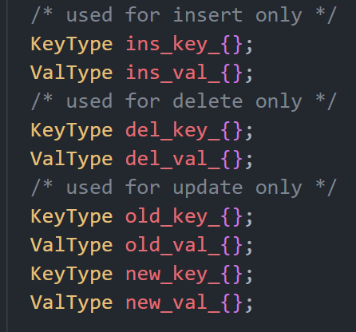

而对于一条日志，构造的主要流程如下：
1. 创建一个新的lsn
2. 利用日志的相关信息（操作类型、lsn、事务id、prev_lsn）创建一个日志
3. 根据操作类型的需求，对对应的变量进行修改（例如对insert操作，需要记录ins_key与ins_value在日志中）

### Chapter 6.2: 恢复模块设计

该模块中，主要工作为模仿ARIES恢复算法作出Redo和Undo，而Undo的具体操作为对每一行进行Rollback.这里会对这三个函数进行具体阐述：

1. void RedoPhase():
   - 目的：从checkpoint开始，一直到末尾进行Redo操作。
   - 实现方式：
     - 1. 获取日志目录中的最近checkpoint对应的迭代器（这里最近的checkpoint已经在init中被初始化好了）
     - 2. 从checkpoint开始，对每一个日志记录进行对应的数据库实现，同时修改活跃的事务状态（就是字面意思，例如Insert就是向数据库中做一遍插入，并将该事务标记为活跃）

2. void UndoPhase():
   - 目的：对当前活跃的所有事务进行undo操作。
   - 实现方式：
     - 1. 对当前活跃的所有事务，调用Rollback()函数进行Undo

3. void Rollback(txn_id_t txn_id):
   - 目的：对一个事务进行回滚
   - 实现方式：
     - 1. 找到该事务对应的日志们（利用prev_lsn_一个一个往回找即可）
     - 2. 对每一个遍历到的日志，进行操作上的反作（例如对Insert要删除对应数据，对Delete要添加对应数据等）

实现上述三个函数后，外部接口可以通过调用RedoPhase()和UndoPhase()实现数据库内容的恢复。

## Chapter 7: Lock Manager

该部分被作为bonus3使用，因此在bonus部分集中说明，请移步Chapter 9: bonus.

## Chapter 8: 测试结果

### 内置test测试

本程序已经通过内置的全部测试，截图如下：
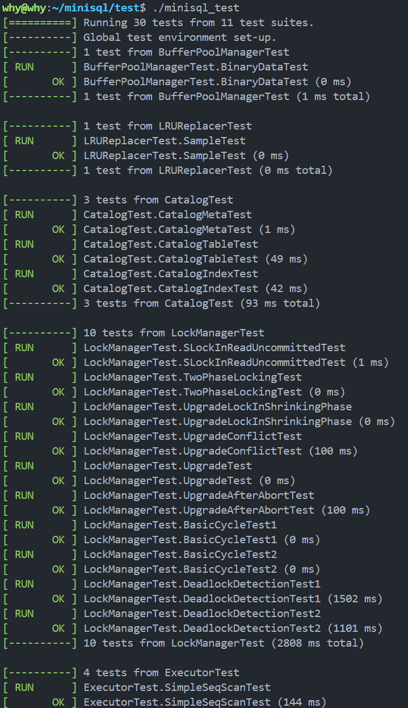

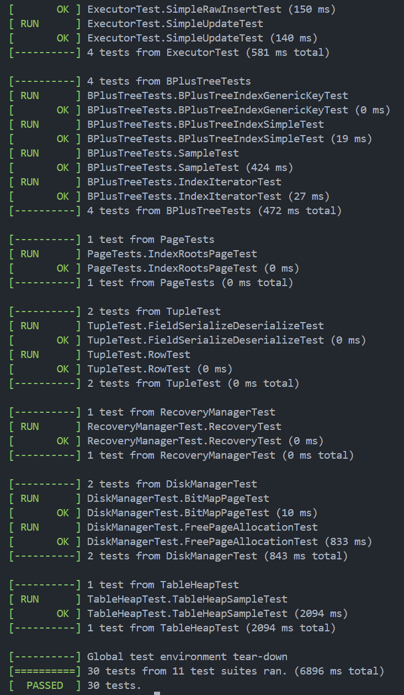

### 场景功能性测试

本部分测试分为两个方面，一是逐步执行第五章列举出的Parser支持的所有语句，二是跟随验收流程进行逐步操作。

#### 语句测试

1. Database相关语句：

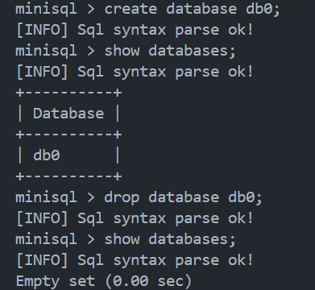

2. table相关语句：

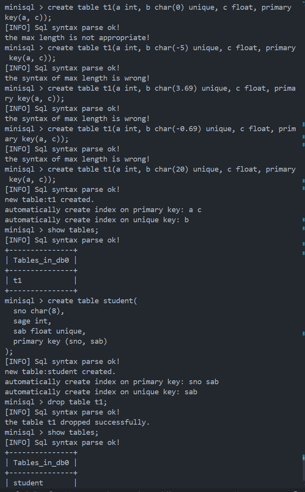

3. index相关语句：

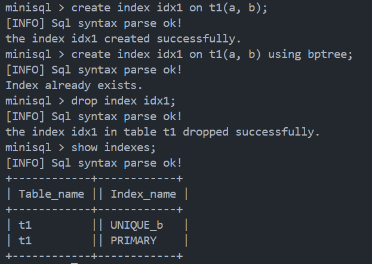

4. select相关语句：在验收流程测试中体现

5. insert相关语句：

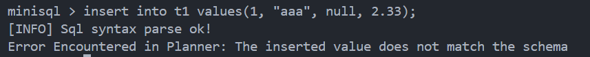

6. delete/update相关语句：在验收流程测试中体现

#### 验收流程测试

本测试将跟随文档中给出的验收流程进行所有测试，并给出相关测试信息。

为了使结果可被展示，因此采用逐个输入语句的方式进行验收而非使用`execfile`语句。

##### 初始化
对如下语句进行考察：
- `create database`
- `show databases`
- `use database`
- `create table`
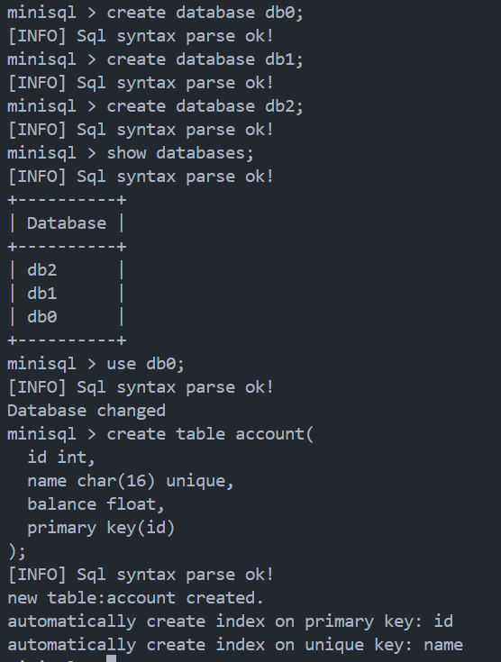

##### 插入
对如下语句进行考察：
- `insert`

**注意：此处为方便测算无索引情况下的插入，因此将先对自动创建的两个索引进行drop，再逐一进行插入。**

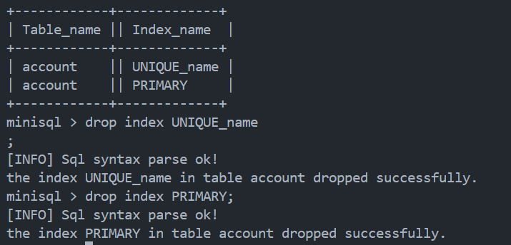

这里将粘贴第一次插入后的效果，并最终列出10次插入每次的执行时间：

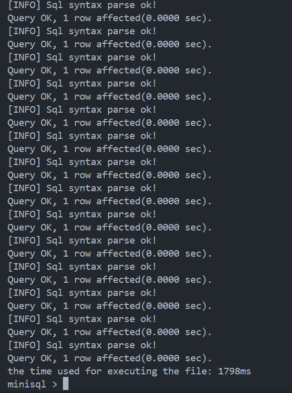

1798
2564
3107
3706
4263
4930
5550
6174
6919
7462

执行全表扫描后，确认100000条数据均被成功插入。

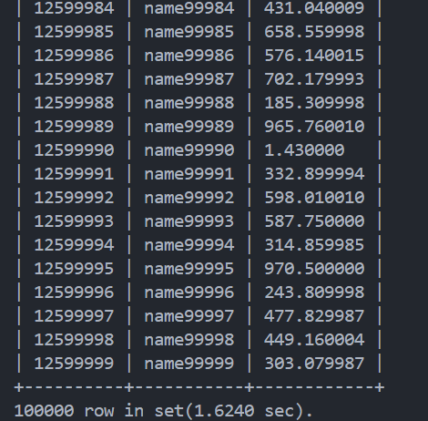

##### 查询
对如下语句进行考察：
- `select`

1. select * from account where id = 12556789;
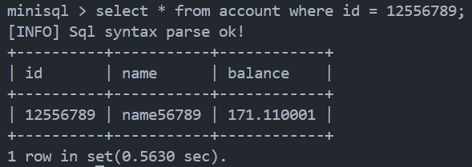

2. select * from account where balance = 100;
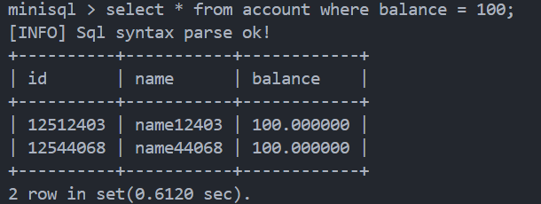

3. select * from account where name = "name56789";

记录t1 = 0.586s:

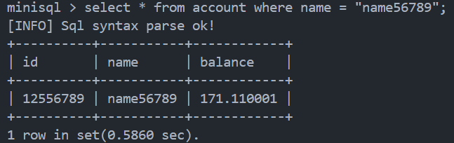

4. select * from account where id <> 12556789;

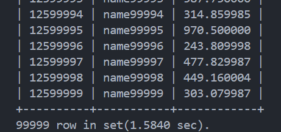

5. select * from account where balance <> 100;

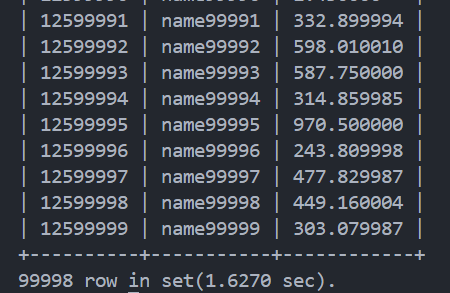

6. select * from account where name <> "name56789";

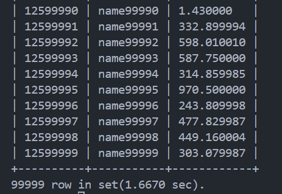

7. select id, name from account where balance >= 0 and balance < 100;

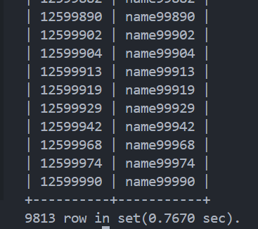

8. select name, balance from account where balance > 100 and id < 12556789;

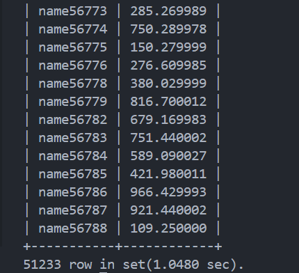

9. select * from account where id < 12515000 and name > "name14500";

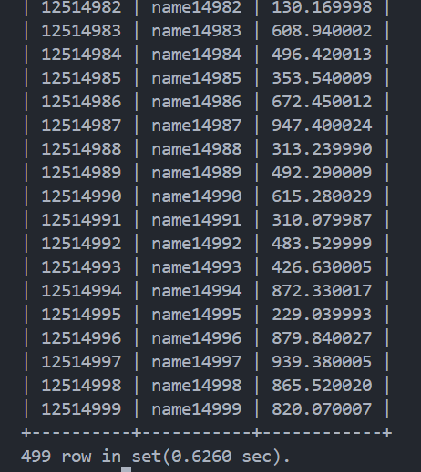

10. select * from account where id < 12500200 and name < "name00100";

记录t5 = 0.609s:

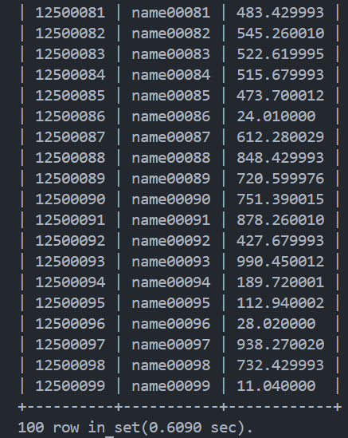

##### 唯一性约束及索引
对如下语句进行考察：
- `insert`
- `create index`
- `drop index`
- `delete`

**注意：在确定唯一性约束是通过索引实现的之后，我们将调整顺序：先创建索引，再确定唯一性约束。在实际情况中，我们会对PRIMARY和UNIQUE自动创建索引以保证唯一性。**

1. create index idx01 on account(name);

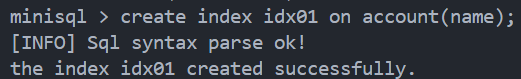

2. insert into account values(1, "name56789", 0);

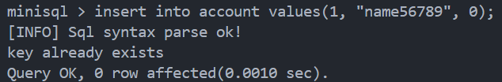

3. select * from account where name = "name56789";

记录t2 = 0.001s:

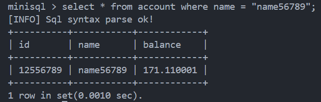

4. select * from account where name = "name45678";

记录t3 = 0.001s:

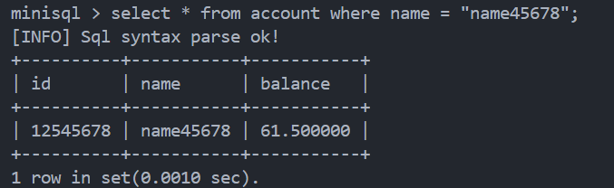

5. select * from account where id < 12500200 and name < "name00100";

记录t6 = 0.017s:

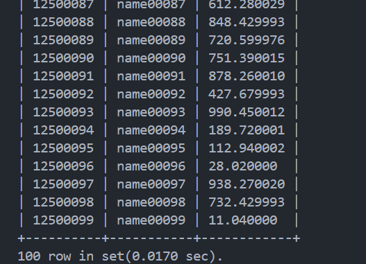

6. delete from account where name = "name45678";

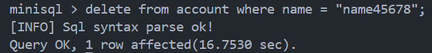

7. insert into account values(0, "name45678", 0);

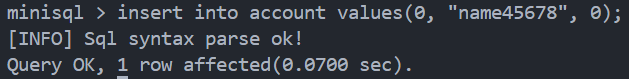

8. drop index idx01;

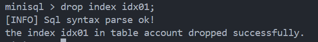

9. select * from account where name = "name45678";

记录t4 = 17.026s:

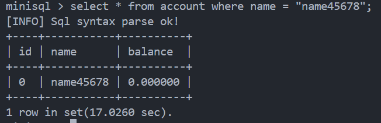

##### 更新
对如下语句进行考察：
- `update`

1. update account set id = 1, balance = 1 where name = "name56789";

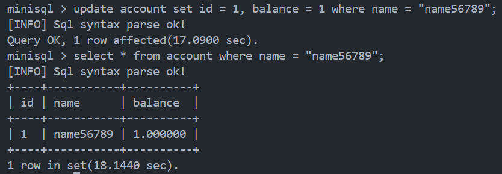

##### 删除
对如下语句进行考察：
- `delete`
- `drop table`

1. delete from account where balance = 100;

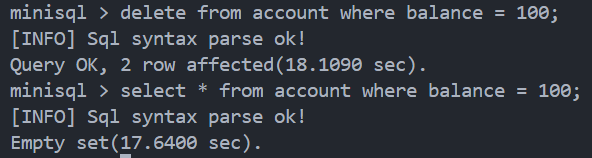

2. delete from account;

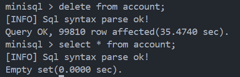

3. drop table account;

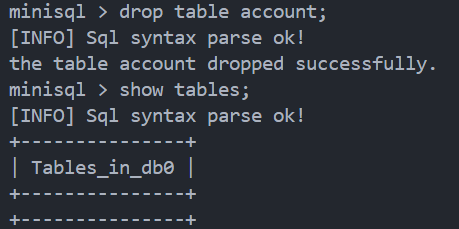

至此，全部测试已经完成。

## Chapter 9: bonus

本实验中已完成了全部的bonus，在此处将分别具体地描述所有bonus的实现方式。

### bonus 1: CLOCKReplacer

涉及代码：
- `buffer/clock_replacer.cpp`
- `test/buffer/clock_replacer_test.cpp`

bonus具体概述如下：

那么我们可以实现一个CLOCKReplacer,从而用一种新的方式进行页替换。

#### Chapter 9.1.1: CLOCKReplacer的原理

时钟替换算法也是一种运用局部性原理进行页替换的算法。它实现的最后效果就是对于每一个可被替换的页，只有在整个列表循环一遍之后才会被选作替换页。

时钟替换算法通过将一个列表“首尾相连”，实现指针走向类似时钟的运行过程。

它的具体操作原理如下：
- 对Unpin而言，将对应的页插入列表中，设置该页状态为1
- 对Victim而言，迭代器从上一次的位置开始，逐一向下遍历，直至找到Victim：
  - 如果指向的页状态为1，更改它为0
  - 如果指向的页状态为0，选它作为victim

#### Chapter 9.1.2: CLOCKReplacer的实现

本节将具体描述CLOCKReplacer类以及各个函数的实现：

0. 类定义
对该类中有如下元素：
- size_t capacity: 替换器的容量
- list<frame_id_t> clock_list: 替换页的列表
- map<frame_id_t, frame_id_t> clock_status: 替换页的状态
- size_t pointer: 迭代器对应位置

1. bool CLOCKReplacer::Victim(frame_id_t *frame_id):
   - 目的：从替换器中选出一个可被替换的页
   - 输入量：无
   - 输出量：
     - 1. frame_id_t *frame_id: 可被替换页的id
     - 2. bool return: 操作成功返回true，否则返回false
   - 实现方式：
     - 1. 如果pointer超出了list的大小，则修改它直至在list范围内
     - 2. 定义一个list的迭代器，并让其抵达pointer所在位置
     - 3. 开始循环：
       - 1. 如果pointer超限则修正
       - 2. 如果pointer所指页状态为0：
         - 1. 令该页为frame_id输出
         - 2. 在list和map中清除相关记录
         - 3. return true
       - 3. 如果pointer所指页状态为1：
         - 1. 修改该页状态为0
         - 2. pointer++

2. void CLOCKReplacer::Pin(frame_id_t frame_id):
   - 目的：传入一个frame_id，将它从list中移除掉
   - 实现方式：字面意思，直接实现即可

3. void CLOCKReplacer::Unpin(frame_id_t frame_id):
   - 目的：传入一个frame_id, 将它加入到list中
   - 实现方式：字面意思，直接实现即可（如果已经存在则不再插入）

4. ize_t CLOCKReplacer::Size():
   - 目的：返回clock_list的大小
   - 实现方式：字面意思，直接实现即可

#### Chapter 9.1.3: 测试效果

本部分中，一方面根据`test/buffer/lru_replacer_test.cpp`改写形成CLOCKReplacer对应的test以外，也可以通过修改`buffer/buffer_pool_manager.cpp`中的构造函数将replacer_改为用CLOCKReplacer实现，从而进行综合测试。

1. `clock_replacer_test.cpp`:

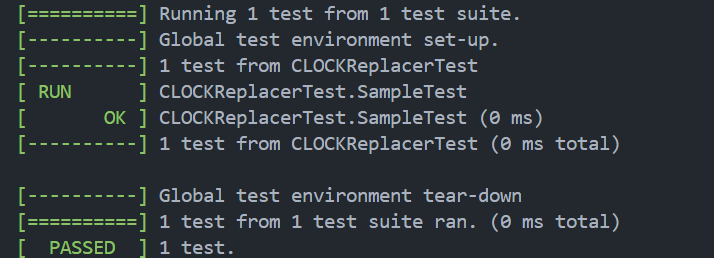

2. `buffer_pool_manager_test.cpp`

在下图中更换替换器后再次运行相关test：

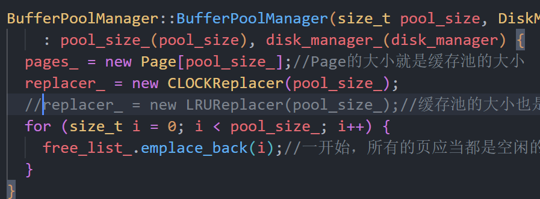

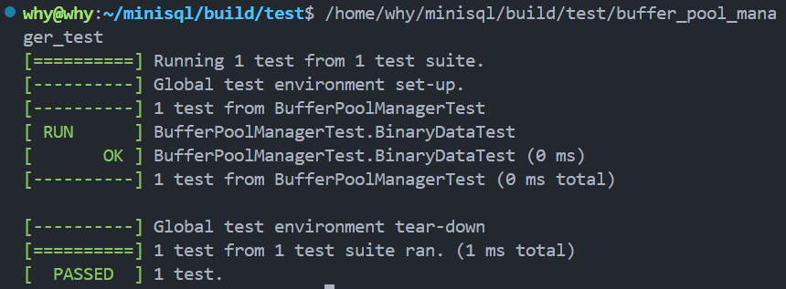

至此bonus 1完成。

### bonus 2: Optimize Table Heap

涉及代码：

- `src/storage/table_heap.cpp`
- `src/include/table_heap.h`

具体要求如下：

#### Chapter 9.2.1: 实现方式概述

本bonus从原则上做的并不够完美（时间过于紧张），但确实做到了bonus要求的所有条件，因此判定本bonus应当完成了。（看在solo的份上放松下判定吧555）

在实现`table_heap`后我们不难发现，它最大的耗时来源在于**insert**操作。

因为对于update与delete，我们都直接掌握了对应的rid，因此可以以$O(1)$的时间内对目标行进行操作。

但insert中，我们需要从第一个页开始进行**Fetch**操作，逐一读取后直到找到能够插入的位置再进行插入。这个时间显然是$O(N)$的，且大多数时间耗费在了**Fetch**操作，也就是涉及到读取文件的操作。

因此，我们可以尝试记录一些关于页的信息，使得insert操作不必进行**Fetch**也可以完成。

#### Chapter 9.2.2: 具体实现

在具体实现时，我并没有采用元数据对相关的数据进行落盘，而是采用了一些缓存中的变量来进行记录。

在这里，我们对table_heap的最后一页的页号进行记录，并且在第一次insert后对最后一页的页号进行更新。为了简化整体的运行流程，我们不再尝试利用*first fit*策略，而是直接插在最后一页之中。

通过这样的方式，我们能够尽可能减少table_heap找到对应页面的时间。

而另一种更为合理且正确的方式，是通过加一个对table_heap中每一个页的剩余空间的映射，来避免Fetch操作的过多次调用。这样虽然时间复杂度仍为$O(N)$，但可以在减少时间的同时保证空间上的连续性。

#### Chapter 9.2.3: 测试效果

可以通过验收流程中的insert数据进行考察。这里分别附上在使用方法前与使用方法后的运行时间：

- 使用方法前：

- 使用方法后：
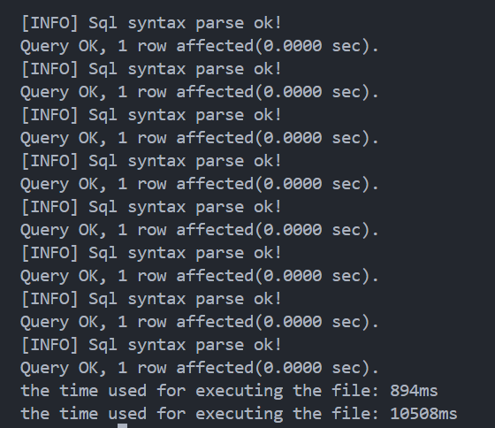

可以看到优化后时间减少了一半，大幅提高了table_heap插入数据的效率。

### bonus 3: lock manager

本bonus主要内容就是实现Chapter 7:Lock Manager

因此我们采用与之前模块介绍的方式对该bonus进行阐述。

**同时，在源代码中我几乎对每一步的代码都有一定的注释，因此也可移步源代码进行查看。**

该部分同样独立于minisql之外，属于一个附属的实验。

#### Chapter 9.3.1: lock manager简述

我们知道，在数据库中每一个操作被视为了一个事务(transaction)，而对于每一个事务，往往会对数据库中的一系列row进行读或写的操作。而这时一旦事务并发，则会出现同时读写/同时写的问题，因此需要通过lock manager对事务之间运行的先后顺序进行管理。

在本lock manager中，采用的是二段锁协议（即事务在growing状态只获取锁，在shrinking状态只释放锁），并且设置有三个隔离等级（读未提交，读已提交，可重复读），从而对共享锁与排他锁的设置进行不同限度的管理。

在[这个博客](https://blog.csdn.net/weixin_51524596/article/details/135497030)中，详细地阐述了三种隔离等级的特征。

接下来将介绍这三种隔离等级以及它们在实际实验中的区别：

| 阶段 | 读未提交 | 读已提交 | 可重复读 |
| :---------: | :-----------: | :-----------: | :-----------: |
| growing | 只可加排他锁 | 可加共享锁/排他锁，可释放共享锁 | 可加共享锁/排他锁 |
| 状态转移点 | 释放排他锁 | 释放排他锁 | 释放共享锁/排他锁 |
| shrinking | 释放排他锁 | 释放共享锁/排他锁 | 释放共享锁/排他锁 |

搞清楚这张表，对于整体lock manager的实现起到了关键的作用。

#### Chapter 9.3.2: lock manager的结构

在本章中，模板已为我们实现了`txn.h`与`txn_manager.h`两个类。其中：
- `txn.h`为事务本身的类，包括：
  - txn_id_: 该事务的id
  - iso_level_: 该事务的隔离等级
  - state_: 该事务的状态（growing/shrinking/aborted/commited）
  - thread_id_: 并行线程的id
  - shared_lock_set_: 共享锁的列表
  - exclusive_lock_set_: 排他锁的列表
- `txn_manager.h`为对事务进行操作的类，其关键方法包括：
  - void Commit(Txn *txn): 对一个事务状态设置为commited
  - void Abort(Txn *txn): 对一个状态设置为aborted

而我们要实现的`lock_manager.h`则是对锁的各种操作，其主要数据为：
- LockRequest类：用于定义单个锁请求
  - txn_id_: 锁所在的事务
  - lock_mode_: 锁的类型
  - granted_: 最终分配的锁类型
- LockRequestQueue类：对一个row的锁请求队列
  - req_list_: 以这个row为目标的所有锁请求构成的列表
  - req_list_iter_map_: 事务id与req_list_中该事务对应的锁请求所在迭代器的映射
  - cv_: 用于多线程中控制waiting等操作
  - is_writing_: 这个row是否正在被写
  - is_upgrading_: 这个row是否正在被进行锁升级
  - sharing_cnt_: 这个row拥有的共享锁数量

我们可以明确如下关系，这对之后的函数实现有较大帮助：

一个row可被多个事务申请锁（形成LockRequestQueue），一个事务也可向多个row申请锁，这些通过上述两个类完成了所有相关数据的管理。

#### Chapter 9.3.3: lock manager的实现

在有了9.3.1与9.3.2的理解后，lock manager的实现会变得轻松很多。

1. bool LockManager::LockShared(Txn *txn, const RowId &rid):
   - 目的：txn向rid申请一个共享锁
   - 输入量：
     - 1. Txn *txn: 事务
     - 2. const RowId &rid: 对应row
   - 输出量：
     - 1. bool return: 成功则为true，否则为false
   - 实现方式：
     - 1. 如果txn隔离级别为“读未提交”，则直接抛出异常，因为对于这种隔离级别是不存在共享锁的。
     - 2. 运行LockPrepare()函数，检测txn的状态等是否正常
     - 3. 获取该rid对应的锁请求队列
     - 4. 在这个队列上加一个共享锁
     - 5. 如果rid正在被写，那么需要等待写操作完成/该事务由于形成死锁被aborted，才能继续进行
     - 6. 如果是被aborted掉而不再wait，则执行CheckAbort()函数抛出死锁异常
     - 7. 到这里则可以真正地分配锁
       - 1. 对事务，在锁集合中插入这个共享锁
       - 2. 对rid，它的共享锁数量+1
       - 3. 对这个锁请求事件，设置“实际被分配的锁”为共享锁

2. bool LockManager::LockExclusive(Txn *txn, const RowId &rid):
   - 目的：txn向rid申请一个排他锁
   - 实现方式：由于与申请共享锁的函数相似，因此不再赘述，具体代码可见源代码。

3. bool LockManager::LockUpgrade(Txn *txn, const RowId &rid):
   - 目的：txn向rid申请锁升级
   - 实现方式：
     - 1. 如果事务状态为shrinking，则直接失败（锁升级应当在growing状态完成）
     - 2. 获取rid对应的锁请求队列
     - 3. 如果rid正有锁处于锁升级过程中，则抛出升级冲突的异常（因为对同一个rid不可能有两个排他锁，这次锁升级必然失败）
     - 4. 设置该锁请求的请求类型为排他锁，分配类型为共享锁
     - 5. 进入等待流程，设置rid正在进行锁升级；它必须等到该rid不处于写状态，且共享锁只有它自己时才能开始进行锁升级。（或者出现死锁）
     - 6. 检测是否出现死锁，若是则抛出异常。
     - 7. 开始升级锁：
       - 1. 将这个事务中rid对应的共享锁删掉
       - 2. 将这个事务中rid对应的排他锁插入
       - 3. 对请求队列，共享锁-1，开始写状态，结束升级状态
       - 4. 更新锁请求的结果

4. bool LockManager::Unlock(Txn *txn, const RowId &rid):
   - 目的：进行锁的清除
   - 实现方式：
     - 1. 获取对应请求队列
     - 2. 通过请求队列，获取这个事务在rid上锁的类型
     - 3. 将事务中对应rid的锁在共享锁/排他锁中删除
     - 4. 对请求队列，删除该事务对应的锁
     - 5. 根据隔离级别分析是否改变事务的状态：如果事务在growing且释放的为排他锁，或者是在可重复读隔离级别的共享锁，都需要改变事务状态为shrinking
     - 6. 更改请求队列状态，如果是共享锁，则共享锁数量-1；如果是排他锁，则写状态结束。
     - 7. 唤醒其他线程，看上述改变是否能够让其他线程分配锁

5. void LockManager::LockPrepare(Txn *txn, const RowId &rid):
   - 目的：检测事务是否在growing阶段，以保证锁分配的前提条件
   - 实现方式：如目的中所言，实现即可。

6. void LockManager::CheckAbort(Txn *txn, LockManager::LockRequestQueue &req_queue):
   - 目的：检测事务是否被abort，是则抛出死锁的异常
   - 实现方式：如目的中所言，实现即可。

#### Chapter 9.3.4: 死锁检测原理及实现

死锁，就是当多个事务互相作为分配锁的前提条件，导致互相等待以至于整个程序卡死的状态。

为了判定是否出现死锁，我们可以通过建立前序图的方式，检测事务之间是否出现环的关系。若是则说明出现了死锁。

为了解决死锁问题，我们可以对最新的事务进行人为abort，从而尝试打开死锁。

而对于检测系统，我们可以设置每x毫秒检测一次，从而避免由于死锁停滞时间过长而影响性能。

在lock manager中，涉及到的变量如下：
- waits_for_: 整个前序图的图信息
- visited_set_: 已经访问过的节点集合
- visited_path_: 已经访问过的节点路径
- revisitied_node_: visited_path_中出现环的起止节点
- enable_cycle_detection_: 是否启用环检测
- cycle_detection_interval_: 环检测的频率

函数实现如下：

1. void LockManager::AddEdge(txn_id_t t1, txn_id_t t2):
   - 目的：在图中加入一个从t1到t2的边
   - 实现方式：在waits_for_加入即可

2. void LockManager::RemoveEdge(txn_id_t t1, txn_id_t t2):
   - 目的：在图中删除一个从t1到t2的边
   - 实现方式：在waits_for_中删除即可

3. bool LockManager::HasCycle(txn_id_t &newest_tid_in_cycle):
   - 目的：检测图中是否有环，如有则返回在环中的最新事务id
   - 实现方式：
     - 1. 清空visited系列记录
     - 2. 通过waits_for_图，获取所有的事务id
     - 3. 对每一个事务id，进行DFS()调用查看是否有环（这是因为图不一定是连通的）
       - 1. 如果有环，则从visited_path_中反向寻找revisited_node_，从而在过程中遍历这个环的所有节点以找到最新的事务id
       - 2. 将事务id存在newest_tid_in_cycle,并返回true
     - 4. 如果没环，则返回false

4. void LockManager::DeleteNode(txn_id_t txn_id):
   - 目的：删除图中的一个事务节点
   - 实现方式：
     - 1. 删除以这个节点为起始点的所有边
     - 2. 查询事务中所有共享锁，如果共享锁所在rid中有请求的granted_为未分配锁，则删除以这个节点为终点的边
     - 3. 查询事务中的所有排他锁，与2的原理一致，删除以这个节点为终点的边

5. void LockManager::RunCycleDetection():
   - 目的：外层接口，通过调用该函数启动环检测
   - 实现方式：
     - 1. 如果开启了环检测开关，则开始循环
     - 2. 先根据环检测的频率进行停滞
     - 3. 遍历lock_table_中的每一个rid，如果同时存在无锁和有锁的，那么就需要先做有锁的事务，再做无锁的事务，因此从有锁到无锁形成了一条边。将它加入到图中。
     - 4. 对形成的图，调用HasCycle()检测环，如果存在环则将返回的最新事务从图中删除，并标注其状态为aborted;同时唤醒其他所有事务重新尝试分配锁，之后重复4，直到图中没有环为止。
     - 5. 清除这个图

6. bool LockManager::DFS(txn_id_t txn_id):
   - 目的：通过DFS检测以txn_id为起点的图是否有环
   - 实现方式：用正常的DFS检测即可

完成上述函数后，我们即可实现死锁的检测。

#### Chapter 9.3.5:测试效果

已通过lock_manager_test对应的全部测试：

## Chapter 10: 小结

终于打到这里了Orz

选择solo掉这个大实验需要较大的精力与代价（点名批评某软工专业课，在我完成minisql的同时追着我砍x），但整体上看这个实验的框架和模板，在大部分章节中都给了我相当大的启发。包括对于底层存储逻辑的严谨的数据类型的选取，以及底层与上层之间接口的相互调用与连接，让我感受到一个真正的“工程”的搭建过程。

对于完成时间而言：
- Chapter 1、2: 一周左右（也许和五一有关x）
- Chapter 3: 大约需要2周甚至更长的时间
- Chapter 4、5: 各自只需要1-3天即可
- 最终的联合调试: 往往可能会一直持续到验收之前x
- Chapter 6: 1天足够
- bonus 1/2: 各自30分钟到1个小时，理解内部运作逻辑后做的会很快
- bonus3: 1天左右，重点是理解这个模块的原理，实现本身并不很难
- 实验报告(?): 建议边打代码边写x

对于为大多数人所“不解”的索引部分，个人认为最关键的原因在于这个B+树索引是通过**3个cpp文件**共同完成的，而在实际设计中，同一cpp文件内的函数之间，以及不同cpp文件的函数之间还存在着层级调用关系。这就导致在实现这部分时往往会出现对函数功能的理解问题，写完函数后发现下一个函数就是刚才写的东西中的某一部分的实现。

因此认为这一部分不再应该大体地用**文件名**来划分完成顺序，甚至应当细化到每个**函数**的完成顺序，并且对每一个函数应当阐述明确它完整的作用，以免在完成函数时过度完成或未完成（例如对于叶子节点的“插入”操作，它真的只是插入一个节点，至于之后的分裂等等操作都不需要这个函数考虑）。

在Chapter 3中，我以**插入**、**删除**、**查询**三个功能，详细列举出了从上层到下层调用所有函数的过程。对于这一部分，必须首先对整体流程有一个大体的了解，才能够有较好的完成体验。（希望对实验文档有一定的补充意义）

（其他的一些小提议以"NOTE"为开头标注在文档之中，可以ctrl+F查看

总体而言，数据库这门课实验部分的课程体验还是蛮好的（可以与FDS的体验拼一拼了），但期末的课程体验还没说法（x