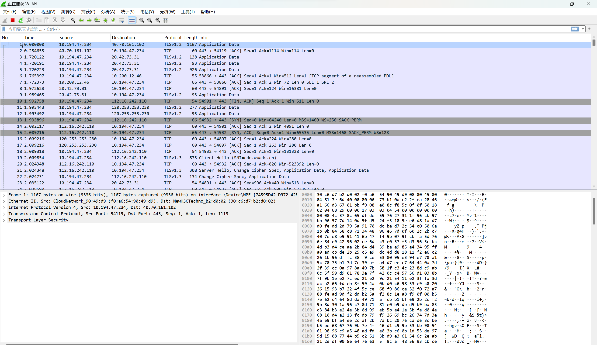
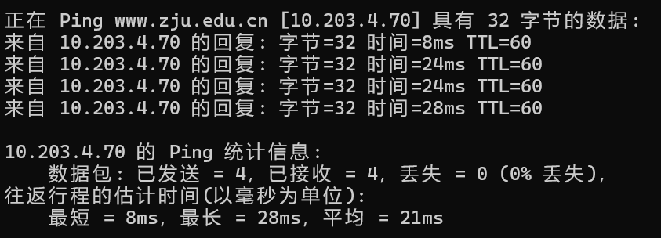
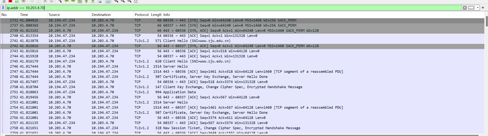
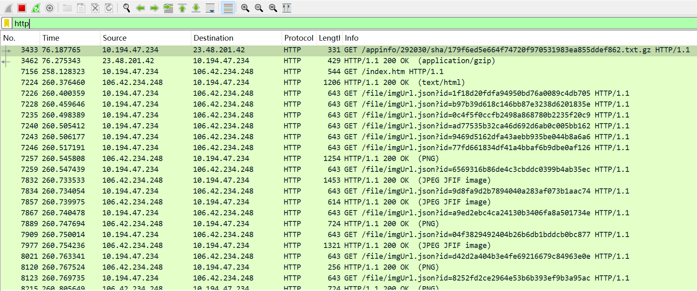
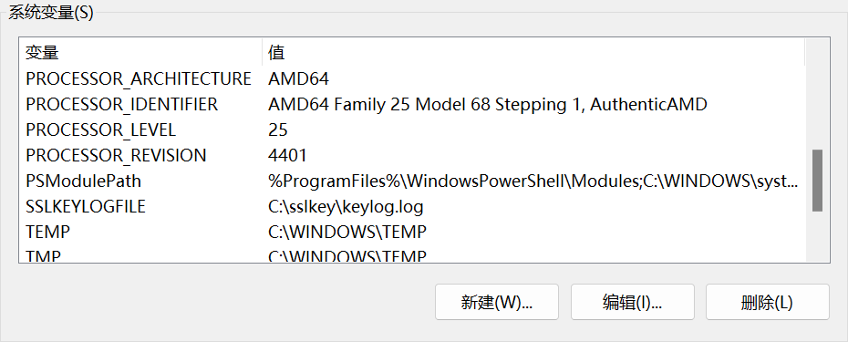
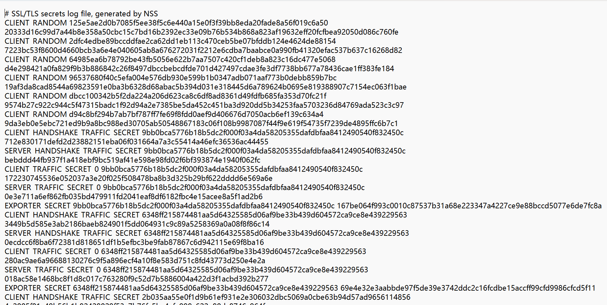
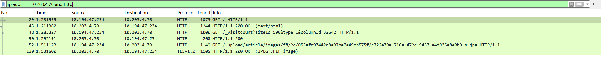
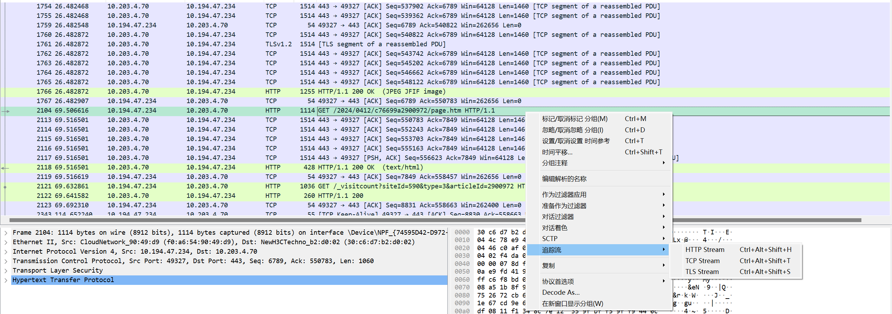
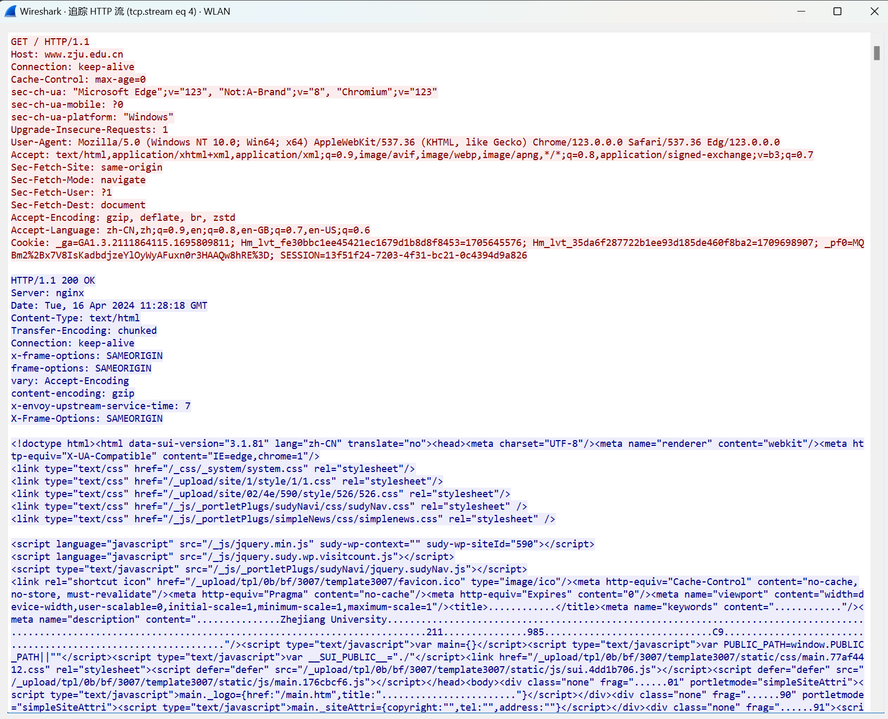
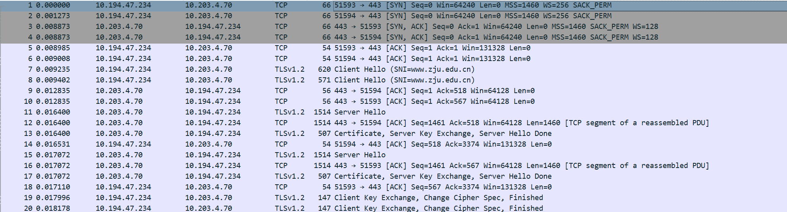

	HW4: Wireshark

	Name: Wang Haoyuan

	StuID: 3220105114

> 考虑到报告描述等问题，本报告采用中文书写

### 实验目的

本实验的目的为：通过WireShark对网址“https://www.zju.edu.cn” 在访问时传输的数据包进行抓取，并且做出分析。

在本报告中，成功抓取到其作为https加密后的数据包，并根据服务器密钥对其解密，最终获取到HTTP属性的包。

### 实验流程

#### step 1: 下载WireShark，选择"WLAN"(WIFI路由)作为线路，并尝试第一次抓取：

此时抓取的是在线路中的所有数据包，包括其他网址发送的包，因此数量较大且难以整理。

#### step 2: 采用显示过滤器，对获取的数据包进行筛选：

通过ping目标网址，可以获取到对应网址的IP地址为：10.203.4.70

在抓取数据包前，使用捕获过滤器对抓取范围进行限制（只抓取src或dst为这个IP地址的包）

或在WireShark页面抓取数据包时，在显示过滤器中输入"ip.addr = 10.203.4.70"，即可筛选出对应网站与主机之间的数据包传输情况：

此时能够看到server与client之间建立联系的TCP数据包，包括数据传输请求的数据包。

但是发现此时获得的包只有TCP/TLS类型，并不能够获取到传输过来的HTTP包，换言之并没有真实数据的数据包。

#### step 3: 对比HTTP与HTTPS，对发送来的HTTPS进行解密并获取数据包：

通过检验发现，WireShark需要提供一些密钥数据，才能够对HTTPS包进行解密。

此处，以一个HTTP网站为例（http://www.jiujiezixun.com/index.htm）：（这个网站是在百度上随便找的，现在绝大多数网站使用的都是https）

对该网站进行step 1/step 2的操作，结果如下：

发现此时获取到了很多HTTP文件，包括一些图片与文字数据。

现在则需通过配置SSLKEYLOGFILE，人为记录浏览器交互时的解密过程，将这些信息传送给WireShark使其能够解析HTTPS包。

1. 在环境变量中设置：SSLKEYLOGFILE

2. 重启浏览器，访问目标网址以记录相应的信息

3. 启动WireShark，在protocol-TSL中加入这个文件，并再次抓包：

效果如下：（对HTTP）

现在可以清楚地看到GET请求的传输与响应过程，以及传输的图片数据包等等信息了。

#### step 4: 对数据包进行分析：

##### HTTP网页分析：
我们在网站上随机打开一篇文章（https://www.zju.edu.cn/2024/0412/c76699a2900972/page.htm）

然后对对应的GET请求进行追踪：

HTTP追踪：可以看到GET请求与响应的具体信息（包括整个页面的html文件）：

##### TCP协议分析：
我们看在主机发送GET请求前，双方互相发送的20条TCP/TLS请求：

很明显地看到，主机端口51593, 51594分别与目标端口443进行了三次握手（即1-6条）。

但具体为何主机端口会有两个，并不太清楚，就搜索到的信息而言可能是网络延时或是出现了并行访问。

之后的一些条目即规范化的“互相打招呼”，并且确认数据包传输的加密方式（这也是https的特征）

在这之后，二者就开始传输数据了。
