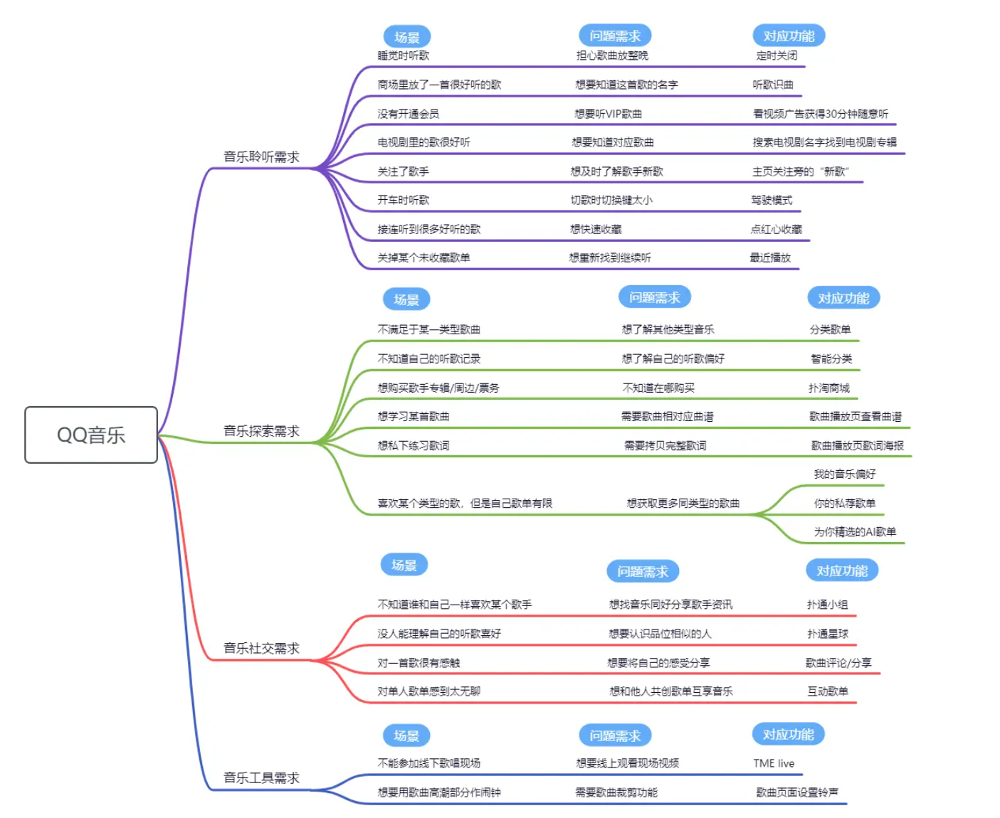

	信息理论调研报告

	浅析信息论在软件工程分析中的应用

	姓名：王昊元

	学号：3220105114

## Chapter 1: 引言

本调研报告将基于软件工程本质的特点，结合自然语言处理、文本分析等领域知识，结合实例调研，对信息论在软件工程中的分析作用进行论述。

## Chapter 2: 领域概述

### 1. 信息论

信息论领域将不再过多赘述。在本文中，我们将主要用到信息论中对信息量、信息熵等概念的定义。

### 2. 软件工程

软件工程领域隶属于计算机技术。不同于面向计算机底层架构与设计的计算机科学与技术专业，软件工程更侧重于软件设计时的协同分析与工程开发。软件工程将软件开发分为四个环节：需求分析->软件设计->实际编码->测试发布。在每个环节中，对于位于软件开发体系不同位置的角色，例如用户、需求分析方、管理方、编码方等，需要通过大量的信息进行交互，从而完成设计框架以及理念的同步。换言之，计算机科学与技术更侧重于“人”与“机器”的交流，而软件工程更侧重于“人”与“人”之间的交流。

在信息传递的过程中，尤其是在人与人之间的交流中，如何快速地提取关键信息、理解信息本质并作出响应，将是软件开发过程中提升效率的有效途径。因此，本文尝试从文本信息出发，结合“QQ音乐”实例，对软件开发的**需求分析**环节结合信息论相关知识进行分析，并尝试进一步通过多模态的手段处理音频、视频等信息来进一步优化整体方法。

## Chapter 3: 实例概述与分析

### 1. QQ音乐概述

QQ音乐是一款音乐播放类软件。受众群体广泛。

经分析可知：QQ音乐采集需求的方式有如下两种：
1. 通过官方提供的渠道进行反馈：

2. 通过用户使用QQ音乐的时间、地点、听歌范围、听歌时长等信息获取隐性需求。

在需求分析中，QQ音乐可被分解为如下需求层次：

### 2. 结合信息论进行进一步分析

首先，根据上述分析，我们可得到QQ音乐的四大方面的需求层次：
- 音乐聆听需求（基本的听歌需求）
- 音乐探索需求（基于用户的听歌喜好发掘用户可能喜欢的歌曲，以及歌曲衍生需求）
- 音乐社交需求（用户社交需求）
- 音乐工具需求（与其他软件、其他方式听歌的兼容性）

由于由用户以自然语言方式给出的反馈往往叠加多个需求，并且掺杂有较多的冗余信息等。**这些反馈很难形成有效的需求，因此应当被排除。**因此我们尝试通过信息论的相关知识来对反馈数据集进行初次过滤，从而提取出更明确的需求。

在信息论中，我们对事件的**自信息**以及**信息熵**进行了定义。简而言之，一个事件发生的概率越大，则该事件的信息量越大。

在本例中，我们可以将每个用户的反馈看作一个事件，并基于已有的自信息与信息熵的定义对其下层属性进行设计：一个用户提出的反馈越靠近需求主层次，语义表述越明确，则其作为**有效信息**的概率越大，则对应的信息量越大。

### 3. 具体实践与设计

我们需要对每一个反馈在概率空间中的概率进行设计。而具体的数值可以通过自然语言处理以及大语言模型进行计算。这里为了简化模型，我们先用word distance模型进行设计。

word distance是一个用来衡量两个单词之间的相似程度或距离的指标。在自然语言处理领域，word distance 可以用来衡量两个单词在语义上的相似度。

我们可以建立单词数据集$J$，其中包含分析得到的需求主层次以及衍生的关键词（诸如听歌场景、会员充值等）作为对照数据集。

对每一个反馈数据集中的数据$j$，计算它与单词数据集每一层次模块的word distance：$d_{jpk}$，其中$p$为层次模块，$k$为层次模块对应条目。

计算$D_{jp} = \frac{\sum_{i=0}^nd_{jpi}}{n}$（或更合理的均值函数）作为该反馈在$p$功能模块中的得分。

计算$q(j) = sigmoid(max{D_j})$，作为该反馈的概率函数（在具体实践中也可换用其他激活函数进行尝试）。显然，$q(j)$越大，说明该反馈对需求的表述越为清晰明确。

将概率函数应用到信息量与信息熵的计算中，即可对$I(j)$,$H(j)$进行分析，从而得出更细致的信息作为判据。同时，我们也可以根据同一类用户发出的不同反馈进行互信息的计算，从而获取某一类别用户的共同需求。

在最简单的模型中，我们直接取用$I(j)$最大的反馈进行进一步的自然语言处理（或人工处理），即可大幅提升反馈处理的效率。

## Chapter 4: 实例延展及总结

> 由于文本字数限制（1000字左右），这里只对可能发展的方向做出简要描述。

### 1. 实例延展：

基于QQ音乐的实例，我们可以进一步发掘信息量与信息熵等定义在文本处理中的作用。例如谣言判别、有效信息即时获取等。

同时，通过$I(j)$与$H(j)$的信息论代数分析，也可以对信息中隐性的共同点进行提取，从而收获意想不到的结果。

进一步，对于音频、视频等数据，我们同样可以通过类似的方法将其转化为信息论中的相关概念，再通过信息论的手段对其进行分析。这对多模态的发展也将有一定的启示意义。

### 2. 总结：

本文主要概述了软件工程需求分析中，对用户需求进行自然语言处理时通过信息论的方式对反馈信息进行分析，寻找信息量化分析的可能，从而浅析了信息论在软件工程专业中可能的发展方向。

## Chapter 5: 参考文献

> https://maimai.cn/article/detail?fid=1725830835&efid=E5uoLQLa_y5WJr7rSz702g

