<div align='center'>
	<font face = "Arial" size="6">Security Programming</font>
</div>

<div align='center'>
	<font face = "Arial" size="5">Lab 1.1 & Lab 1.2</font>
</div>

<div align='center'>
	<font face = "Arial" size="5">Wang Haoyuan</font>
</div>

<p style="page-break-before:always;"></p>

# lab 1.1 前置环境安装

## Java

对Java由于在之前已经安装过，因此只需要验证其是否处于环境变量中，并且可以成功查看版本号即可：

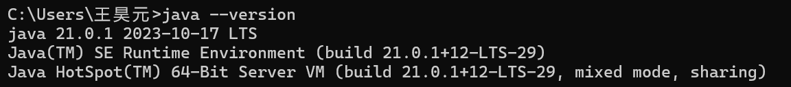

## Tomcat

对Tomcat，需要对安装包进行下载并且进行最基础的配置，最终的效果是可以在本地的8080端口看到初始化的前端页面：

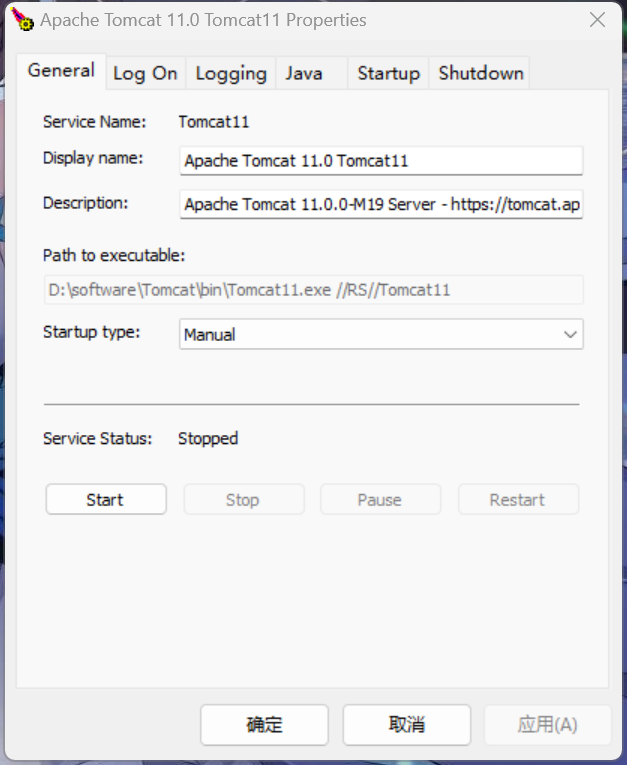

点击"start"后可以在浏览器中打开locathost:8080对页面进行查看：

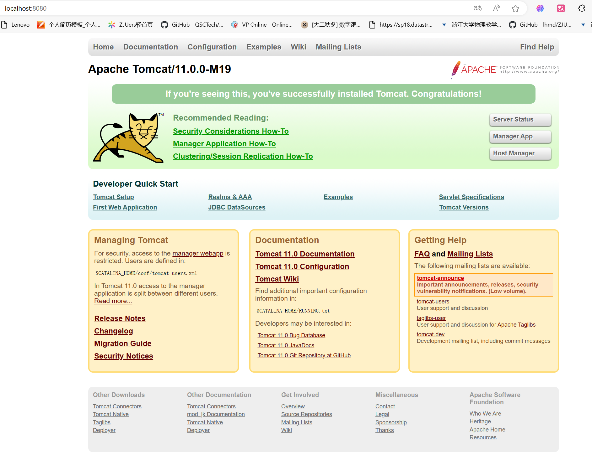

## Eclipse

对Eclipse，由于镜像速度慢等问题，直接下载了package而非安装驱动程序。

在经过诸多尝试（例如VScode + Java + Tomcat）等后，最终还是确定用Eclipse + Tomcat来做这个实验。

（其中碰了巨多的钉子，各种插件安了好长时间才调试好）

那么现在需要实现一个能够将"hello world"展示在网页上的前端。

通过如下步骤：
- 连接Eclipse与Tomcat
- 创建新的服务器
- 建立新的webapp
- 编辑webapp中内容
- 将webapp加入到服务器中
- 在对应的链接下查看结果

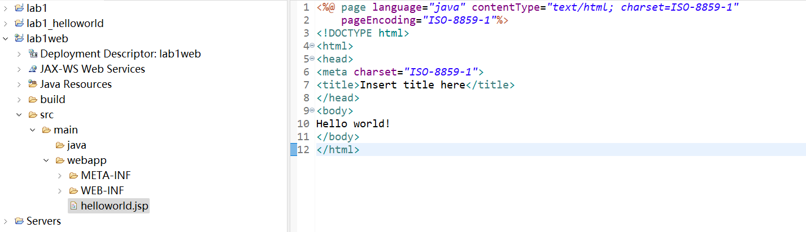

效果如下：

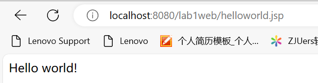

# lab 1.2 web网页设计

由于Java/JSP相关课程在大三设置，并且现在尚且不具备相关知识储备，因此lab 1.2选用了Python的Django库进行web开发。

## 环境配置

在`simpleweb`文件夹中配置一个本前端要用到的环境：`python -m venv env`并将python解释器指向它

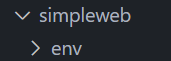

在这个环境下，安装Django库：`pip install django`

之后搭建脚手架并尝试运行初始页面：`python manage.py startproject mysite`; `python manage.py startapp myapp`

同时要记得运行`python manage.py migrate`对功能进行整合

之后在`manage.py`所在目录下运行：`python manage.py runserver`,效果如下：

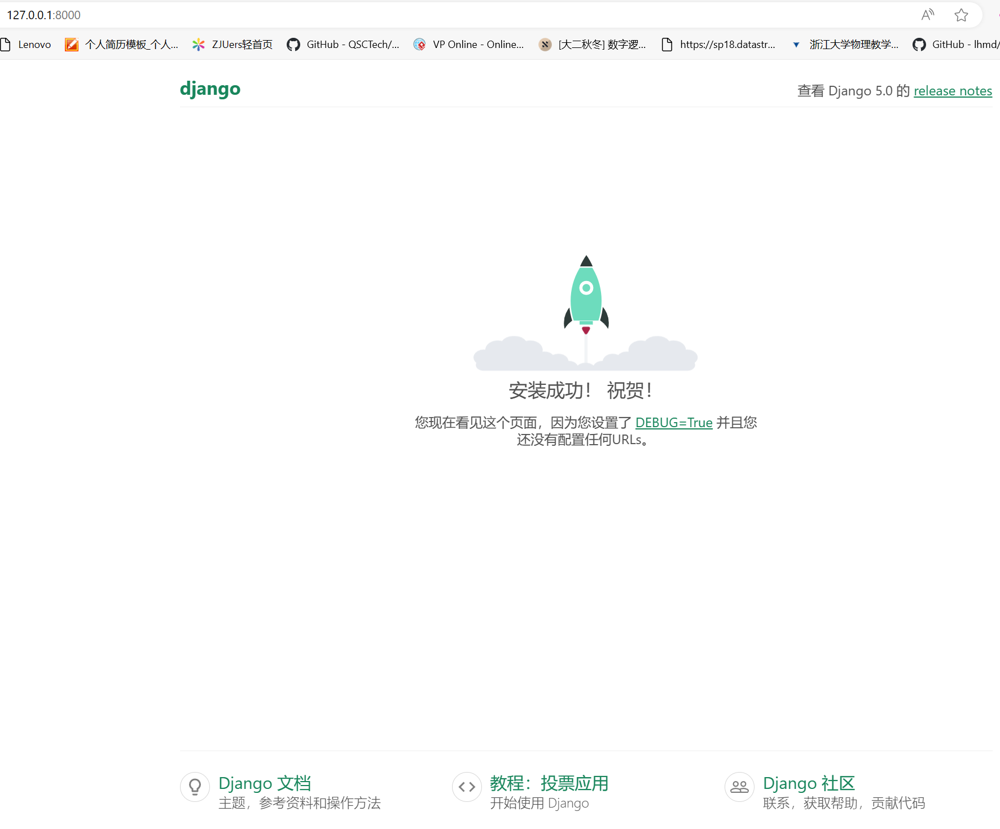

创建一个管理员用户，方便调试：

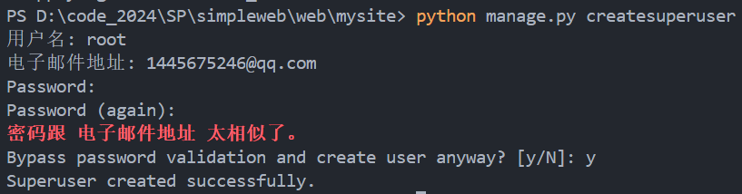

## 系统设计

### 系统概述 (Descript your application scenarios to make the TA know what you want to do.)

本系统以商场售货为例，将设计一个货物信息的展示表，用户可以通过该网页查看货物名称、货物类型、货物价格，并根据需要对货物信息进行增加、修改、删除。本系统还采用了`bootstrap.css`框架进行了美化，使整个页面更为美观。


### 系统设计流程 (How is your application designed)

本系统希望通过前后端协同的方式，由用户在前端发送相关数据，以请求体的方式传递给后端并由后端对数据库相关的内容进行更改，最终将处理结果反馈给前端。

具体的架构图如下：

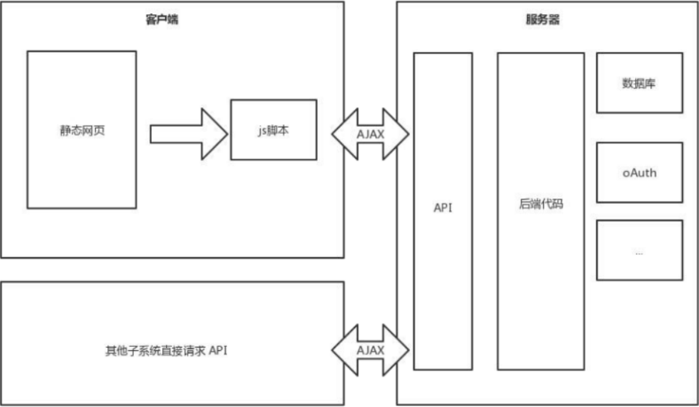

对于提供的四种功能都是同样的流程，功能包括：
- 查看货物（GET）
- 货物增加（POST）
- 货物修改（POST）
- 货物删除（POST）

### 数据库设计 (The database design)

本系统涉及到一个数据表：货物信息；表定义如下：

```python
from django.db import models

class item(models.Model):
	name = models.CharField(max_length = 40)
	type = models.CharField(max_length = 40)
	price = models.FloatField()
```

在数据库中将这样建表：

```sql
create table item(
  id int auto_increment primary key,
  name char(40),
  type char(40),
  price float
)
```

效果如下：

| id | name | name | price |
|----|------|-------|-------|
| 0  | 书本 | 教辅   | 15.5  |

需要注意的是，这里使用的数据库为轻量级数据库`sqlite3`，它需要在进行下载并进行环境变量的配置之后才可使用，此处不再赘述。

而sqlite3会为每一个表自动创建一个属性`id`，这是一个自增属性。

为了使表能够被读取，需要先后输入`python manage.py makemigrations item_manage`与`python manage.py migrate`对数据库进行组织与初始化，并在`migrate`文件夹中生成相应的说明文件，可以通过sqlite3相关语句对表是否被创建进行确认，如下图所示：

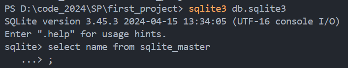

可以发现item_manage_item已被生成：

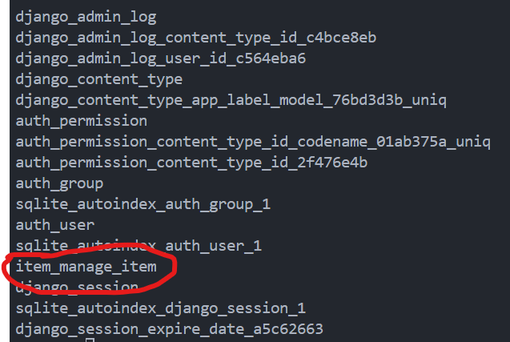

### 总体设计流程 (The procedure of implementation)

#### URL设计 

URL设计在前端设计中是很重要的一步：需要将多个不同的页面用逻辑性较强的方式进行组合：

本例中，使用的URL如下：

(主体url为http://127.0.0.1:8000/),**在使用时直接访问这个地址会出现404 not found，只有加上下列的后缀才可以成功访问！**

- item_manage/: 该项目的主页面（连接`item_list.html`）
- item_manage/create/: 创建新的商品（连接`item_create.html`）
- item_manage/{int:pk}/update/: 更新pk为{int:pk}的商品（连接`item_update.html`）
- item_manage/{int:pk}/delete/: 删除pk为{int:pk}的商品（连接`item_delete.html`）

#### 基础html设计

考虑到事实上html的基本架构是一样的，因此采用一个`base.html`作为html的模板，简化整体的html代码：

```html

<!DOCTYPE html>
<html lang="en">
<head>
  <meta charset="UTF-8">
  <title></title>
  <link href="" rel="stylesheet">
</head>
<body>
  <h1 style = "text-align: center; color:blue">商品库存管理系统</h1>
  <div class="container">
    <div class="row">
      
    </div>
  </div>
</body>
</html>
```

这里，我们将基础的html架构给出，那么其他的html只需要给出`title_content`和`body_content`即可，例如：

```html



商品列表

  <table class="table">
    <thead>
    <tr>
      <th>名称</th>
      <th>类型</th>
      <th>价格</th>
      <th></th>
    </tr>
    </thead>
    <tbody>
    
      <tr>
        <td>{{ item.name }}</td>
        <td>{{ item.type }}</td>
        <td>{{ item.price }}</td>
        <td><a class="btn btn-sm btn-outline-success" href="">更新</a></td>
      </tr>
    
      <tr>
        <td colspan="3">暂无数据</td>
      </tr>
    
    </tbody>
  </table>
  <p><a class="btn btn-primary" href="">添加</a></p>

```

其他页面与这两个例子相仿，因此不再特别给出html源码，可以通过查看源代码获取详细的信息。

同理，对于“增加商品”和“修改商品”，它们的表单格式是一致的，因此采用了`forms.py`以模式的方式来进行管理：

```python
from django import forms

from item_manage.models import Item


class ItemCreateForm(forms.ModelForm):

    class Meta:

        model = Item
        fields = '__all__'

        widgets = {
            'name': forms.TextInput(attrs={'id': 'name', 'class': 'form-control'}),
            'type': forms.TextInput(attrs={'id': 'type', 'class': 'form-control'}),
            'price': forms.NumberInput(attrs={'id': 'price', 'class': 'form-control', 'step': '0.1'}),
        }

        labels = {
            'name': '商品名称',
            'type': '类型',
            'price': '价格',
        }


class ItemUpdateForm(ItemCreateForm):
    pass

```

#### 外部css引用

为了具体体现外部样式表（css）的使用，这里引用了`bootstrap.css`作为css使用的样板。

在相关使用中，我参考了这条博客：https://blog.csdn.net/weixin_63548440/article/details/131414087 学习了具体的操作方式，包括table的建立和button的使用。

由于css的使用深度嵌入html代码中，因此较难展示单独使用css的部分，具体效果可以看“测试样例”部分。

### 部署方式及测试样例 (The deploy process and the test)

#### 部署方式

由于本系统采用的是较为简单的数据库**sqlite3**，同时采用的服务器为Django提供，因此需要部署环境如下：

- Django(latest)
- sqlite3(latest)
- python(latest)

在编写代码后需要依次运行以下两行代码对所有文件进行整合：

`python manage.py makemigrations item_manage`

`python manage.py migrate`

之后运行下面代码，并访问`http://127.0.0.1:8000/item_manage/`进入网页：

`python manage.py runserver`

#### 测试样例


直接在`first_project`文件夹下命令行内运行`python manage.py runserver`,在`127.0.0.1:8000/item_manage/`可看到对应的网页，实例如下：

##### 测试0：查看商品：

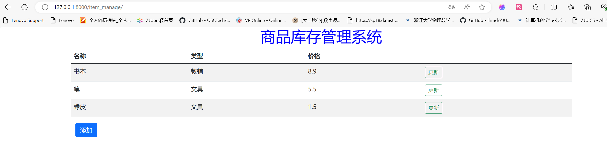

##### 测试1：添加商品：

点击**添加**，并将要插入的物品**桌子**输入：

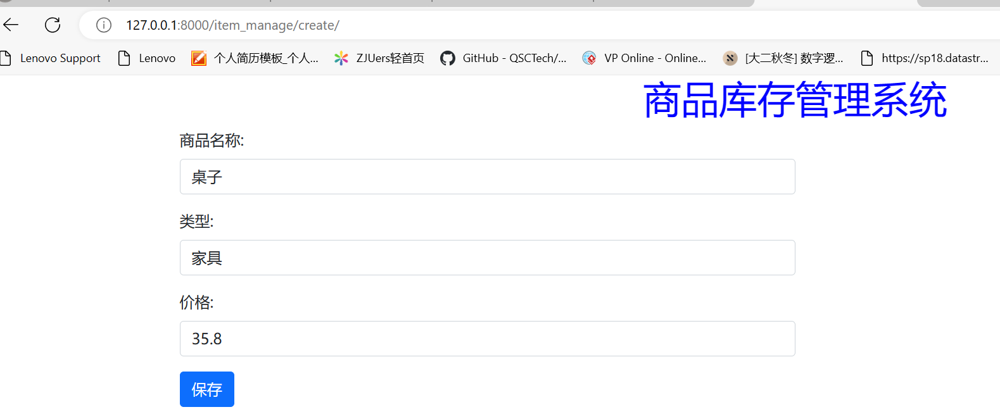

点击**保存**，即可完成添加：

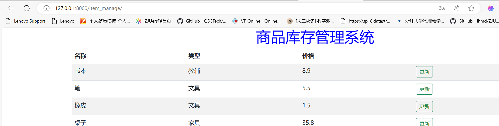

##### 测试2：更新商品：

对书本点击**更新**，并更改其价格为5.5：

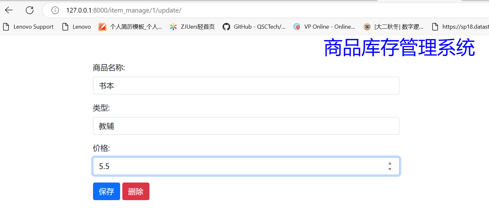

点击**保存**，即可完成修改：

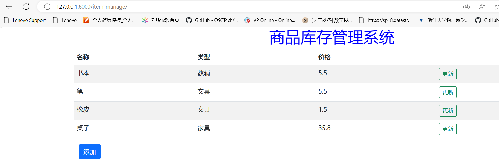

##### 测试3：删除商品：

在橡皮的更新界面，点击删除：

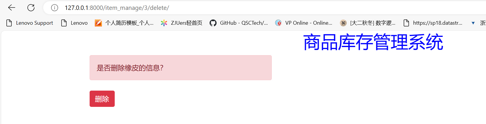

再次点击删除，即可删除橡皮的信息：

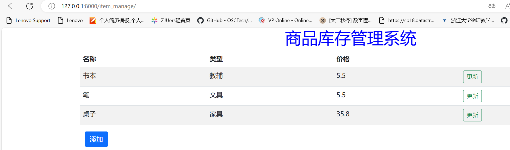

在命令行中，可以清晰地看到表单传递的过程：

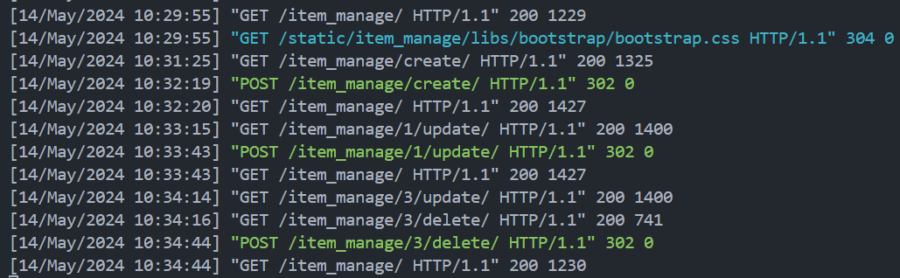

# 小结

本次实验主要是对Java、Tomcat、Eclipse进行安装，并设计一个简单的网页（由于题目的要求为Recommended，并且本实验的主要目的是体会设计web网页过程中的前后端联调与表单提交等问题，因此采用了Django而不是Servlet体系进行建造）。

由于没有任何前端设计的经验，因此本实验我消耗了极大量的时间去重新学习整个前端体系的建构（指B站和CSDN来回跑Orz）

如果希望自行调试，需要安装`sqlite3`，`python`环境，请注意。同时运行`python manage.py runserver`后直接进入8000端口是**404 not found**的，因为网页主页的后缀还需要添加`item_manage/`!