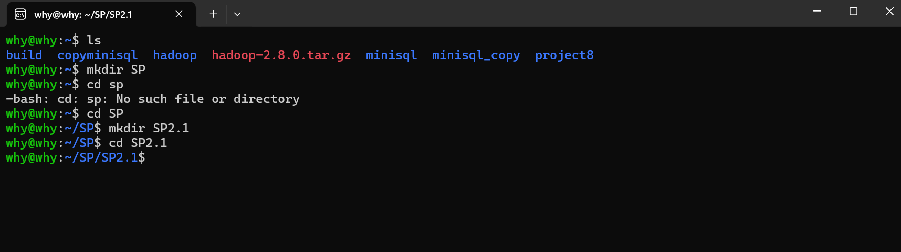
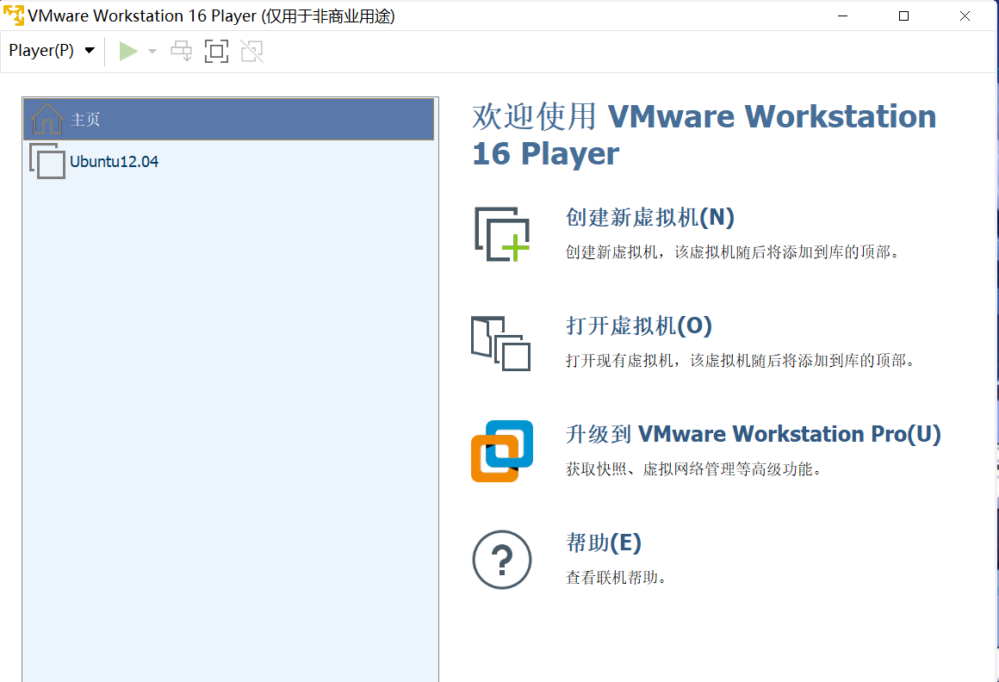
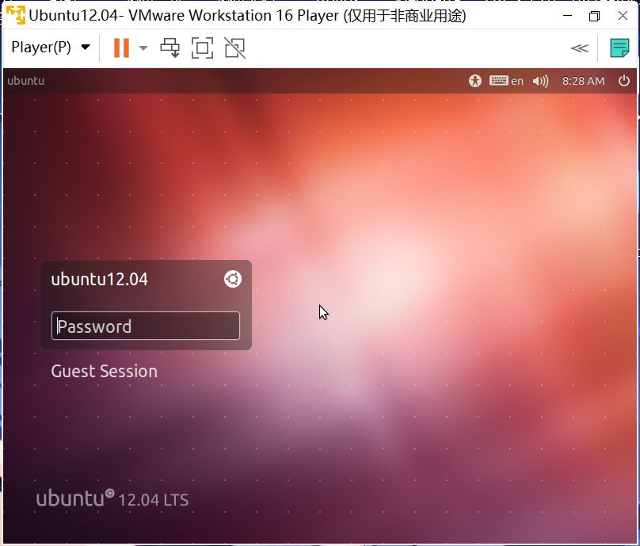
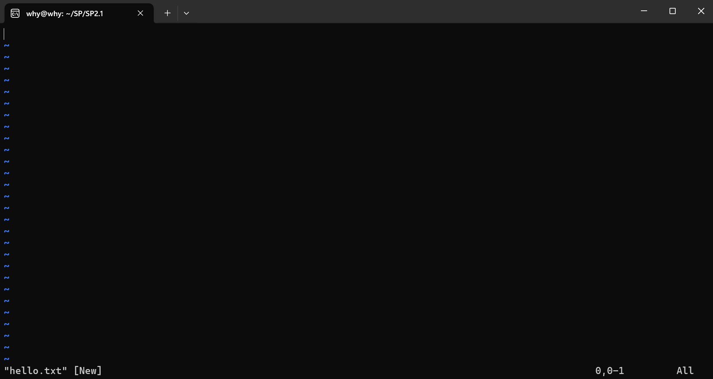
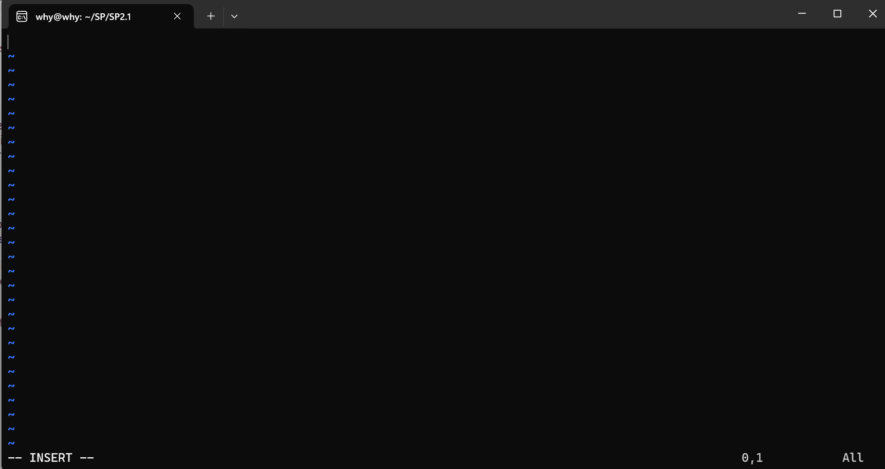
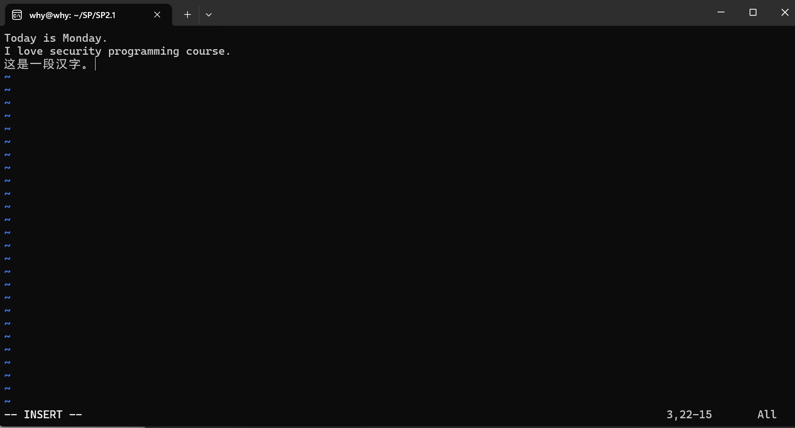
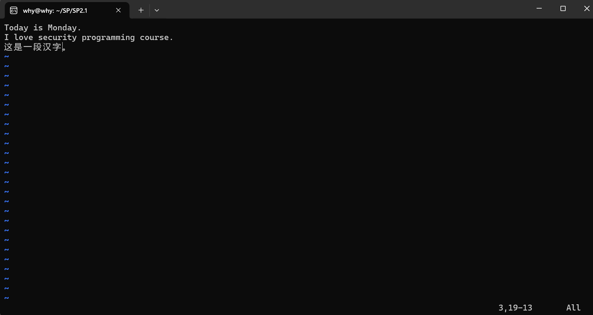
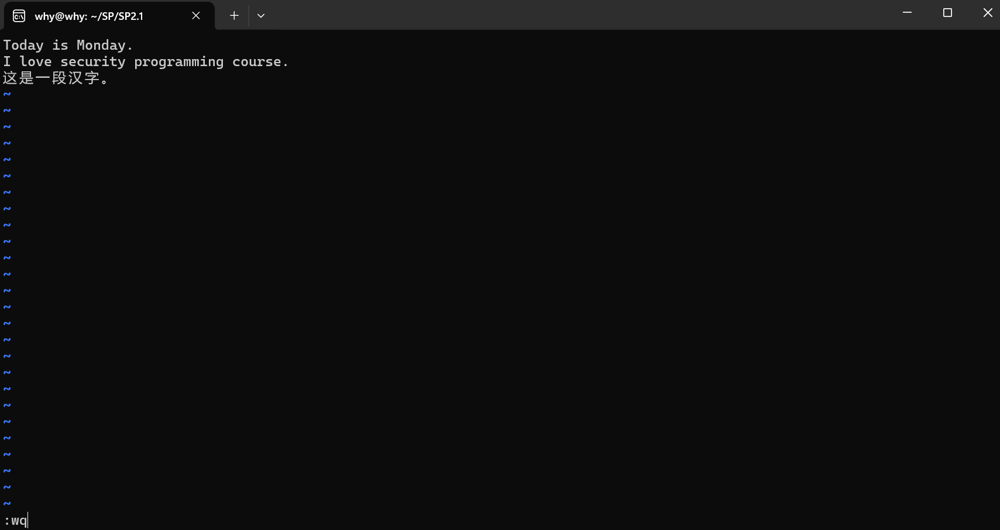
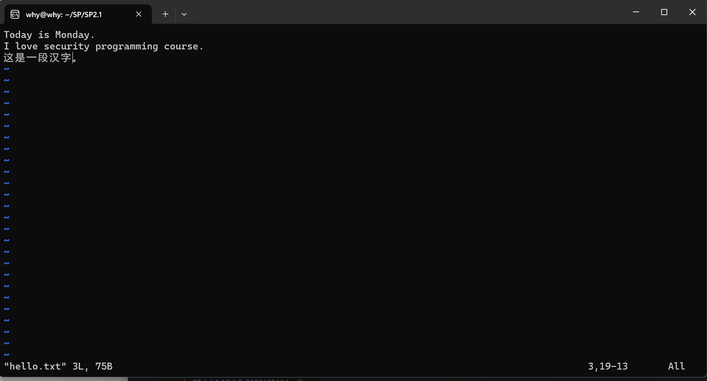
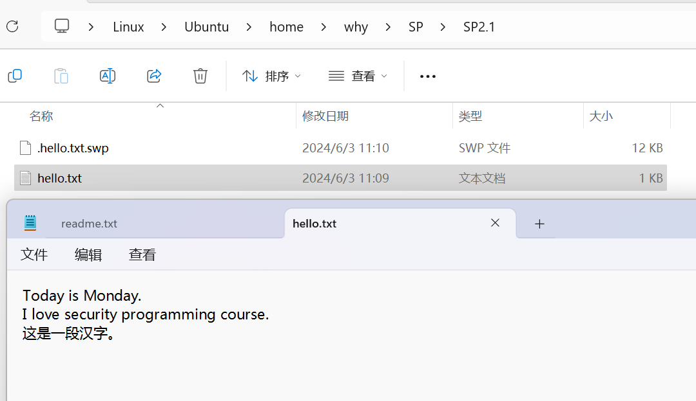

	Security Programming

	Lab 2.1

	Wang Haoyuan

# Lab 2.1: Setting up Ubuntu Linux with VMWare Player

## Step 1: 安装VMWare Player

由于自2024年5月5日起，官网免费版VMWare Player不再在官网内下载而是集成到BoardCom，因此经查阅资料后根据如下Blog步骤进行VMWare Player的安装：

https://blog.csdn.net/axing194/article/details/139172933

> 补充，这里有的版本按钮无法点击是因为没有勾选"accept conditions"选项，这个需要补充一些额外的账号信息。

对它进行安装，即可成功安装VMWare Player。

## Step 2: 安装并配置Ubuntu

由于在《数据库系统》课程中已经对Ubuntu进行了下载、安装与基本的配置，这里直接粘贴成功进入Ubuntu（Linux子系统）的界面：

并且可以使用基本的命令行语句：

如果一定需要通过VMWare Player进行Ubuntu登录，那么这里附上在Lab2.3中在VMWare中配置Ubuntu的图片（具体步骤也可以查阅Lab2.3）
- 下载对应版本的镜像文件
- 直接将镜像文件导入即可

之后可以成功运行并正常登录：

## Step 3: 使用vi进行文本编辑

输入`$ vi hello.txt`后可以发现，进入了vim的编辑模式：

输入`i`后看到底部转化成了insert mode,此时可以输入一些数据：

输入数据后：

此时键入`Esc`，即可回到命令模式：

命令模式中，输入`:wq`为“保存并退出”，`:q!`为“不保存”，这里键入:wq后退出：

我们再次输入`vi hello.txt`进入这个文件，看到内容确实被保存了：

我们也可以直接前往文件资源管理器，通过非命令行的方式验证（这里因为放在普通文件夹内，因此不需要超级管理员权限）：

因此可以验证vi使用成功了。

## 小结

在本实验中，我们实现了在Windows操作系统中安装Linux子系统，从而实现在同一台电脑上使用两种不同的操作系统；同时我们通过使用vi工具进行了文档的新建、编辑与保存。