

	Security Programming

	Lab 2.2

	Wang Haoyuan

## Step 1/2: 打开Ubuntu并创建debug_me.c:

那么先通过vi创建这个文件：
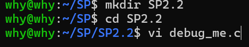

向文件中写入示例代码：

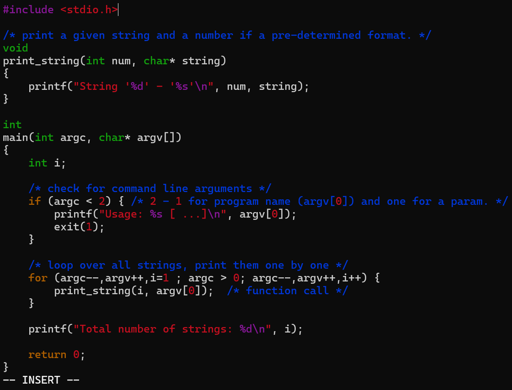

保存并退出：

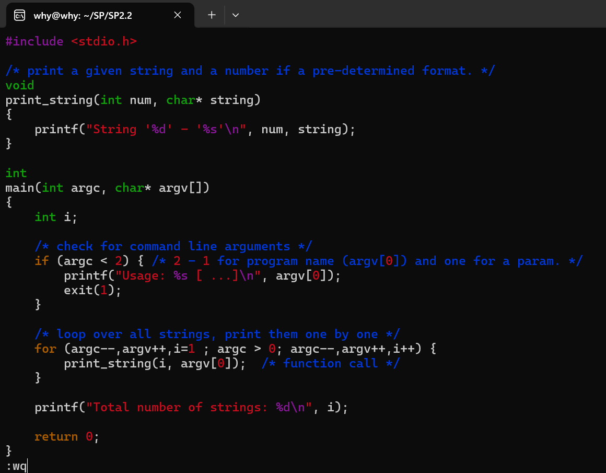

## Step 3: 通过gcc编译该文件后，以gdb打开该文件

由于gcc与gdb在《数据库系统》课程中已经被配置到Ubuntu中，因此这里直接进行相应的操作：

1. 用gcc编译：

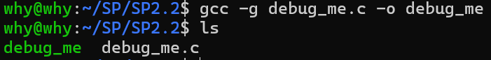

用ls后发现生成了`debug_me`的可执行文件。

> 在编译时，发现代码中exit(1)是在"stdlib.h"文件中出现的，此时更改代码为如下形式后再次编译发现不再有warning：

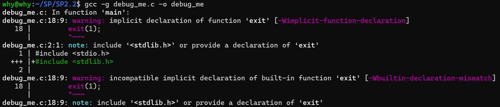

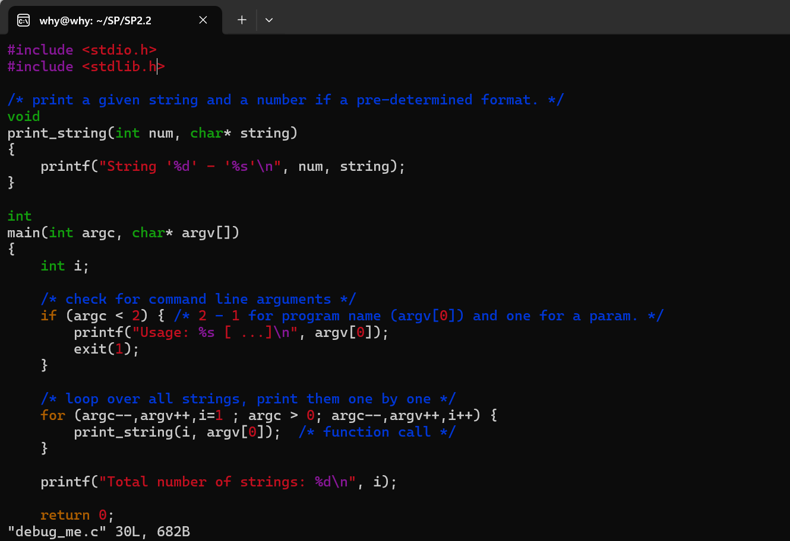

## Step 4: 用gdb对代码进行调试：

### run/r

运行`gdb debug_me`即可调试：

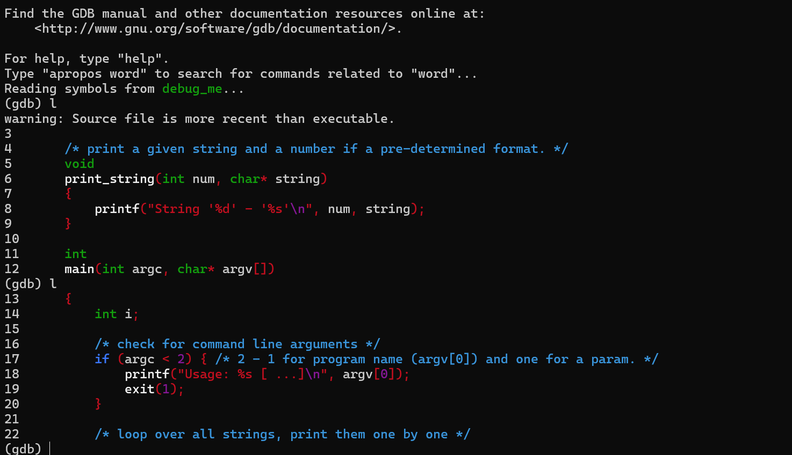

先进行整体的运行（`r "hello, world" "goodbye, world"`）:

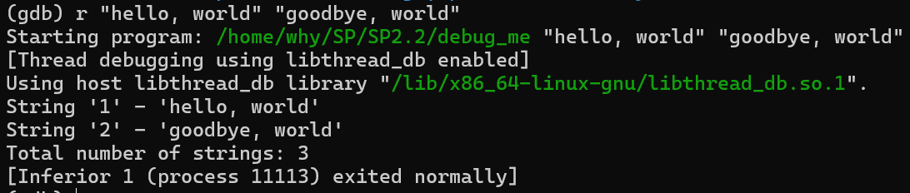

其中包括该程序调用的库（在Linux中，程序库设置在.so文件中），运行的结果，以及程序正常退出的状态。

### break/b

我们可以通过设置断点让程序在某处中止，从而查验具体信息：

输入`b 17`，则代码在当前文件的第十七行中止。

> 也可输入b debug_me.c: 17,则代码在指定文件的第17行中止。

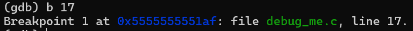

输入`r`尝试运行，发现停在了第17行：

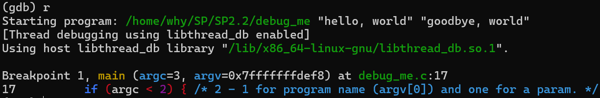

另外也可对函数进行断点设置，则每次调用函数时进行中止程序（相当于在函数的第一行设置断点）：

输入`b print_string`,在上述情况基础上输入`c`，发现停在了函数所在行：

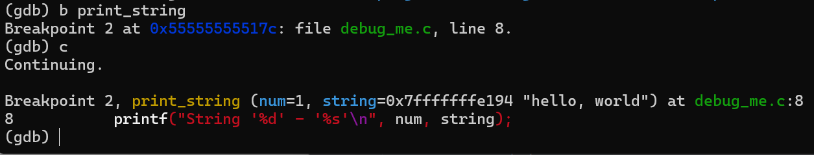

### next/n && step/s

这两个操作符目的都是从断点处向下运行程序，但区别在于：

**next为当前函数的逐行运行，step为整个程序的逐行运行。**

换言之，如果某函数调用了其他函数，则next不会进入其他函数中，只是在所在函数中逐行运行，而step会进入其他函数逐行运行。

下面我们以示例为例进行测试：

设置断点为23并运行：

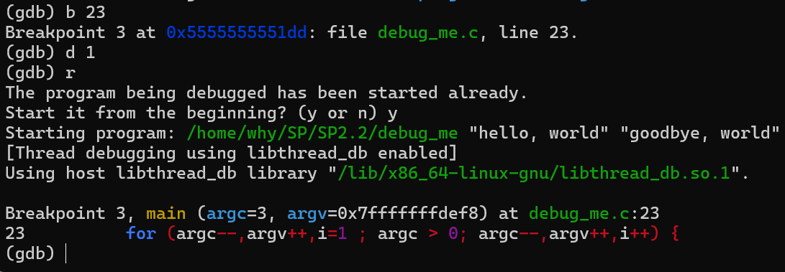

接下来先尝试next方法，发现它只在主函数内部逐行操作，并没有跳转到`print_string`函数内部：

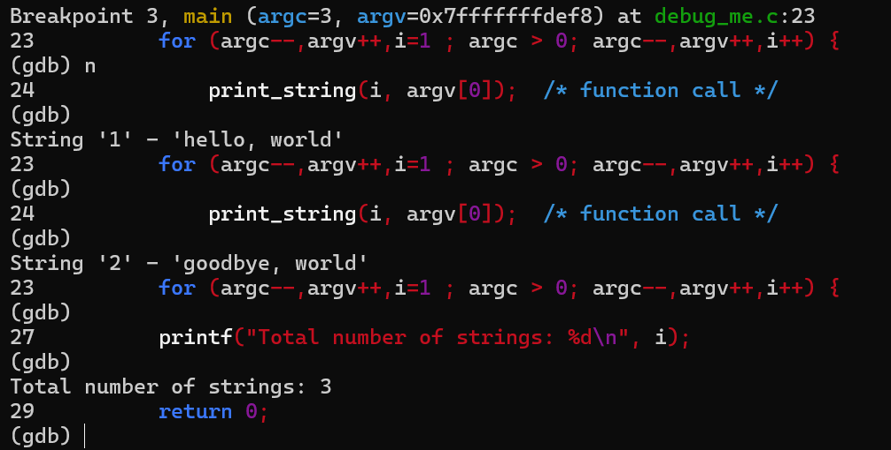

再尝试step方法，发现它进入了`print_string`函数内部：

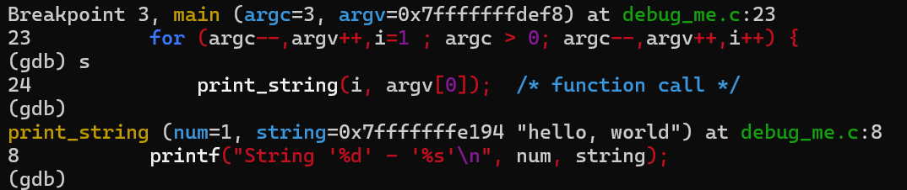

### print/p

我们可以通过print方法来对当前状态的变量进行查验：

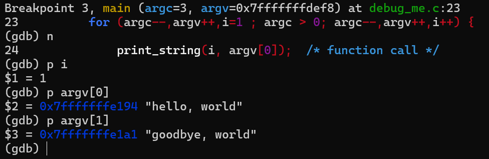

### where/frame

当一个C语言程序调用函数时，它会将函数相关信息推到函数栈中，以存储调用函数的状态。

我们可以通过where方法查看当前程序执行位置所在的函数栈位置，并且可以通过frame方法查验当前每一层函数的具体信息：

首先在主函数中查验：

可以看到，当前函数栈中只有一层（主函数main）

然后进入`print_string`函数中查验：

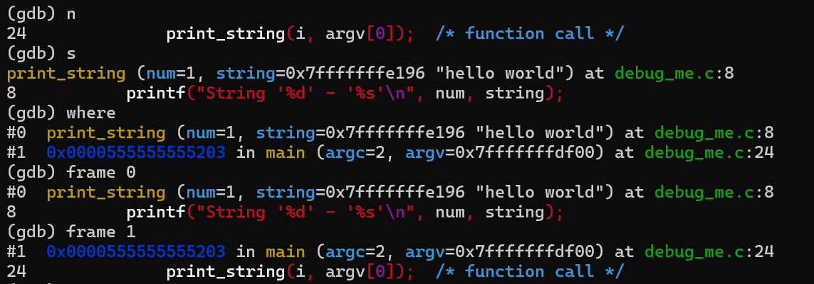

我们可以看到，上层函数栈变更为了`print_string`函数。而当前语句是在0层（main）与1层（print_string）的结构位置上的。

我们也可以通过frame方法结合print方法查看不同层的变量：

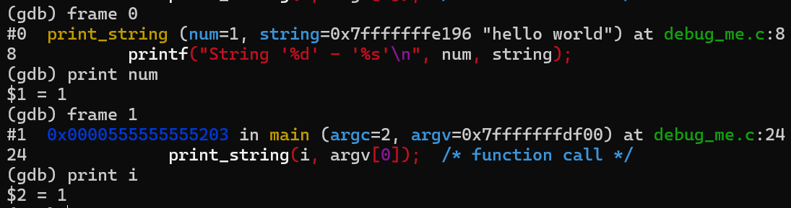

*需要注意的是，局部变量无法被跨函数访问。*

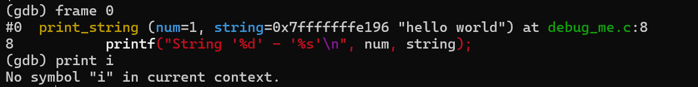

## 小结

本实验中，我们在Linux环境下对C语言程序进行了编写，并利用gcc与gdb编译与调试。初步掌握了gcc与gdb的使用方式，能够更高效地开发C语言程序。