

	Security Programming

	Lab 2.3

	Wang Haoyuan

# Lab2.3: Buffer Overflow Vulnerability

## Step 1: 配置相关ubuntu环境

由于实验推荐ubuntu版本为12.04，因此在ubuntu官网中下载12.04镜像，并安装虚拟机：

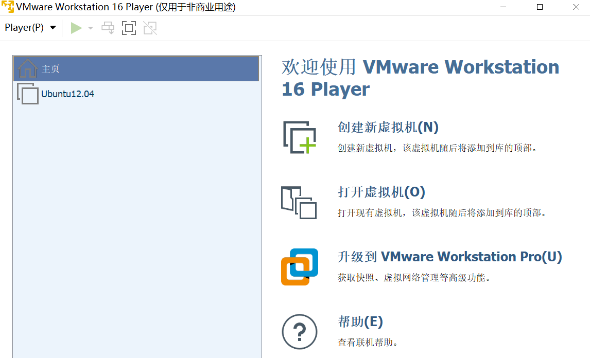

启动后页面如下：

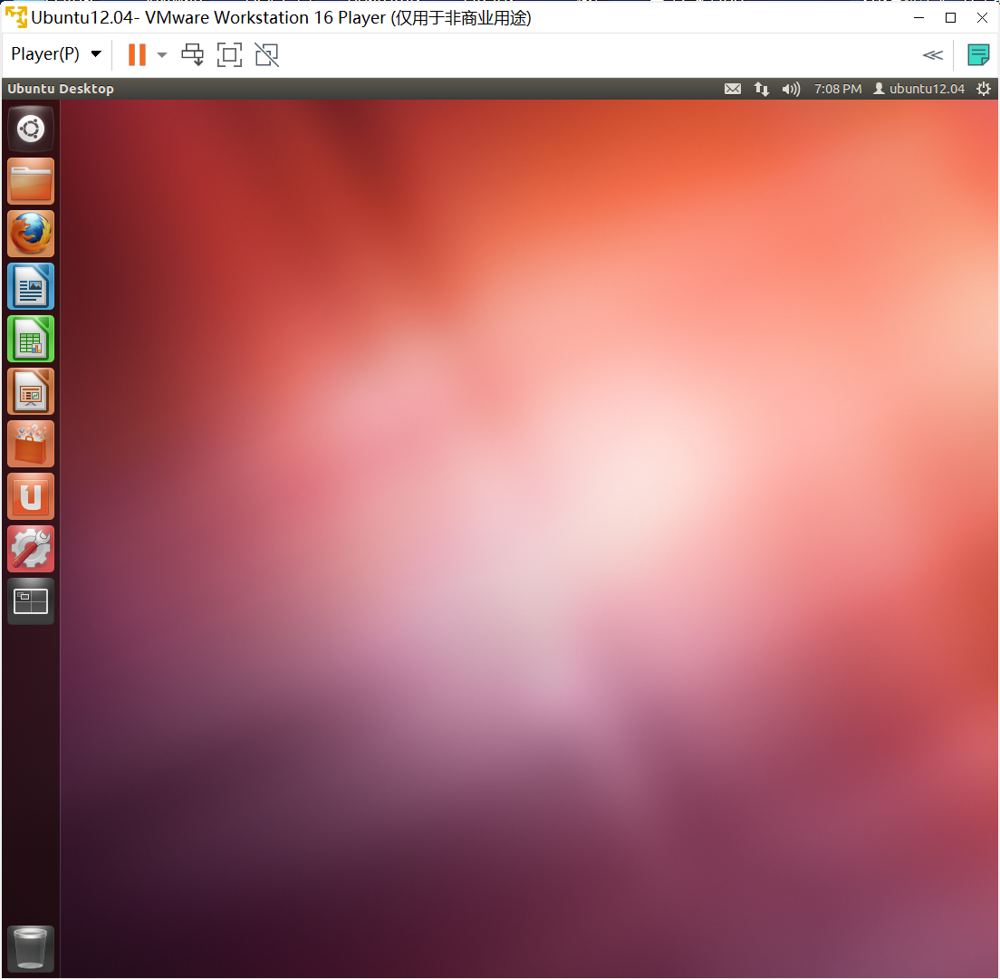

## Step 2: 禁用相关保护功能：

### 1. 禁用地址随机化：

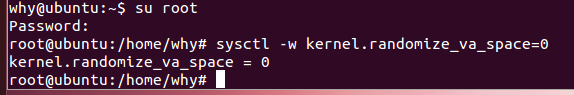

### 2. 取消ExecShield Protection:

尝试取消后发现并没有这个保护：

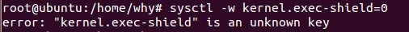

查阅博客后发现Ubuntu系统中应当没有这个屏蔽，那么继续实验。

## Step 3: 创建易受攻击的程序：

按照实验步骤，创建 `stack.c`:

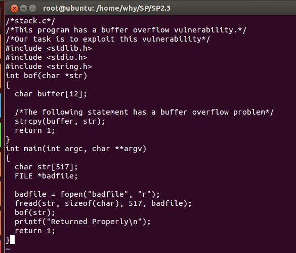

通过root账户来编译它（32位），并将可执行文件更改为4755：

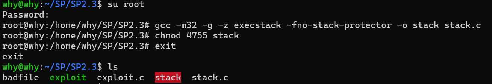

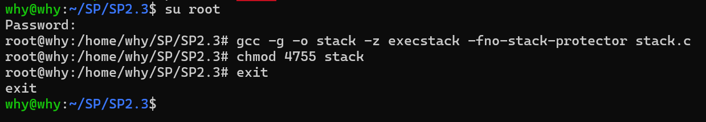

## Step 4: 通过gdb解析相关地址，并对exploit.c进行补全：

通过`gdb stack`, `disass bof`来具体解析bof内的汇编语言：

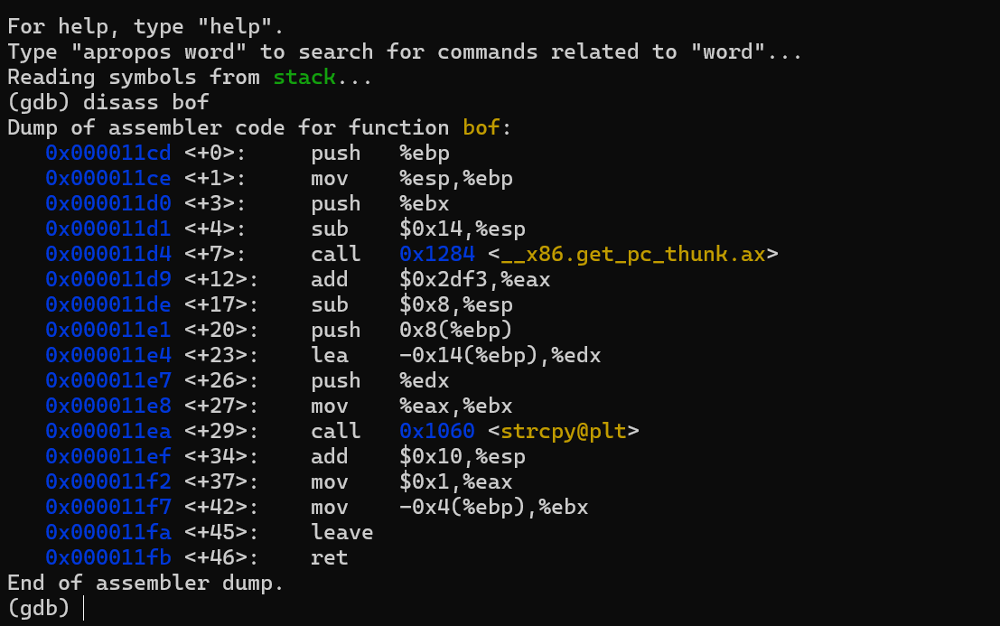

我们发现对于esp和edx是其中的关键节点，那么我们需要对它们所在的行设置断点，并且对它们的实际地址进行记录：

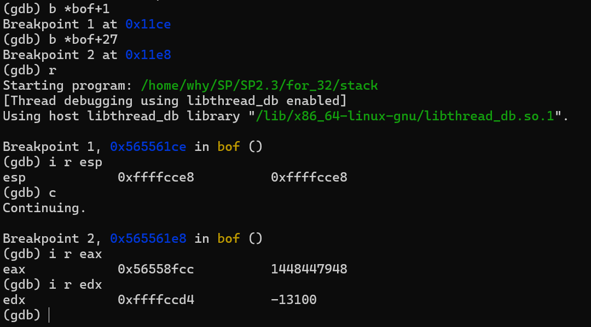

那么$0xffffcce8 - 0xffffccd4 + 0x4= 0x18 = 0d24$，因此得出buffer的偏移量为24。

接下来对exploit.c进行补全：

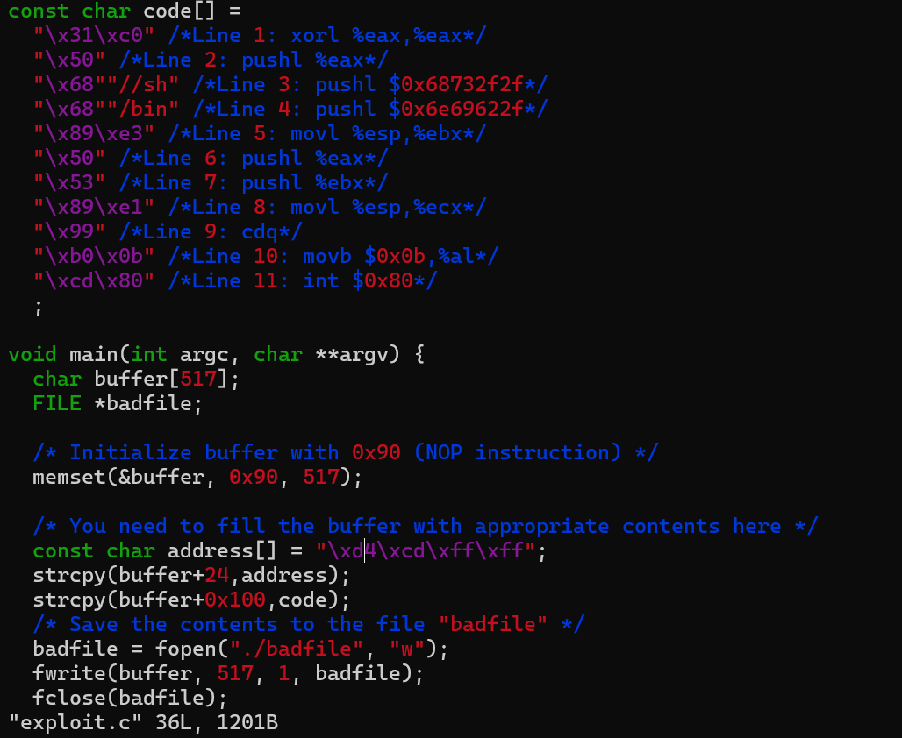

## Step 5: 尝试编译并运行：

编译exploit.c文件，并执行exploit与stack，可以发现跳转到了对应的命令行。输入`whoami`后可以查看当前的用户名称：

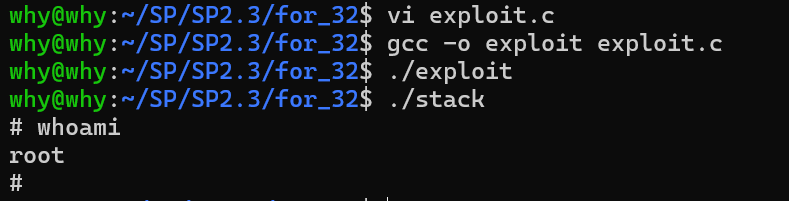

## 小结：

本实验主要通过模拟缓冲区溢出的情况，对系统内部进行攻击。由于该实验相对复杂，因此进行了多次不同的尝试才成功将程序运行起来。其中包括分别通过`ubuntu12.04`与`ubuntu22.04`及32位编译与64位编译四种方式进行尝试。其中由于`ubuntu12.04`版本过低似乎无法安装编译32位的gcc库，因此中途改换成了`ubuntu22.04`系统。最终发现`ubuntu22.04`也可以完成本实验。
