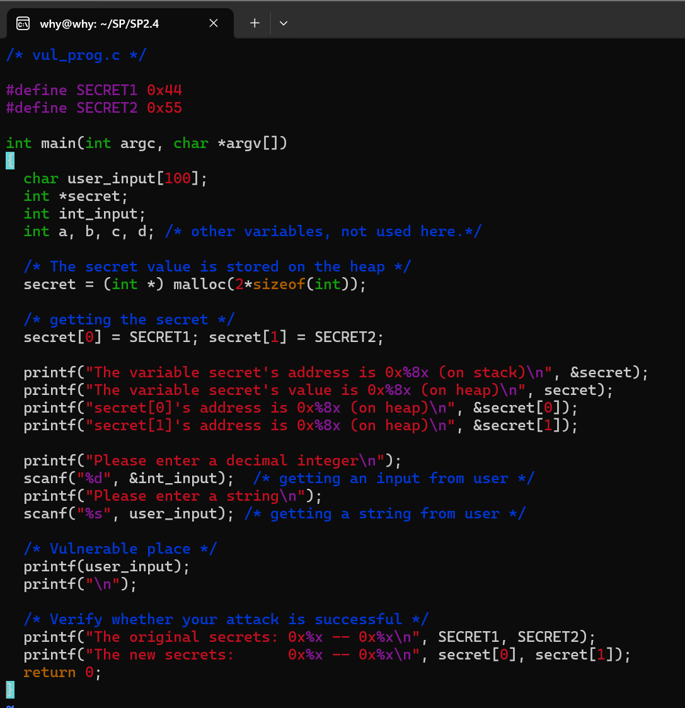
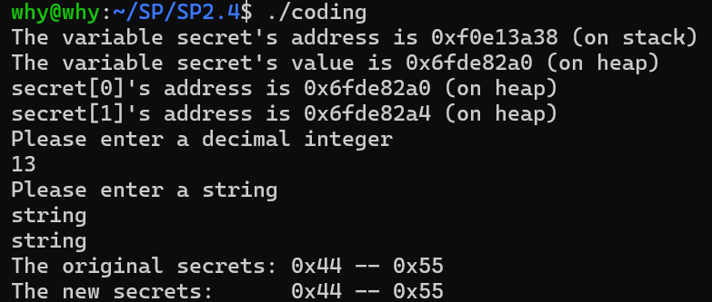
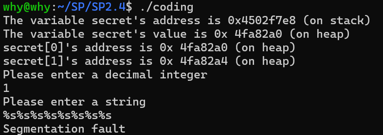
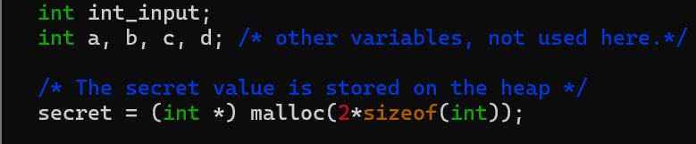
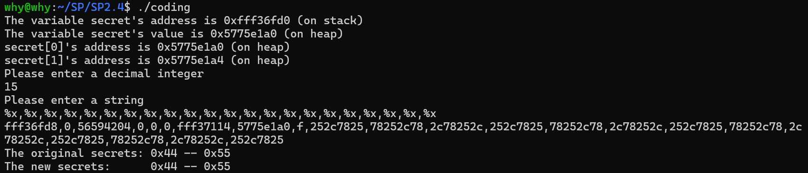
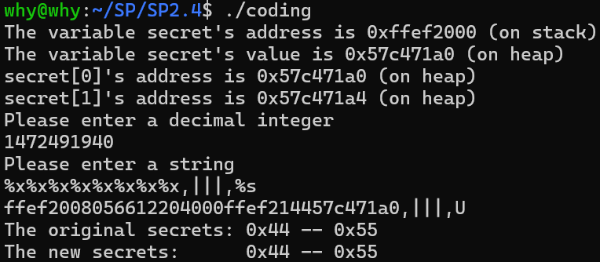
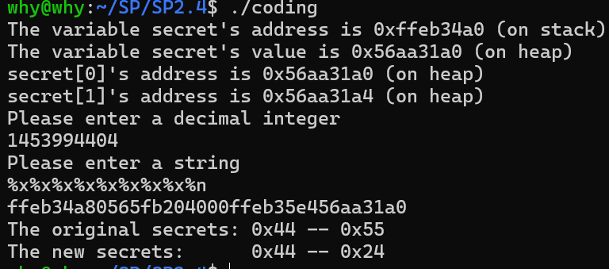
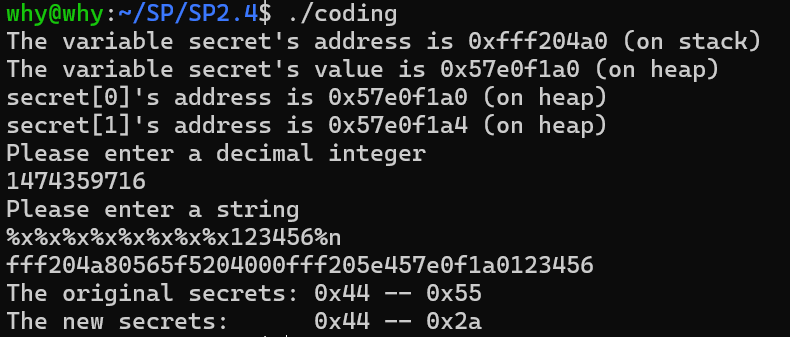

	Security Programming

	Lab 2.4

	Wang Haoyuan

# Lab2.4: Format String Vulnerability

## Step 1: 配置具备漏洞的程序：

与之前的lab一样，在文件夹中创建一个.c文件，并输入示例代码：

编译它（虽然有很多warning），之后尝试运行它，可以看到它是能够“正常”运行的：

## Step 2: 尝试使其崩溃：

本程序主要通过`printf(user_input)`这行代码进行攻击。由于printf()函数会将带有`%`的格式化字符串进行参数匹配，而如果没有足够的参数（例如`printf("%s%s%s")`，此时需要三个参数但实际没有为printf传参），那么printf()就会用栈中元素替代参数。而这种未定义行为很有可能使程序崩溃。

因此，我们只需在`string`栏输入多个`%s`，即可令程序崩溃：

程序显示`Segmentation Fault`说明已经崩溃，因此目的达到。

## Step 3: 获取secret\[1\]:

我们观察代码中的内存分配可以发现，可以通过user_input来反向获取secret的地址：

那么通过输入的user_input结合利用printf()函数，让系统将栈中的数据逐个抛出，即可查看到secret\[1\]对应所在的位置，具体操作如下所示（注意，此处编译时应当用32位方式编译！）

发现我们输入的15（十六进制为f）在第九个位置（而它前面恰好是secret\[0\]的地址），因此可以通过输入secret\[1\]对应的十进制地址，来尝试对第九个位置的数据以字符串的方式输出：

成功找到了secret\[1\]中对应的值（U）。

## Step 4/5: 修改secret\[1\]的值；修改secret\[1\]的值为预设的值：

这一步主要利用的是printf()的`%n`方法。它会将对应位置的数据修改为已经输入的字符个数。那么如果直接将`%s`改为`%n`，其结果就会是$4 \times 9 = 36$，即`0x24`:

根据这个原理，我们可以在`%n`前插入任意长度的字符，从而将对应secret\[1\]的值修改为想要的值，例如可以在`%n`前输入`123456`令其结果为`0x2a`:

## 小结

本实验目的为通过`printf()`函数相关的隐式漏洞，完成相应的程序攻击。这警示我们在编程时同样要注意编程安全的问题。
