

	Security Programming

	Lab 3.1 & Lab 3.2

	Wang Haoyuan

# 0. 实验目的概述：

第三部分的实验主要目的是通过相关的工具，对编程语言代码进行可能出现的编程漏洞的检测。

# Lab 3.1 Using splint for C static analysis

## Step 1: 安装splint

通过给出的链接下载splint并在linux环境下解压，之后的文件夹结构如下：

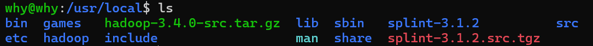

建立相关文件夹后，运行`configure`程序：

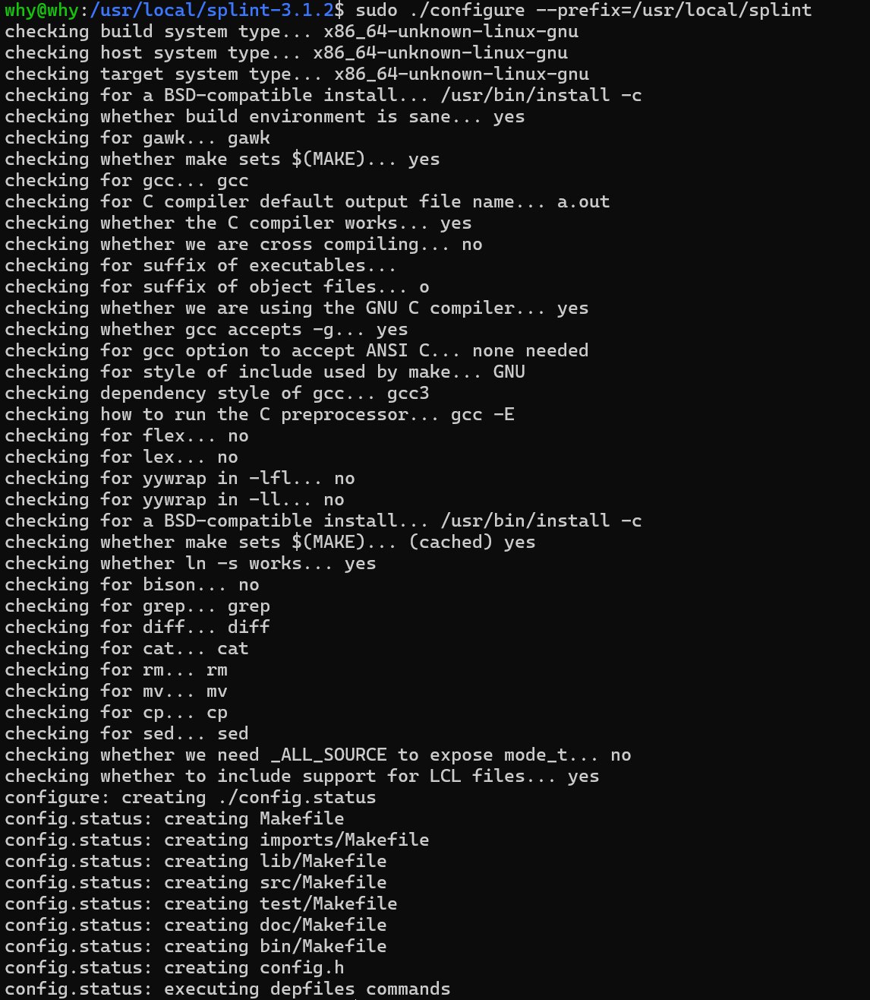

之后在当前文件夹下进行`make`并且运行`sudo make install`进行安装：

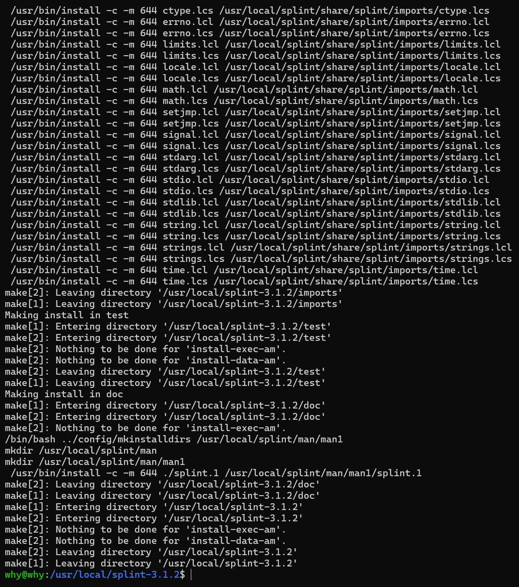

## Step 2: 配置环境变量：

在~/.bashrc文件末尾插入如下代码即可：

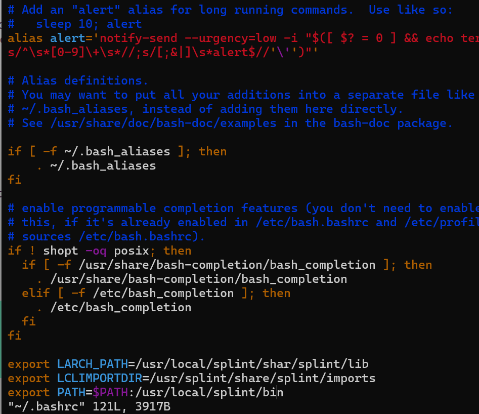

执行命令`source ~/.bashrc`以应用。

## Step 3: 编写可能出错的C语言文件

这里给出了11条示例错误中的5条错误（由于在splint检测中，vulnerable 1对应错误会影响到splint对应的parser，因此在图片中被注释掉）：

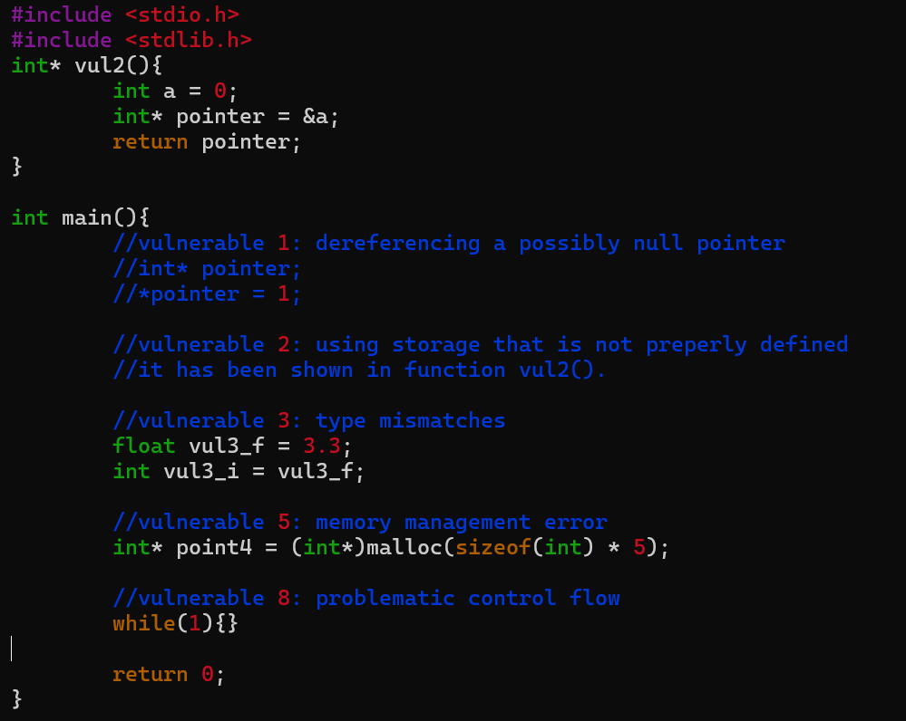

## Step 4: 利用splint检测代码漏洞

在运行`splint vulnerables.c`后出现一系列警报信息，这里将对其分类进行解释：

1. 漏洞2：
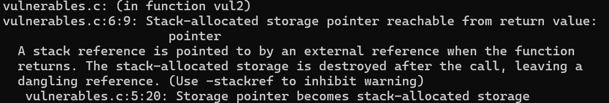

这是在函数中的警报，原因是在函数栈中分配空间的局部变量在函数执行完毕后空间会被释放，而此时如果返回指向这个局部变量的指针是危险的。

2. 漏洞3：
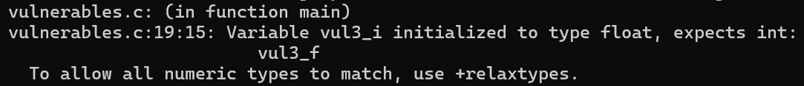

该警报是因为我们将float类型的变量赋值给了int，因此出现类型错误（但相对不严重，splint也提示表示可以通过`+relaxtypes`忽略这类警报。

3. 漏洞5：
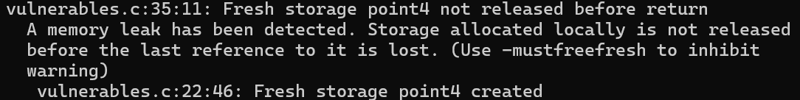

该警报是因为我们在动态内存分配后到程序末尾都没有释放空间，因此造成了内存泄漏。

4. 漏洞8：
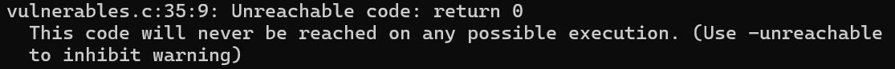

该警报是因为`return 0`将永远不会被执行。由于控制流警报并没有找到splint发出的对应警报，因此用这种方式`unreachable code`来代替。由于该代码之前有死循环，因此函数永远不会终止。

5. 漏洞1：（去掉注释代码后可见）

该警报是因为我们给一个未被定义的指针所指向的地址赋值。这会导致不可知的错误。

# Lab 3.2 Using eclipse for java static analysis

由于本实验中在尝试实验报告给出的三个插件时，一个（FindBugs）检测无任何反应，其余两个链接直接失效，因此本实验采用IDEA平台提供的PMD接口进行PMD插件的下载，并直接在IDEA中完成本实验。如若希望看到在Eclipse的尝试可以移步Appendix。

## Step 1: 在IDEA中下载PMD插件

在plugins中搜索`PMD`，即可找到对应的插件，下载之。

## Step 2: 编写一段有待优化的代码

如下图所示，编写了一段尚待优化的代码，其中包括死循环问题、参量未使用、变量未使用、方法未使用等问题：

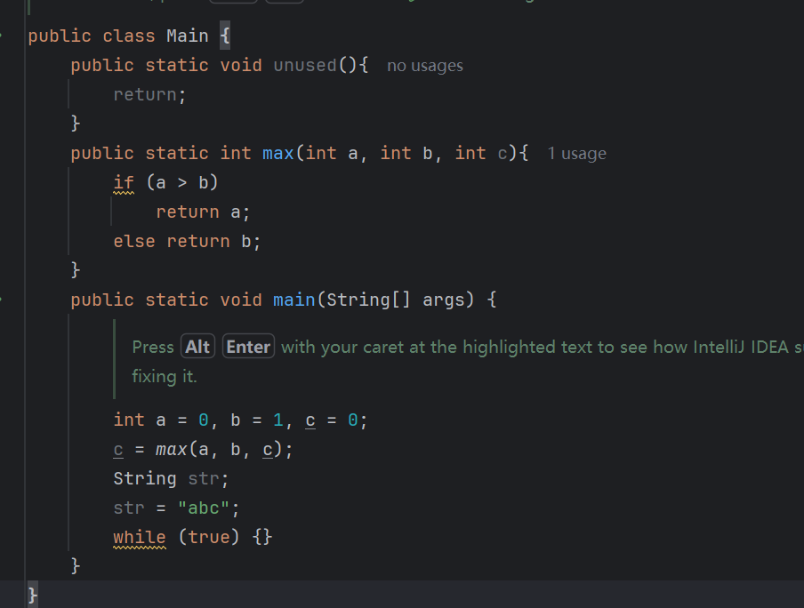

## Step 3: 使用PMD对其进行检测

右键项目，通过`analyze->inspect code`进行查验：

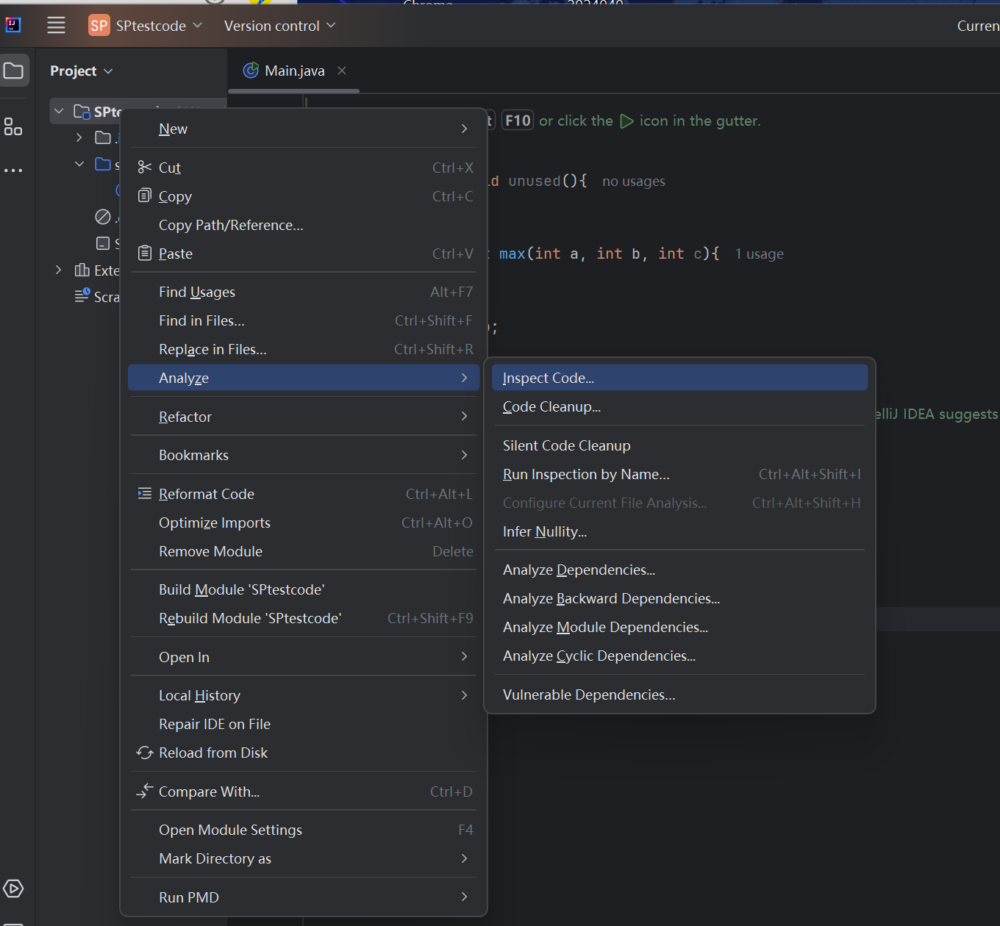

于是可以看到所有的warning，并且点击其中一个可以看到右侧甚至给出了对应截取的段落：

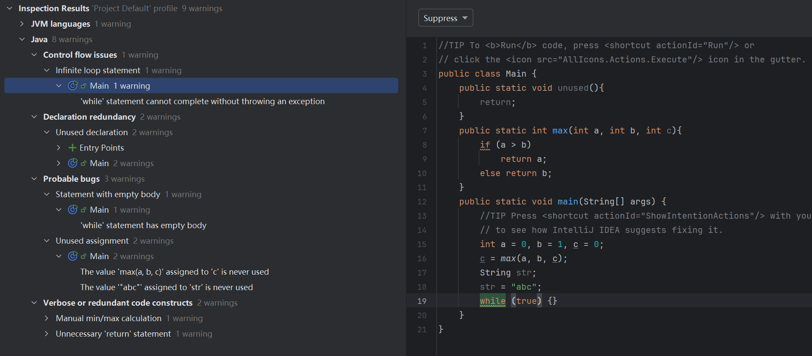

接下来将逐一解释所有的warning：
- Contorl flow issues: 控制流错误，具体为while()为死循环
- Declaration redundancy: 声明冗余，具体为未被调用的方法与变量
- Probable bugs: 可能的错误，具体为while()的执行语句为空以及未使用变量/参量，检测软件判断可能为程序员漏写或错写，因此可能导致错误出现
- Verbose or redundant code constructs: 冗余的代码结构，具体为max()方法在Java的Math库中已经给出，因此不必再手动设置一个max()方法；以及在返回值为void函数中，没有必要单独写出return语句。

# 小结

这两个实验主要是让我们熟悉C语言代码以及Java语言代码检测工具的使用，进一步提示我们不仅要注意error，还要注意warning.在编写代码时，应当尽可能将所有warning消除，养成好的编程习惯。

# Appendix：failure attempts

## Step 1: Eclipse安装

本实验似乎并不严格要求在linux平台下进行，而在Lab1.1中已经在Windows系统中安装了Eclipse,因此这里只粘贴Eclipse成功运行的窗口：

## Step 2: 选择合适的Java代码检测软件，并编写代码

本实验选择的是findBug，在Install New Software中可以看到对应的软件：

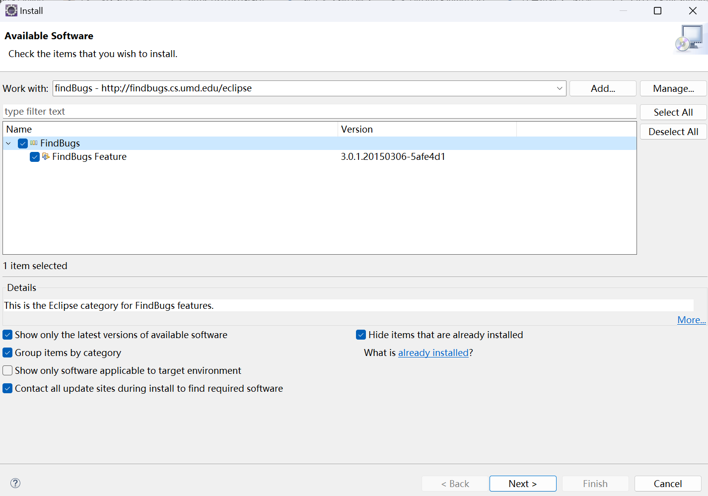

之后使用Lab1.1的方式创建一个简单的Java文件，并编写一份有各种问题的代码：

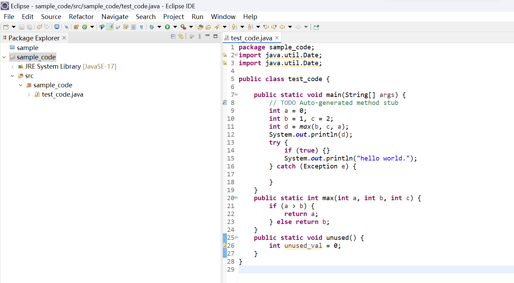

安装eclipse-pmd：

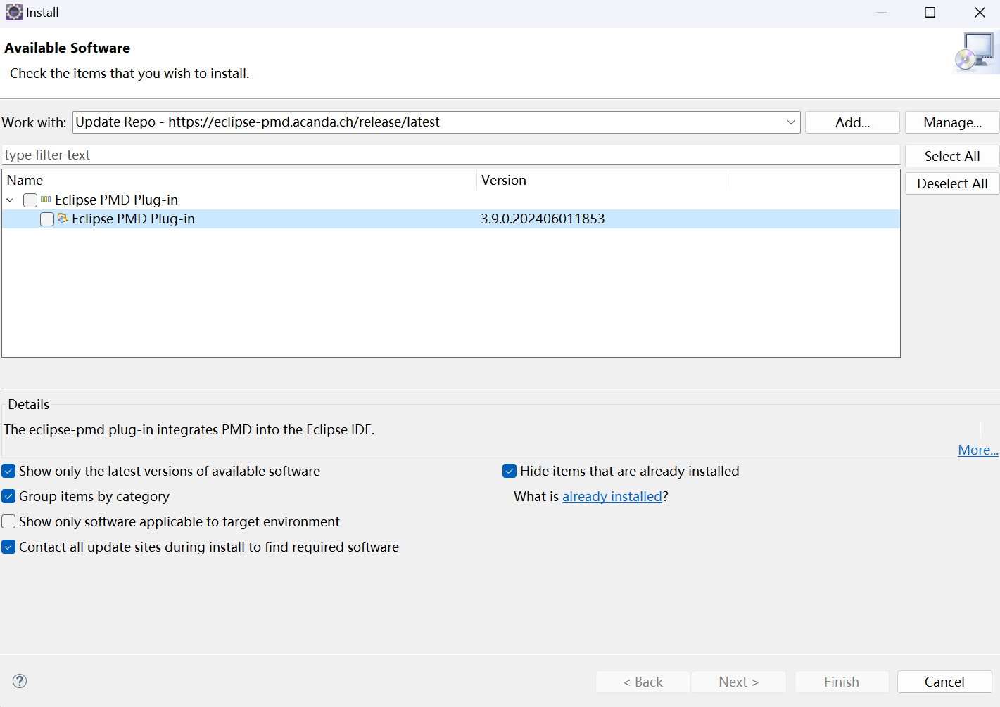

## Step 3: 对代码进行检测

右键后找到对应安装的代码检测软件：

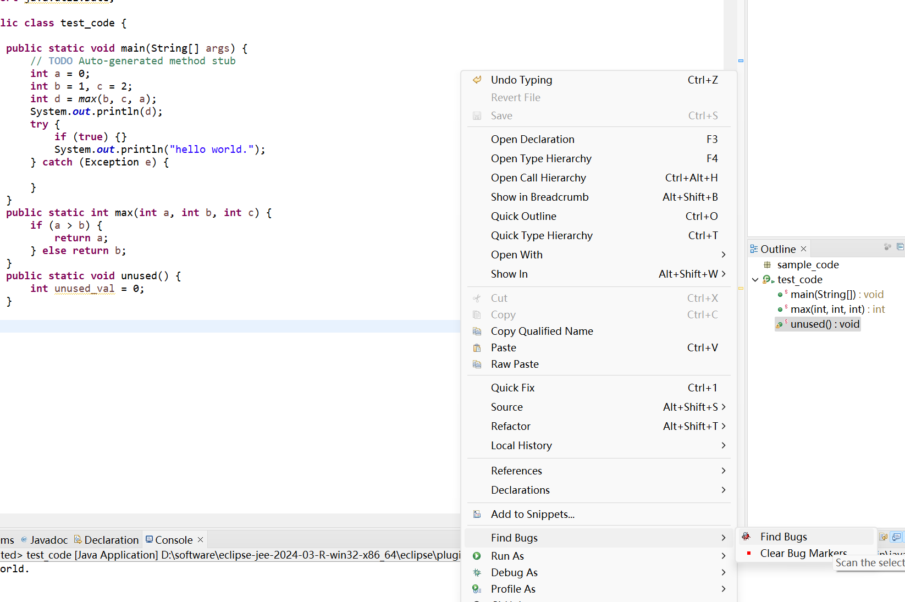

运行后发现BugExplorer中无任何信息，且日志中无任何信息。在设置preference检测力度、property的相关设置之后仍然无效，查找众多博客后依旧无法生效，因此更换为其他平台。